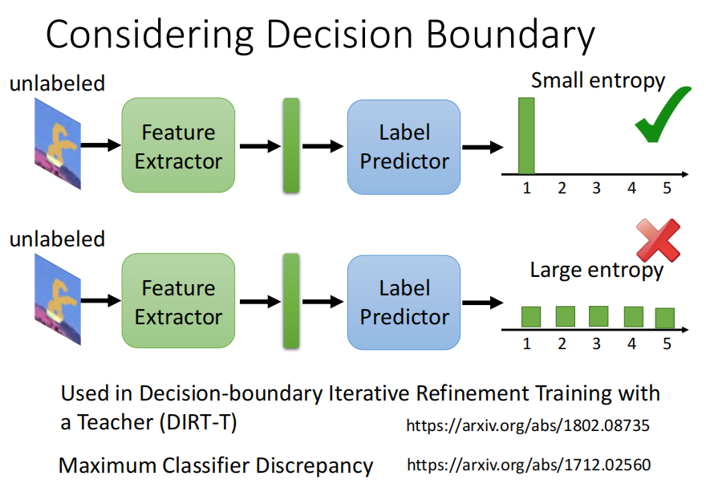
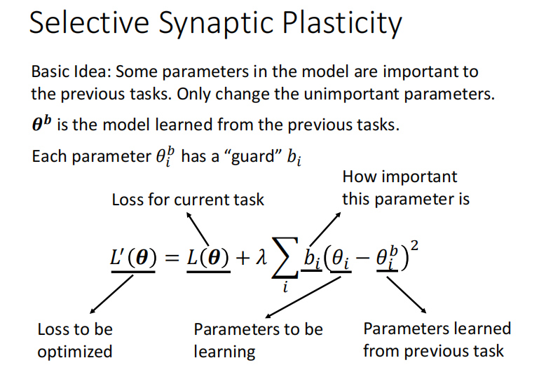

# 2022李宏毅机器学习课程

## 第一部分、绪论

### 1.什么是机器学习

***

机器学习就是 --- ` 找函式`

例如，输入一段音频 --> 通过一个函式 --> 得到音频的内容。

1. 有监督学习

   * 回归问题 --> 输出一个数字

   * 分类问题 --> 输出属于哪一类

     ` 除了回归问题和分类问题机器学习领域其实还有很多其他问题，我们最终除了得到一个结果(数字/分类)，还要得到一些其他的结果文件。`

2. 无监督学习
   * 聚类问题

### 2.相关知识

***

#### 1）机器学习基本步骤

1.**Model：** 实际上就是带有未知参数的函式，例如 Y = b + w*X1

2.**Loss：**损失函数是函式参数的函式，可以用来描述模型有多好，越大越不好，越小越好。
$$
L = 1 / N \times \sum_n e_n
$$

**label：** label就是正确的结果。

**MAE：** Loss是绝对误差。
$$
e = |y - \widehat{y}|
$$

**MSE：** Loss是平方误差。
$$
e = (y - \widehat{y})^2
$$

注意：如果以上的方法效果不好有时也会考虑交叉熵损失：Cross-entropy

3.**Optimization：**优化更新函式里面的参数，上例中就是更新w和b

梯度下降：

图中的Loss有负数是因为损失函数是自己设定的也许我可以设定损失函数最后-100，就会导致结果变成负数。

注意：我们梯度下降方向与斜率反向，并且斜率越大移动距离越小，斜率越小移动距离越大。

#### 2）model bias

由于线性模型总是直线所以对于某些不是直线的问题会存在无法避免的偏差问题。

**解决方案：**

red curve红色曲线 = constant + sum of a set of 曲线

就是把目标曲线按照转折点**`用若干个线段`**进行拼接最终表示出来。

这一堆线段函数表示为：
$$
y = c \times  {1 \over 1+e^{-(b+wx_1)}}
  = c \times sigmoid(b + wx_1)
$$

c：是个常数

如果X_1非常大的话那么最终的值就会趋近于c，如果X_1非常小的话那么最终值就会趋近于0。--- sigmoid函数

通过调整不同的`c，b，w`我们就可以得到不同的sigmoid函数。

修改w：更改斜率

修改b：平移

修改c：修改高度

所以如果我们用多段线段来表示`函式(model)`我们可以表示y = b + wx1为：

若用`矩阵形式`表示则为下图左边所示，如果用`图示`表示就是下图右边所示：

此时未知参数数量变多，用θ来表示，所以梯度下降就是对θ的更新：

对于给出的数据集使用分批(epoch)进行读取：

注意：1次epoch指的是该批次中的全部batchs的一次运行，而每一个batchs都需要update

所以例子中1epoch中update更新次数如下所示：

#### 3）其他的激活函数

例如下图所示的`ReLU函数`，我们可以看出sigmoid函数可以用两个ReLU函数进行组合而成。

所以我们修改之前的`函数(model)`就可以得到使用ReLU函数的式子。

#### 4）再次修改模型

我们可以在之前的模型后再加一层sigmoid或者ReLU，将原来的部分当作a输入a'中，而且我们可以反复多做几次这个过程。

上述的模型就是`神经网络`，其中的每个sigmoid函数可以称为是一个`神经元`，后来我们把每一排的神经元称为一个`隐藏层`，所有隐藏层合到一起就是一个`深度学习`。

## 第二部分、训练集调整

### 1.作业攻略（模型搭建流程）

***

**`下图是整个机器学习任务中训练集所可能遇到的各种问题：`**

1. 当训练误差较大时可能是模型设计的不合理(model bias)导致的偏差过大，或者是因为优化器设计的不好。
   * 我们可以通过修改模型使得模型更加复杂(比如添加sigmoid或者ReLU)解决model bias的训练误差大。
   * 下一节学如何解决优化器问题。
2. 当训练误差小时，我们认为模型不错，当投入测试集发现误差较大时，也许是过拟合，也可能是训练集和测试集较大程度的不匹配(mismatch)。
   * 当过拟合发生时我们可以选择
     * 使用更多的训练数据来使得模型更加精确，即减少由于之前训练数据少而导致有些点的预测结果是随机生成的问题。
     * 111
   * 当出现mismatch时需要我们对训练集和测试集有较为清晰的认识才能解决，后面会学。
3. 验证集的引入，我们可以将已知的数据集划分为训练集和验证集，通过训练集训练数据产生不同的模型，结果放到验证集去验证，取在各种情况下平均误差值最小的模型作为最终模型，拿最终模型放到整个数据集作为训练集训练之后，放到测试集去测试。这样可以避免在作业提供的公共测试集上由于随机结果产生误差小但是在真实测试集上误差大的问题。

**图中的流程在下面的各部分均有详细的展示：**

#### 1）model bias / optimization

下图是`model bias`的问题，我们的虽然从构建的各个模型中找到了Loss最小的模型，但是他并不是实际上最小的。

下图是优化器`optimization`效果不好的问题，我们的优化器不能支撑我们优化得到最小的损失函数的模型。

当我们不知道我们的模型是不是足够复杂、是不是足够大的时候我们可以测试看看。

例如：

56层的模型可以轻而易举做到20层模型能做到的事情(后36层什么也不做就相当于是20层模型)

但是结果发现56层的训练误差更大，所以只可能是优化器不够好。

#### 2）overfitting

下图表示的是`过拟合(Overfitting)`的问题，也就是当模型不复杂时(如图左)我们根据训练集找到比较小的Loss时，应用在测试集效果也很好。

但是当我们的模型变得更复杂(能够更加精确的拟合训练集)，但是对于没有见过的数据会产生随机的预测结果，所以当使用测试集时，我们会发现由于测试集的实际预测结果和我们之前随机生成的不一致，从而导致了测试集误差很大。

解决过拟合问题我们可以使用增加训练集的数量，如下图所示，当训练集增多时，我们的模型自己产生随机预测值的部分就会减少，模型就会被限制住，就可以避免过拟合的产生。

下图所示就是我们增加训练集的一种方式，但是最后一种不符合实际情况(没有小猫是倒着的)，这种图片如果放入训练集那么结果一定会变差。

解决过拟合问题的另一种方式，就是直接去限制模型，比如直接限制模型为二次函数，也许我们就会得到比较好测试的结果。

限制模型我们可以使用较少的参数，比如深度学习我们可以减少神经元的数量，或者共用参数(CNN部分有提到)

但是我们的模型不能限制太过不然就会出现下图的问题，由过拟合变成model bias。

所以我们的目标就是得到训练集和测试集loss都小的模型。

#### 3）validation

验证集的引入，为了解决训练集训练的结果直接放到作业中给出的public test中也许会随机出好的结果，但是并不能随机到private test中产生好的结果的问题，我们引入验证集，这样我们当在public test上发现loss大的时候我们就可以返回训练集去调整模型参数，直到在public test上loss满足的时候，再放入private test中，这样最终不会出现在public test上误差小而private test上误差大的问题。下图右边是`验证集划分`和使用的一些方法。

#### 4）mismatch

如下图所示，由于训练集和测试集本身的不同，也许会导致大误差的问题。

### 2.local minima 与 saddle point

***

**当我们使用优化器的时候有时会出现优化器效果不好的状况，其中一种原因就是由于local minima 和 saddle point 的原因。**

观察上图我们可以发现，local minima 和 saddle point 都会导致梯度下降时出现导数为零的情况而停止继续的参数更新，但是此时的Loss还没有达到我们想要的值。

#### 1）泰勒方法逼近L(θ)

这种方法就是针对于θ'逼近θ时，使用两部分来完成，其中绿色方框中的部分是用梯度(`一次导数`)，红色方框中的部分是用`二次导数`。

其中梯度得到的g是一个向量，而二次求导之后得到的H是一个矩阵。

这样做的好处就是当我们处于local minima 或者 saddle point的时候，梯度为零，但是红色框中的二次导数不为零，从而我们还可以继续参数更新。

#### 2）区分local minima/local max/saddle point

如上图所示，当我们已经处于梯度为零的点时，我们假设θ - θ' 用v来表示，当vT H v > 0 的时候，也就是此时的θ'是周围点中最小的点，我们就说此时θ'是`local max`。

同理，当vT H v < 0 的时候，θ'所在位置是`local minima`。

当θ'附近有大于零也有小于零的点时，θ'所在位置是`saddle point`。

如果用线性代数加以推导的话我们可以发现，当vT H v > 0 的时候，H的`特征值`均为正数。当vT H v < 0 的时候，H的特征值均为负数，所以我们也可以根据二次导数得出的H的特征值来判断此时为什么样的critical point。

例如：

下图所示的误差曲面(Error surface)中，中间为saddle point，而两侧均为local minima。

注：图中每一条线上的loss均相同，没有线的部分表示loss为零。

当我们使用前面的泰勒逼近的方法进行操作，我们就可以很轻易的得出中间的是saddle point，过程如下图所示。如果一个点已经判定为是一个鞍点(saddle point)的话，我们也可以根据所求得的H矩阵来得出接下来应该去`移动的方向`。

但是，我们不能随时都去计算二次导数所以这种方式我们用的非常少。

#### 3）梯度等于零的情况

如图所示当移动过程中除了遇到saddle point 和 local minima之外，当处于非常平缓的地带也会使得梯度趋近于，从而停止移动。

#### 4）small batch/large batch

之前已经提到过batch的概念，也就是我们把一个大的数据集进行划分之后我们可以每部分作为一个batch进行一次update。

那么batch大小的选取会有什么影响如下图所示。

也就是说当batch小的时候虽然更新会很快，但是当我们的硬件(gpu)能够满足并行运算时，batch划分的大还是小时间是差不多的。

对于梯度而言，因为小的batch梯度下降过程中是不同的(noisy)，所以就可能会避开由于梯度过小而停止移动的问题。所以对于优化器来说small batch 的优化效果更好。

而对于泛化能力(可以理解为在测试集上的表现)，也是small batch比较好，因为当batch比较大的我们倾向于走入峡谷中，因为small batch每次方向修改的比较快，更可能会停留在平原而不会停在峡谷。（正在研究中的一个问题）

#### 5）Momentum(SGDM)

`Momentum`是用于解决local minima的一种方法。

如上图所示常规的`梯度下降(SGD)`是沿着斜率的反方向进行下降。

而`引入momentum的优化器(SGDM)`是在基础梯度下降的基础上参考了之前的每次移动，来合力作用得出下降的方向。也就是可以理解为是一种运动中的`惯性`。

我们期望的结果就是使用之前累计的`惯性`来冲出local minima。

#### 6）different learning rate(RMSProop)

由于我们梯度下降停止也许不止是由于梯度值过小引起，而是遇到了一个无法跳出的深坑。

例如上图所示当我们从起点向较为平坦的地方前进的时候我们应该需要较大的学习率，而当我们向较为陡峭的地方前进的时候我们需要较小的学习率。

对于我们之前一直使用的η，我们在他下面除以了一个另外的值，这个值与i有关，也就是没一次下降都有各自相应的学习率。

后来考虑到每次移动和之前并不是完全均等的关系，所以提出了另一种方式--`RMSProp`，这种方式添加了α作为权重。同样的我们在遇到`陡峭`的地方的时候通过增大分母从而减小步伐，遇到`平坦`的地方我们减小分母从而增大步伐。

如果使用原来的没有调整适应的学习率到时候结果就是如下图所示，无法到达目标位置。

当我们使用调整适应后的学习率，我们可以到达目标位置，左图有一些来回飞的情况可能是在平原走到时间过长，从而分母过小导致的移动方向激增，但是后来激增到一定程度又会减小回来。

#### 7）Adam优化器

adam优化器就是综合了SGDM和RMSProop之后的优化器

#### 8）Warm up黑科技

影片中提到了一种名为warm up的学习率调整方法，即先增加后下降，在某些时候也许会产生非常好的结果。

### 3.Batch Normalization(归一化)

***

#### 1）归一化引入

由于数据集数据的差异以及环境的随时变化，我们有时会用一组较小的值作为输入，有时会用一组较大的值作为输入，但是我们最终都是想让他们有相类似的结果。所以就引入了`数据归一化`的概念。

对于特征x的归一化我们通常使用`x - 均值(m) / 方差`。使用了归一化之后梯度下降速度也会有明显的提升。

#### 2）Deep learning中的归一化

对于一个`深度学习`的架构我们也常常使用归一化的思想。

#### 3）batch normalization(批归一化)

如下图所示我们直到之前的x1~,x2~,x3~都是分别使用数据归一化得出的结果，而后续结果中的z1,z2,z3是相互间有关联的使用的`批归一化`。

#### 4）在测试集中使用批归一化

由于我们不知道测试集的数据有多少所以不能使用之前的方法，等一个批次排满了才开始运行测试即，所以我们使用之前训练集最终得出的平均μ-和🤖-(方差)作为测试集中归一化的`均值`和`方差`。

结果就是使用了归一化的方法(红色虚线)达到`最佳accuracy(准确率)`的速度会快很多。

### 4.简述分类问题

***

相比较于之前的回归问题，分类问题最终的结果不是一个数，而是一个类别。

#### 1）one-hot编码

我们可以使用`one - hot编码`来对分类结果进行表示，如下图所示。

#### 2）Softmax

相较于回归问题最终比较预测结果和真实结果的差距，在分类问题中我们最后使用`softmax函数`对y进行处理使得最终的向量中的每部分的结果都在0-1之间，然后与用one-hot编码表示的分类结果进行比较判定所属类别。

#### 3）分类问题计算Loss

与回归问题不同，在分类问题中我们使用`交叉熵损失函数`求Loss。

因为使用回归问题中的`MSE损失函数`，梯度下降会停在损失较大的部分，而使用`交叉熵损失函数`，梯度下降损失会逐渐从大向小移动。

## 第三部分、Network网络架构

### 1.CNN架构

***

Convolutional Neural Network (CNN)是专门用于做影像辨识的。

在对影像的处理中，我们的`输入是一个向量`。

我们的数据集图片的尺寸大小往往是不一致的，所以在最开始一般`先对图片的大小进行统一`。

以下图的RGB彩色图片为例，图片是由三个channel组成的一个三维的`tensor`(tensor可以理解为是在二维矩阵之上的一种结构)

为了能够把图片数据输入到模型中，我们将图像拉直变成如图右侧所示。

但是如果使用上面右侧的Fully connected network的话所需的参数过多，所以我们考虑使用减少参数的方式，即`简化`。

#### 1）局部连接(感受域)

如上图所示我们并不需要使用全连接的方式(fully connected network)，而是只需要图片中的一小部分我们就可以完成分类任务。

如上图所示我们可以使用`3 x 3的感受域`进行操作，每一个3 x 3的感受域(此时包括3个channel)作为每一个神经元的输入。

我们一般的典型感受域(卷积核)的选取可以按照下图所示。

由于考虑到关键信息可能在交叉部分所以我们可以控制每次移动的`步长`，使之有交叠的移动，最后不够的部分通过`padding补全0`。

我们一般并不只是使用一个神经元负责一个感受域，一般会使用若干个神经元负责同一个感受域，例如上图中的鸟嘴的位置并不在一个位置，但是只要负责这两个感受域的神经元中有识别是否为鸟嘴的部分，我们就可以根据结果判断此图片为鸟类。

#### 2）权值共享

`权值共享`，是减少参数量的一种有效的手段，如右图所示，我们对于不同的感受域可以使用相同的权值(filter)进行计算，因为不同感受域内的值不同，所以虽然权值相同，最终结果也不同。

具体例子：

如上图所示(假设只有一个channel的情况)，每一个filter就是一个`卷积核`，右图是每一部分得出的结果。

这每次的卷积操作的结果称为一个`Feature map`。

注意：每次卷积操作之后的**通道(channel)数与卷积核的数量保持一致**，上图中一共64个卷积核(filter)所以输入3个channel输出是64个channel，**后续的卷积**操作的输入就要是64个channel。

#### 3）池化

`池化的目的就是减少卷积后的图片大小`，包括Max Pooling，Min Pooling，Avg Pooling等等。

例如：

Max Pooling如下图所示。

但是池化并不全是好处，由于池化的操作，我们会损失很多的特征值，所以大部分时候我们考虑不适用池化。

#### 4）完整的CNN架构

如左图所示，在经过了不断的卷积和池化操作之后我们还要经过`Flatten操作`，目的是把卷积最终的结果`拉直`，后续再经过若干次`全连接`，也可能最后经过一个`softmax`，最终得到符合分类要求的一个向量(每部分都在0-1内)。

例如，对一个9类的问题进行分类，我们最终的结果应该是一个(x1,x2,x3,x4,x5,x6,x7,x8,x9)的向量。

右图则表示了cnn架构实际是全连接网络架构的一种细化，所以会存在`model bias`的问题，但是由于cnn一般就是用来做影像辨识的所有问题不大。

#### 5）CNN的问题

cnn无法解决图片放大缩小，旋转等情况下的影响辨识问题。例如下图我们的识别结果可能就会由于图片的放大，感受域无法准确的捕捉特征而出现不一致的情况。通常需要我们对数据集的图片进行`数据增强`。

### 2.Self-attention架构

***

Self-attention架构下我们的输入是`一连串的向量`，并且向量的长短也许是不一致的。

输入有两种形式，一种是one-hot编码，另一种是词的形式。

比如我们可以使用`一串音频、一个关系网、一串化学元素`作为self-attention的输入。

最终我们得到的输出也是与cnn有所区别的。

也许是`一对一`的label输出，也许是最后只输出`一个label`，也许最后输出的结果`由机器自行决定`。

右图是输出一个label的一些例子。

#### 1）窗口思想

由于输入是一串向量，那么如下面的例子输入了一个句子是“I saw a saw.”此时两个saw的词性应该是完全不同的，为了帮助计算机进行判断，我们可以设置一个`窗口`来判断某一个向量和其相邻若干个向量之间的相关关系。

但是有一个问题就是我们的输入向量个数无法确定所以窗口大小没法确定，于是就有了`self-attention架构的"天涯若比邻"`的想法，我们将每一个向量都和其他向量进行计算权重，得出大家的相关性，最终得出结果。

上图中由一组输入的向量经过self-attention得到的`带黑边的向量`其实就是和其他所有向量产生联系之后的结果，然后我们再经过一个`全连接`得到进一步的结果。

当然我们也可以多self-attention几次。

#### 2）计算权重

那么如何用a1，a2，a3，a4，得到相对应的b，就是`计算权重`的过程。

如下图所示，有两种计算权重的方法，我们一般选择第一种Dot-product计算权重。

计算过程如下图所示，这个`softmax`过程可以有也可以没有，具体可以看用和不用的效果决定。

其中q和k是相对应的a和矩阵Wq，Wk做乘法得出来的。

然后对所有α和矩阵v做乘法再求和，得到a1考虑其他所有向量相关性之后的结果b1。

右图b2的计算同理。

如果用`矩阵的形式`表示的话就是如下面几张图所示。

如果将a1，a2，a3，a4简化成I，b1，b2，b3，b4简化成O，结果如下图所示。

如果是要`考虑多个相关性类别`的话只需要分别计算对应的q和k矩阵产生各子的b即可。

最后`综合考虑`多个不同的b得出最终结果。

#### 3）添加未知项

有时由于我们考虑到有`未知项`的存在所以会在需要的未知添加未知项，常见的未知项有sin，cos，embedding等如右图所示。

#### 4）Self-attention v.s. CNN

cnn每次只能考虑到`感受域内`的资讯，而self-attention的每次考量`整张图片`的咨迅，所以cnn其实是self-attention的一种加以限制之后的特例，或者说`cnn是简化的self-attention`。

同时我们发现CNN当训练图片的量逐渐变多的时候其效果会慢慢被self-attention超过。

#### 5）Self-attention v.s. RNN

最重要的是由于self-attention的所有计算都可以是`平行计算`(计算b1与b2之间相互不影响)，所以其执行效率会高与RNN。

另外还有RNN的每一次结果都是基于左边以及输入的结果，而self-attention每个b都是考虑全局的相关性，所以self-attention优于RNN。

(如果使用双向的RNN，那也可以考虑到全局，但是这种情况下RNN想要最右边考虑最左边的向量，他需要让memory一直带着最左边向量逐步运算直到最右边，而self-attention"天涯若比邻"的思想，提供矩阵q和k就很方便实现相互关联)。

## 第四部分、Transformer

### 1.Seq2seq

***

`Transformer`就是一个**Sequence-to-sequence (Seq2seq)**的model模型。

seq2seq指的就是输入是一个序列，输出也是一个序列。

如下图所示seq2seq的模型可以用来解决语音识别，机器翻译，语音翻译等功能，并且最终的输出结果有几个由机器来决定。

#### 1）一些应用

对于某些不好去转换的情况，比如输入一段台湾话的音频，将其转化为国语，我们可以`把每一个台湾话对应的国语作为训练集强行训练一次`，也可以得到语音翻译的结果。

我们也可以使用seq2seq实现聊天机器人，如下图所示。

另外的一个常见应用就是用seq2seq实现Q&A的问题，如下图所示。

最后还有一些其他的应用，比如得到语法的树形结构，图像识别，(多相关性)分类问题等等，如下图所示。

#### 2）Encoder

Seq2seq的模型架构主要就是由两部分组成，一部分是处理输入序列的`Encoder`，另一部分是处理输入得到的结果产生输出的`Decoder`。

首先讨论Encoder，如下图所示，Encoder是针对每一个输入的x均会产生相应的结果h，基于这种特点我们就可以使用`CNN`或者`RNN`来进行处理。

如上图左面所示，在`Block`部分使用的是`self-attention`的方式对每个输入的x和其他所有向量产生联系进行处理，得到相对应输出的过程。

如上图右面所示，此时我们使用的是`layer normalization`而不是batch normalization，layer normalization是当我们得到一个结果α之后将其原来的输入向量和α相加组成新的residual(残留)再进行normalization的一种方法。上图右边的右边所示的是当我们有了layer normalization的解果之后，我们拿这个结果进行一次fully connected然后再加上自身进行一次normalization，最终红色边框的结果就是我们通过一层Block之后的一个输出。

这也就是Encoder的内部实现。

注意：最开始输入序列之后的Positional Encoding指的是添加未知项的过程，通过添加未知项可以使得我们的模型应对未知的能力增强。

#### 3）Decoder

然后是Decoder的部分，其中有两种架构分别是`AT(Autoregressive)`和`NAT(Non-autoregressive)`。

##### (1)AT(Autoregressive)

AT的结构是指的是我们将Encoder得到的结果输入到Decoder之后，由一个特殊记号`START`表示开始，然后经过Decoder架构的处理得到一个结果，对结果进行softmax处理使得每一项的概率都处于0-1之间，并且加起来等于1。最后类似`分类问题`，我们根据那一个可能的概率最大得出判断结果。

之后每一次都是用前一步输出的结果作为下一次的输入进行同样的过程。所以如果在过程中有如图所示的错误产生那么后续也可能会产生错误的结果。

我们先在忽略Encoder结果输入Decoder的情况下分析一下Decoder的架构，如下图所示，后续会有完整的Encoder和Decoder的连接图。

在Decoder中我们由于每次考虑的都是在之前每一步基础上进行的分析，所以将之前平行计算的self-attention更改为了基于之前结果(只考虑左边不考虑右边)的`Masked self-attention`架构，可以对照一下上面的忽略Encoder输入的Decoder架构。

例如以b2为例，`self-attention`为下图左，`Marsked self-attention`为下图右。

由于Decoder必须由机器自己决定输出的sequence的长度是多少，否则他可能会无休止的继续下去，所以我们引入了类似之前START标记的概念--`END`。

当我们某一个输入结果得到说END在结果中的概率最大时，我们就停止。

##### (2)NAT(Non-autoregressive)

NAT与AT的不同在于AT是每次的输出结果作为下一次的输入(类似LSTM)，而NAT是在START开始的时候一次性传入一整个句子的资讯，一次性结束(类似self-attention)。

那么NAT如何判断结束有两种方式：

* 在Encoder之后我们得出输出的结果数量，用这个数量控制Decoder产生多少个START。
* 或者如上图所示我们假设他Encoder输出有200个左右，我们可以给他300个START，看那个是END，END之后的部分就舍弃。

NAT的优点就是平行计算比AT快，而且我们可以灵活的设置Decoder的大小，比如在语音合成中我们想让合成快一点就可以让Decoder小一点，想要合成慢一点就可以让Decoder大一点。

但是实际是NAT的效果往往差于AT。--- 其中的一个问题就是Multi-modality。

#### 4）Encoder与Decoder连接

如下图所示，我们可以看到Encoder提供两个箭头作为Decoder的输入，Decoder提供了一个箭头。

具体的过程如下图所示。

而且也并不是说Decoder一定是用Encoder若干次之后的最终结果作为输入，例如下图所示，有很多种不同的Encoder的输入形式。

#### 5）复制机制

我们在实际问题中有的时候一些输入是没有什么逻辑关系的，这是就需要用到`复制机制`。

#### 6）Beam Search(定向搜索)

假设一共就只有A、B两种类别的情况下，我们可以选择红色的每次都选择最优的进行搜索，也可以按照绿色的开始的时候损失一点，后续可能反而能得到更好的结果(有种RL的感觉)。

比如右图所示我们使用Beam Search去预测后续的语句，他得到的最好的情况反而是单纯的语句重复。

## 第五部分、自监督式学习(Self-supervised learning)

### 1.Self-supervised learning / Pre-train

***

一个有趣的现象是，BERT相关的模型的命名都是用的芝麻街里的人物名字的简称。

下图所示的是self-supervised learning的结构，与之前学过的回归问题(regression)、分类问题(classification)所属的`有监督学习(supervised learning)`不同的是，self-supervised learning并没有输入x对应的类别标签y，在self-supervised learning种我们通常将输入的x分为两个部分，一部分x'用作输入，另一部分x''用作类别标签，所以综合来说`self-supervised learning属于无监督学习`的一种。

所以使用self-supervised learning我们通常想寻找一些没有标注资料的问题，比如`做填空题`。

`self-supervised learning`也叫做`Pre-train`。

### 2.BERT

***

#### 1）BERT做填空问题

BERT相当于是Seq2seq中的`Encoder`。

BERT的设计是一种屏蔽输入的填空问题，比如下图所示常用的屏蔽输入的某一部分有两种方式：1.用一个特定的字符MASK表示被屏蔽的部分。2.用一些随机生成的其他文字作为屏蔽项(例如，一、天、大、小等等)

BERT也是针对输入产生`相同数量`的输出。

上面两张图右上角的部分就是针对使用了BERT的填空问题，最后也是将输出结果通过一个Linear和softmax计算概率，最后当作是一个分类问题得出预测结果，在将结果和真实结果做交叉熵(cross entropy)得到最后的调整后的填词模型BERT。

#### 2）BERT处理两个句子的连续性

BERT同时也可以用来处理两个句子是否是相连的问题。

注意：对于两个输入的句子我们在前面加[CLS]，中间加[SEP]做分隔。

CLS就是classification的意思，可以理解为用于下游的分类任务。

最后判断两个句子是否应该为相连接的句子，是就输出Yes，不是就输出No。

当然BERT不只是能解决填空问题，也可以解决之前涉及到的问题，比如图像辨识，文字处理，语音翻译等等。

BERT称作`Pre-Train`。

这些各种功能都叫做BERT的`下游`(Downstream tasks)，在BERT上加上一些小的数据标签`调整(Fine-tune)`就可以实现各种功能。

#### 3）GLUE

GLUE是通用语言理解，一般用来评价BERT的效果。

右图表示的就是我们通过不断的使用BERT进行完善最终的处理效果从最初的一个效果优于人类(人类是1.0的那条线)，到最后有四个都由于人类。

#### 4）BERT的例子

下面是BERT的四个简单例子。

Case1：输入一个句子，输出这个句子的结果是正向的还是负向的。

Case2：输入一个句子，输出这个句子每一部分对应的词性。

Case3：输入两个句子，输出这两个句子分类的结果(可能是这两个句子是否为同一类、或者这两个句子所描述的是否为同一个问题)。

Case4：输入一个问题(Q)和原文(D)，根据两个随机的向量，最终判断出回答(A)的开始位置s和停止位置e（s和e是两个整数）。

注意：CLS就是classification的意思，可以理解为用于下游的分类任务。

主要用于以下两种任务：

* 单文本分类任务：对于文本分类任务，BERT模型在文本前插入一个[CLS]符号，并将该符号对应的输出向量作为整篇文本的语义表示，用于文本分类，如下图所示。可以理解为：与文本中已有的其它字/词相比，这个无明显语义信息的符号会更“公平”地融合文本中各个字/词的语义信息。
* 语句对分类任务：该任务的实际应用场景包括：问答（判断一个问题与一个答案是否匹配）、语句匹配（两句话是否表达同一个意思）等。对于该任务，BERT模型除了添加[CLS]符号并将对应的输出作为文本的语义表示，还对输入的两句话用一个[SEP]符号作分割，并分别对两句话附加两个不同的文本向量以作区分。

我们在经过BERT之后，继续进行fine-tune操作时，`使用的参数初始值就是做填空问题的时候的参数值`，如下图所示使用填空问题得出的参数而不使用随机的初始化值我们的Loss下降的更快也更好。

#### 5）BERT的有效性

研究发现一些比较相似的词在分布中也比较接近，而不相似的词分布比较远，比如下图的吃苹果和苹果电脑分布就比较远。

最终的训练结果我们可以看到上面的部分分布距离较近，下面的部分分布较近，但是两类之间分布较远。

将BERT应用在词的嵌入中，我们可以考虑上下文最终得出空缺的地方应该填什么词，右边是旧的词嵌入的方法。

下面的三张图阐释了我们把BERT用在蛋白质，DNA序列，音乐的分类问题上，假设我们把所要评判的指标用不同的词表示，比如第二个图中将DNA的各个脱氧核糖核酸用不同的单词表示来做预测，最终如图三我们发现使用了BERT之后的效果反而是最好的。

、

多语言的BERT翻译问题，我们发现不光是输入英语的讯号转换成英文讯号使用BERT的效果优于QANet，甚至输入英文讯号，输出中文讯号的BERT的效果也是非常好的。

下图所示的分别是QANet的训练结果和BERT分别使用汉语和104种语言训练BERT做Pre-train的之后的结果。

还有一种奇怪的现象是，英语和汉语在表示相近似的意思的时候也具有相近似的分布。

所以我们就可以使用BERT实现汉语和英语的转换。

### 3.MASS/BART

***

人们对于填空问题中的对单词的屏蔽方式做了各种各样的调整，如下图所示，有的交换位置，有的删除一部分，最终所有这些统称为`BART`。

### 4.GPT

***

`GPT与BERT一样都是含有较大的参数量的结构，也都可以作为Seq2seq的Encoder`。

而GPT可以解决的是我们在一句话中**由前一输出结果预测接下来的输出结果**的功能，比如对“台湾大学”做训练之后，我们在测试的时候输入“台”，机器就会告诉我们下一个应该是输出“湾”，然后是“大”，最后是“学”。

(用独角兽来表示GPT的原因是GPT通过自己预测下一步的形式写出来了一则独角兽的假新闻。)

https://talktotransformer.com/z这个网站上可以自己写一小部分内容，他会自动写剩下的部分。

例如，我实验的结果如下图所示。

使用GPT我们可以完成一些简单的填空题，如下图左边所示。

下图右边是人们的一些使用GPT的想法，最上面是使用若干英语和法语的对应示例，去预测一个英语的法语应该是什么，到下面的只给出一个英语和法语的对应示例去预测，再到最下面不给任何的英语和法语的对应示例纯靠机器去预测。

预测的准确率如下图所示。

## 第六部分、自编码器(Auto-encoder) 

### 1.Auto-encoder

***

Self-supervised learning是类似无监督学习的一种，self-supervised learning又叫做Pre-train。

`Auto-encoder`也可以用于图像辨识或者文字辨识问题，如右图所示是一个图像辨识问题。例如，我们输入一张`高维的图片`经过一个`Encoder`输出一个`低维的向量`，再用低维的向量作为输入，经过`Decoder`去`还原一张图片`，最终使得还原出来的图片和原图片尽可能的`接近`。

为什么一个高维的图片可以变成一个低维的向量，最后还能还原出一张图片？

因为一张图片看似是3 x 3的但是其中所蕴含的`变化是有限的`，比如下图所示的我们可以用一些二维的向量来表示3 x 3的图片的变化，从而实现用低维的向量表示一张图片，最后还能根据二维向量所对应的变化还原出图片。

### 2.De-noising Auto-encoder

***

`De-noising Auto-encoder`指的是在对图片进行encoder之前，添加一些杂讯(noises)在图片中，然后经过变换还原图片，最后和原图片尽可能的接近。

De-noising Auto-encoder过程和BERT类似，都是在最开始添加了杂讯，然后进行处理的过程，其中各部分的所对应的名词如下图所示。

### 3.特征分离

***

我们还可以实现特征的分离(Feature Disentangle)，比如下图是输入一段音频，我们可通过一个Encoder使得音频的内容信息和说话者的音频信息(包括音高，语调等等)进行分离，还可以实现变声器的功能。

下图中间是简单的Auto-encoder过程，输入一段音频再还原。右图是语音特征分离再组合，实现变声器。

我们在特征分离的时候，中间的低维向量可以使用真实的数字、二进制、one-hot编码等来表示不同的特征。

### 3.Vector Quantized Variational Auto-encoder (VQVAE)

***

下图表示的`矢量量化变分自动编码器（VQVAE）`指的是我们例如输入的图片通过Encoder之后得到一个低维向量，然后这个向量和我们数据集中学习得到的一些其他的向量`分析相关性(self-attention)`，最后拿最相关的作为输出，输入到Decoder中去还原图片。

### 4.更多应用

***

#### 1）通过添加Discriminator输出文章摘要

下图所示的是机器通过训练大量文章，能够在encoder和decoder中间产生某种`暗号`，使得decoder能够还原出原文章，但是这个暗号是人们看不懂的，也就是中间的部分不能作为我们的摘要。

我们可以使用`GAN`中的想法添加一个看过人们写的文章的`Discriminator`，使得输出的摘要是我们能看懂的样子。

#### 2）Generator

我们发现Auto-encoder的后半部分和GAN中的，由一个向量输出一个图片是一致的，所以这部分就可以当作是`generator`来用，`VAE(variational auto-encoder)`就是这种思想设计的，将auto-encoder的decoder作为generator来用。

#### 3）Compression(压缩)

因为encoder就是输出一个低维的向量所以可以用作`压缩(Compression)`，反之decoder可以用作`解压缩(Decompression)`，但是这个过程会`丢帧(Lossy)`。

#### 4）Anomaly Detection(异常检测)

当一个新的资料来的时候，我们去判断他和我们训练的资料是否是`相似`的，是就输出`正常(normal)`，不是就输出`异常(anomaly)`。

相似的定义是根据情景来设计的。

#### 5）制作图片

对于训练集训练过的人脸，我们就可以在测试集的时候`重建`出相似度很高的图片，而对于训练集没见过的图片，我们就不好完成图片的重建。

## 第七部分、可解释性的机器学习(Explainable ML)

### 1.Explainable ML

***

之前我们已经研究了如何从一张图片输出一个结果，并且学习了相关的模型，比如self-attention、self-supervised learning等等。那么这些模型输出结果的`理由`就是Explainable ML所要研究的问题。

例如，医疗问题中我们怎么知道这个机器学习得出的方案是合理的呢，而不是让机器学习是一个`黑箱`。

#### 1）可解释性与性能

我们都知道linear model就是做矩阵的乘法(线性变换)，所以linear的model具有很好的可解释性，而deep learning的model通常都是很深的多层复杂结构，对人们来说相当于是黑箱的，所以deep learning的model可解释性就很差。

但是，deep learning model的性能比linear model更加强大，那么我们如何衡量可解释性与性能呢？

右图是一个直观的例子，一个人的钥匙丢了，但是他只在路灯下寻找，理由是路灯下有光。

#### 2）decision tree

我们知道使用决策树的时候，每一步是为什么来到我们都可以知道，那么能否用decision tree来解决可解释性的问题？

答案是没那么简单，因为有时我们单单使用一个decision tree来解决问题这个决策树会很复杂，我们会使用很多个decision tree(forest)，所以决策树并不能很好的解决可解释性的问题。

#### 3）Explainable ML的目标

好的explanation就是人能接受，让人高兴的解释。

Explainable ML有两大类，一类是根据classification的结果进行解释(`local explanation`)，另一种是在我们还没有得出classification的结果的时候进行的解释(`global explanation`)，这两个也就是`Explanation AI`的两个关键的技术。

### 2.Local Explanation

***

即，分类的`组成部分(component)`中哪些部分是得出分类结果的关键部分。

例如，右图表示的就是用灰色的方块去覆盖图片，红色的部分表示方块放在该位置时分类结果正确的情况，蓝色时分类错误的情况，我们就可以发现分类时小狗主要是依据小狗脸的部分，分类轮胎主要就是依据轮胎的部分。

如何判断某个component是重要的，我们可以给他加上一个`∆x`，得出一个`∆e`，最后如果∆e趋近于0，那么这个特征x是不重要的，重要性就用`∆e/∆x`来表示，最后其`微分(梯度)`的计算结果画的图就是`Saliency Map`，其中白色的就是比值比较大的，黑色就是比值比较小的。

但是这种求梯度表示特征重要性的方法也会有一些`局限性`，比如下面两张图。

左图是当我们识别瞪羚的时候其周围也有一些白色的点，使得我们的观感不是很好，可以使用`SmoothGrad`的方法添加一些杂讯的方式输出一些结果最后平均所有结果再得出Saliency Map，可以看出观感就变好了。

右图是对于大象的鼻子长度求梯度的时候，由于大象鼻子长度从短到长我们可以认为他是一个大象，但是当象鼻子超过某一个界限无限变长的时候，我们的偏导数会逐渐趋近于0，最终我们可能会判断说象鼻子不是一个判断大象的重要的特征，解决这种问题的方法是`IG`。

### 3.Global Explanation

***

与local explanation不同的是，global explanation不是根据给出的分类的结果去解释为什么是这个类，而是在还没有分类结果的时候解释模型的哪些参数能够得出分类结果，即NetWork心里所期盼的这个类应该长什么样子。

如下图所示的一个CNN的架构，我们每一次经过一个filter之后，global explanation都期望能够通过自己输入一个不在data中的数据(X)，得到`尽可能符合filter结果特征`的矩阵，即
$$
X^* = argmax_x\sum_i \sum_j a_{ij}
$$

这时候使用的就不是gradient decent而是gradient ascent。

例如，左图是对于一个数字识别的问题，我们从左下角开始得到NetWork架构中所有的filter的结果，可以看到左下角可能是判断有没有竖线，后面是判断有没有横线，在后面是判断有没有斜线等等。

右图是对于最后的分类结果输出的矩阵，我们发现虽然最后他把一堆杂讯分类成了0-9的数字，但是这也是可以实现的。

在这里为了避免最后我们辛苦一场判断出来的机器的评判准则是杂讯的情况，我们加上了一个`R(X)`，这个R(X)就是添加了一些限制条件，比如下面左图是添加限制条件为去掉一些白色的点之后的结果，和数字就接近了一点。

右图是添加了更为复杂的限制之后，能够得到一些机器所认为的动物的图片。

所以我们就可以把问题从对于data没见过的数据X，寻找符合机器想法的结果，变成了寻找z，而且这个和GAN进行结合我们就可以对这个低维的向量z通过一个Generator过程得到一个图片X，我们把这个图片X作为输入放入NetWork架构中进行而分类。

这就是Explanation AI的一种思想，也就是让机器自己得到自己认为的图片应该是什么样子。

### 4.解释网络架构的Input部分

***

对于解释一个NetWork的输入数据部分是怎么样的，我们有两种方式，一种是`人直接观察(Visualization)`，另一种是添加一些`探针(Probing)`。

首先是`直接观察`的部分，假设我们观察的输入通过不同的层之后会得到100维的数据，为了方便我们观察我们可以使用`PCA`或`t-SNE`的方式进行降维。

右图所示的两个分别是我们把一个语音通过降维之后的二维数据输出到图中，第一个是原始的输入，我们发现虽然不同的颜色表示不同的说话者吗，但是不同的人说相同的话的结果并没有很接近。而通过了8层网络结构之后，相同的话逐渐变成一条一条的线。

然后是添加`探针`的部分，例如我们对于一个BERT的架构，我们可以探测他某一步是否输出了词性，或者是否得到了一些地名等等。

右图中是一个输入一段声音讯号，然后通过一些层之后我们再收集结果，通过`TTS模型`去还原原来的音频，如果通过这些层的时候语者的资讯被删去了，那么还原的结果会听不出是男生还是女生的一种声音。

### 5.用linear model解释黑盒

***

因为黑盒我们是很难去解释的，但是我们知道linear的结构比较简单，所以我们如果可以用一个linear model去达成和黑盒相似的工作结果，那么我们就可以用linear model去解释黑盒内部的原理。

（这个很难实现，因为黑盒比linear model通常情况下复杂很多。）

## 第八部分、对抗性攻击(Adversarial Attack)

### 1.Motivation动机

***

我们在实际生活中会遇到各种各样的攻击，比如垃圾邮件，或者奇怪的带有杂讯的输入导致不合适的输出。那么我们搭建的NetWork能否很好的抵御攻击就是这个领域讨论的问题。

### 2.如何攻击(Attack)

***

#### 1）Example of Attack

下面我们看一个简单的攻击网络的例子，我们使用一个网络去分类出了一个猫的图片，当我们添加一些人多肉眼看不出来的`杂讯`的时候，会得到一些奇怪的分类错误。

制造这些杂讯进行攻击很简单，首先如下图所示原始的图片是x0，x是我们添加了杂讯的新图片，我们期望的是有一个目标的预测结果ytarget，他和我们使用x的预测结果y要尽可能地`近`，而我们的预测结果y要和x0的正确的预测结果y^尽可能地`远`。

我们衡量远近用的都是`交叉熵损失函数(cross-entropy)`，然后在y和y^的损失值Loss上加负号，所以最终我们只需要使得x*越小越好。

除此之外每次还需要考虑一个`d(x0,x)≤ε`，这个是x0和x的距离要小于人类能够识别的范围，如果距离＞ε，那么人们就能看出来这个图片的杂讯。

#### 2）d(x0,x)≤ε

对于这个`d(x0,x)≤ε`有两种方式衡量，一种是`L2-norm`，另一种是`L-infinity`，我们把x和x0都用向量表示，差值平方求和就是L2-norm，选最大值就是L-infinity。

右图所示的就是两种对图片进行调整的方式，上面是每一个部分都加了一点小杂讯，下面是只在右下角绿色的部分加了较大的杂讯其他部分没变化。

最后L2-norm的两个结果是一样的，而L-infinity不同，对于上面那种我们人眼不容易辨认的杂讯，其L-infinity是较小的。所以我们通常使用L-infinity方式来表示d(x0,x)≤ε。

每次对x的调整类似于梯度下降，只不过我们每次更新的不是参数而是输出的图片向量，并且初始值不是随机的而是用x0作为初始值。上图是两种更新方式。

第一种，是左图所示的每次都梯度下降(`Gredient Descent`)更新，但是要确保d(x0,x)≤ε，一旦＞ε，那么就找x0上下左右范围ε内和x距离最近的点把x拉回来(`fixed`)。

注意这里x0关于ε的范围是正方形而不是圆形的原因是这个正方形表示的是x与x0横、纵坐标的差≤ε的意思。

第二种，是右图所示的只进行一次更新(`FGSM`)作为最终的x输入其中，这个方法类似碰运气，所以通常我们可能进行好几个一次更新，最终选取满足我们要求的，如果出现超出范围的也是找范围内最近的拉回来(`fixed`)。这种只更新一次的方式我们使用的不是梯度下降而是一种符号函数sign(t)，每次移动的都是ε +1 或者 -1，所以最终结果会在四个角上(相当横纵坐标±1)。

### 3.White Box v.s. Black Box

***

我们前面所讲的更新参数的方式都是`White Box`也就是我们都是知道参数是什么进行的更新。

`Black Box`反之就是我们不知道参数的NetWork架构，而且黑箱也是可以被攻击的，比如我们知道这个黑箱的训练资料是什么，我们在自己的网络架构中使用这个训练资料也得到了一个模型，那么我们对自己的网络架构进行攻击(给图片加杂讯)，由于我们的网络架构和黑箱的网络架构使用的是同一个训练资料，所以一定会有一定的相似度，最终用来攻击我们自己的网络架构的图片也可以成功的攻击黑箱的架构。

上面的最后一个图表示的是一些做白箱和黑箱攻击的测试结果，对角线是白箱攻击，其他未知都是黑箱攻击，表示的值是攻击后的准确率，我们发现白箱攻击后准确率都是0，黑箱攻击之后网络架构越接近能够使得正确率更低。而下面这个表格与上面相反，对角线是黑箱攻击(即，第一个位置应该用ResNet-152去攻击，但是他用了其他的NetWork)，而非对角线才是白箱攻击。

下图表示的就是为什么攻击这么容易成功的一个实验，我们发现输入一个小丑鱼的图片，对于各种模型，中间深蓝色的部分是预测为小丑鱼的时候，当我们用VGG-16进行训练的时候，竖向移动不会产生什么攻击但是横向移动会产生攻击，我们把这个产生了攻击的结果输入到其他模型中之后横向都会很容易被攻击到。这个原因**可能**并不是模型不够好，而是我们的训练资料本身的一些问题产生的，比如添加了一些杂讯之后他本身的问题导致了模型容易被攻击，如果我们的训练资料足够多的时候我们可能就可以避免被攻击。

下图所示的是两种攻击，第一个图是只修改一个像素就可以产生攻击，第二个图是不需要费力气去寻找一个可以产生攻击的像素而是用一个通用的杂讯贴到任何一个图片里都快可以产生攻击(这个还真的是存在的)。

### 4.除了图片之外的其他攻击

除了对图片进行攻击我们也可以对语音进行合成攻击，对文字进行攻击，以及在真实世界中的攻击，例如，带上一个神奇的眼镜可以骗过人脸识别系统（甚至是全方位去人脸识别都能骗过）。

下图所示的是与之前不同，不在testing上攻击，而是在`train`的时候就进行攻击，比如我们做图片的识别，我们对输入的某一张图片加入一些杂讯，然后正常去训练，其他图片都是正常的，最终在testing的时候如果遇到这个图片他就会`走后门`似的输出奇怪的结果。例如你在网上下载了某人公开的人脸识别的数据集，在自己的模型中训练之后效果非常好，但是实际上这个数据集中的某些照片是加了特殊杂讯的，当知道他的人使用人脸识别的时候就可能会输出和你的模型预期不一致的结果。（当然这种开后门的方式也是有各种各样的限制的）

### 5.防御（Defense）

#### 1）被动防御(Passive defense)

不需要动我们的模型，只是在前面加一个filter对图片进行一些处理挡住Attack，比如对图片进行`模糊化`(Smoothing)，`副作用`就是我们对于没有添加杂讯的图片使用了Smoothing模糊化之后，可能会让原来正确的结果预测错误。

进行`压缩`和`解压缩`，由于压缩会丢帧，所以也可能会达到预防攻击的作用。或者对输入的图片经过`Generator`进行再次生成一遍，也可以预防攻击。

不过如果**被攻击者知道防御者使用了模糊化技术**，攻击者就可以在自己的模型的第一层放一个模糊化，在自己的模型中就考虑到这个问题，从而完成在其他使用了模糊化模型上的攻击。

所以更厉害的是`随机化`防御，如下图所示，我们自己也不知道他图片输入进来会进行那种随机的防御。（也可能会被攻破）

#### 2）主动防御(Proactive Defense)

`Adversarial Training`主动防御就是我们在训练的时候就主动加入各种杂讯对模型进行攻击，遇到错误我们也可以主动对结果进行修正，当测试的时候真的遇到攻击产生了错误，我们也可以根据训练中遇到过的情况把结果拉回来。

这种方式就算不是考虑模型被攻击，单纯使用也可以对`数据增强`，使得自己的模型训练的更好，更`不容易过拟合`。

存在的问题一个是对于训练的时候没有预见过的问题，也挡不住新的攻击。另一个是我们会需要很大的运算资源。

## 第九部分、领域自适应(Domain Adaptation)

### 1.Domain Shift

***

`Domain Shift`是指的训练集和测试集的差异。

如下面左图所示，也许我们做一个数字识别的例子，在训练集上已经有了一个比较好的结果，但是当测试集的数据`分布`发生变化的时候可能识别效果就会大打折扣。

如图右所示，是三种Domain Shift的可能情况。

1. 训练集和测试集的`分布`不同。
2. 训练集和测试集的`产生结果`可能不同，例如左边是各个数字的识别概率是相同的，右边是概率不同。
3. 对于同一个数字在训练集和测试集上的`标注(y)`是不一样的。

### 2.Domain Adaptation

***

#### 1）测试集数据带有类别标记

对于分布不同的训练集和测试集，当测试集自带`类别标记(y)`时，我们只需要在训练集的现有模型上加一些微调，再跑几个epoch我们可能就会得到符合要求的结果。但是由于这种带有标记的分布不同的测试集数量是非常少的，所以我们训练的时候要注意不要训练的太过了，导致在测试集上发生`过拟合(Overfitting)`。

#### 2）测试集数据不带有类别标记

当我们的测试集中的分布和训练集不同，并且训练集`没有带类别标记(y)`的时候，如下图左所示。

基本的解决方法如右图所示，我们可以找一个`Feature Extractor`的网络架构，功能是将训练集和测试集上的例如颜色的资讯滤掉，使得原来分布不同的训练集和测试集，变成相同分布的数据。

### 3.Domain Adversarial Training

***

#### 1）Feature Extractor and Domain Classifier

`Domain Adversarial Training领域对抗性训练`指的就是，在我们做分类任务的网络架构中，前几层可能是一个`Feature Extractor`用来滤掉差异的分布，将滤掉不同分布后的相同分布的结果，由于Feature Extractor使用的是`CNN`所以得到一个`Feature Map`，后面再拉直，放入`Label Predictor`中做类别分类。

`Domain Classifier`是用于将Feature Extractor之后的结果(Feature Map)通过分类得出是训练集的输入还是测试集的输入，很类似`GAN`网络的结构，Feature Extractor类似于`Generator`，Domain Classifier类似于`Discriminator`因为他看过训练集和测试集的数据。

#### 2）Decision Boundary

`Decision Boundary指的是判别边界`,如下图左所示，对于两种分类，我们认为右边的有清晰的判别边界的情况是好的情况。用图右的形式表示出来就是对于没有类别标记的数据，我们希望最终的输出结果尽可能集中在某一个类别上，而不要是每个类别都有可能。

当训练集和测试集的类别不一致的时候如何应对，文章`Universal domain adaptation`给了我们解释。

### 4.其他的测试集情况

#### 1）测试集非常少，并且没有类别标记

当测试集没有类别标记(y)的同时，数量还非常少的时候，我们可以使用`Testing Time Training(TTT)`的方式进行处理。

#### 2）对测试集一无所知

当我们对于测试集一无所知的情况，又分为两种。

第一种，是图右所示的`训练集非常丰富`，测试之后效果比较好。

第二种，是图右所示的`训练集训练种类比较少`，测试集非常丰富，这种就需要我们在训练的时候使用一些`数据增强(data augmentation)`的技术，使得训练集尽可能的丰富。

## 第十部分、 强化学习Reinforcement Learning (RL)

### 1.Reinforcement Learning

***

强化学习(RL)也是有监督学习的一种，前面提到的sulf-supervised learning和Auto-encoder虽然说是无监督学习但一种，但是处理思想其实也是有监督，只不过类别标签不需要人标出，由机器自己就可以产生。

和机器学习一样，强化学习的过程也是输入一个环境的`信息(Observation)`输出一个对应的`行为(Action)`，并且都每次把行为作用在环境之后会得到一个`回报(Reward)`。

经典的例子就是下围棋的AlphaGo。

回顾机器学习第三步，第一步是寻找一个有未知数的function，第二部是定义损失函数，第三步是定义优化器去更新参数。

#### 1）RL基本步骤

强化学习的步骤也是和机器学习一样的三步组成的。

例如，下图是一个用RL做的打游戏的例子，第一步定义函数就是定义RL的Actor，这个部分包含了各种的未知的参数等待我们去学习。

第二步，定义Loss，在RL中从开始执行各种动作到游戏结束称为一个`episode`，每一步所有的reward加起来就是Total reward也叫return（R）。这个R就是我们的训练目标，我们希望他越大越好，所以我们可以拿-R作为我们的Loss。

注意：**reward**指的是每次action后的即时回报，而**return**是所有reward的总和。而且每次得到reward不仅仅是由action决定，也和前一个状态的环境有关。

第三步，定义优化器optimization，由于每次的行为和环境**互动**的结果都是随机的，而reward和environment对我们来说都相当于是`黑箱`并且可能也有`随机性`，所以如何设计优化器是一个强化学习的**关键问题**。

**RL的随机性**指的是在testing的时候，当我们使用同样的actor输入，最终的输出是不一样的。而我们在train模型的时候固定的`random seed`目的是让模型训练的初始化参数是一致的。

回想在GAN中学的部分我们通过将`generator`和`discriminator`连接起来，调节generator的参数期望discriminator的输出越大越好。

同理RL中我们也是将`actor`和`reward + environment`连接起来，通过调节actor使得reward+environment的输出越大越好。

而GAN和RL不同的是discriminator是一个**network**，我们也可以通过调整参数的方式进行优化，而RL中的reward+environment不是network无法去优化。

#### 2）控制Actor输出的行为

假设我们想要让一看到S图片就选择a^的行为，即向左走，可以通过我们Actor得出的行为的结果和向左走的正确情况结果做对比，计算两个的`交叉熵(cross-entropy)`，得到一个损失值e，让e越小，我们的行为就越接近left。

反之，如果不想让机器在看到情况s向左走，就对求-e，交叉熵求得的e越小，-e反而就越大，行为就越远离left。

综合左图的想法，我们可以得出右图的操作，即想**让环境s做行为a^，不想让s'做行为a^'**，那么我们就想要e1小，e2大，即L = e1 - e2越小越好。

这种想法其实就是`supervised learning`

而实际上，我们在采取action的时候可以加上动作的**倾向**，如下图右图所示（左图是上面的例子的结果），右图所示就是当我们看到s1的时候我们倾向于去做A1，看到s3的时候倾向于去做A3，但是做A1的倾向大于做A3的倾向，同理不做AN的倾向也大于不做A2的倾向。

注意：不希望看到si执行Ai不是说什么也不执行，而是可以执行Ai之外的其他动作，当然也可以选择原地不动。

难点就是：**如何确定A，以及什么action应该执行，什么不应该执行。**

#### 3）actor倾向确定

**`Version 0`**

最简单的方式（并不是一个好的版本，只是一个**短视**的版本，没有考虑到当前的动作对后续的事件也有联系）就是我们随机初始化一些actor来和s进行互动，然后拿产生点reward作为A，如果reward>0那么就倾向于做，反之倾向于不做。

注意：往往需要多个episodes才能得到较为全面的结果

##### **`1.Version 1`**

将执行完a之后的所有的reward**加起来**来评估一个actor的好坏。

但是问题是**假设游戏非常长，我们把功劳都归功于a1或者a2或者其他，这是不合理的**，例如采取a1之后也许rN得到了比较好的reward，但是这不应该归功于a1（离得太远了）。

##### **`2.Version 2`**

即根据距离添加γ，距离越远乘的γ越多，产生的影响越小

##### **`3.Version 3`**

如果我们不想让距离近的r产生比较大的影响，那么就是在A上做文章，其实**不同的强化学习文章就是在A中做改动**

比如说我们考虑也许reward>0但是其实他也是不好的动作。

例如，考试拿了60分，除了自己之外全班都是40分，那么60分就是一个高分。反之除了自己全班都是80分，那么60分就是一个低分。

做法就是**在所有的累计的reward之后减去一个b**，这个b就是RL中的一个baseline的概念，目的是**让r非常大的保持正，让r小的保持负**，即让结果`有正有负`

### 2.梯度下降策略（Policy Gradient）

***

* 先随机初始化参数θ0
* 任意的进行一些actor，得到一堆{si,ai}
* 用Ai进行评价看这个动作是好的还是不好的
* 然后计算损失
* 更新参数

注意：和一般的机器学习模型的执行过程不同的是，RL手机资料进行循环的部分是在下图画圈的部分执行的，也就是如果T=400，那么需要收集资料400次。之后我们更新**一次参数**，然后就要继续去重新收集资料才能更新下一次参数。

所以RL的过程往往是非常**耗时**的。

这是由于，在RL中也许前一步的结果是后面某一步的原因，就是说θi-1可能是后续的**经验**，但是并不一定是用来更新参数的内容。

简单来说就是同一个θi-1对于θi的actor来说可能是好的也可能是不好的。

所以，我们收集资料的actor和被训练和environment互动的actor最好是同一个，actor更新之后再重新去收集和训练。

#### 1）On-policy v.s. Off-policy

**`On-policy`**

On-policy指的是收集资料的actor和训练和environment互动的actor**是同一个**。

**`Off-policy`**

Off-policy指的是收集资料的actor和训练和environment互动的actor**不是同一个**，采取某些方法使得两者不一致。

Off-policy要求我们的actor知道自己的actor和跟环境互动的actor是有不同的。

经典的Off-policy方法是`Proximal Policy Optimization (PPO)`

上图是一个直观的例子，例如，美国队长是做示范的和环境互动的actor，告诉我们勇敢告白不会失败，但是我们拿自己的actor去勇敢告白，可能就很壮烈。

#### 2）Exploration

由于对于相同的输入，我们的输出结果会由于和环境互动的**随机性**导致输出结果不一致，我们可以期望随机性大一点，使得我们能够收集到更多的资料。

而Exploration就是增加随机性的方式，

* 有的人直接认为加大最终分配actor的可能性，让一些可能性小的actor也被采取到（enlarge output entropy）
* 有的人在参数上添加噪声，使得收集的结果更加丰富（Add noises onto parameters）

在我们train强化学习的时候如果我们没有添加随机性的话，最终可能不会train出比较好高的结果。

### 3.评估动作（Actor-Critic）

***

#### 1）Value function

Value function要做的工作就是**未卜先知**

* 当我们遇到一个environment场景s
* 采取了actor为θ
* 那么我们需要估算出后续（一直到底）的reward乘以各自的γ之后累加的G'是多少

#### 2）评估Vθ(s)

##### **`1.Monte-Carlo (MC) based approach`**

MC观察actor对环境**完整的**互动之后得到的G‘，目标是当我们看到某个场景s，输入Vθ之后得到的Vθ(s)要与G’**越接近越好**。即，直接拿训练资料来做Value function

##### **`2.Temporal-difference (TD) approach `**

TD不需要我们actor完整的环境，而是只训练一部分的资料就可以来**更新参数VΠ(s)**。

如果我们观察MC中的Vθ(st)与Vθ(st+1)之间是有关系的，由于我们没有Vθ(st)与Vθ(st+1)的标准答案，但是我们可以通过这两个**相减**，得出要尽可能接近rt的大小。

##### **`3.MC v.s. TD`**

下图是在当前例子下使用MC和TD计算在γ=1的情况下，进行8个episodes之后，Vθ(sa)以及Vθ(sb)的值。

对于Vθ(sb)无可争议的是8个episodes中出现六次，所以平均3/4

而对于Vθ(sa)如果使用MC就等于0，如果使用TD就等于3/4。

这两个结果都是对的，只是背后的**假设**不同。

* TD中假设的sb的reward与sa没有什么关系，

* 而用MC他认为sb会由于sa的出现而产生reward=0

##### **`4.Version 3.5`**

与之前的version 3类似，在做**归一化**的时候减去一个b，使得结果**有正有负**，但是version 3.5使用Vθ(s)来作为b。

由于**随机性**的原因所以我们看到st的时候不一定会执行At，所以我们会算出多个At，我们最终取**平均值**就是Vθ(st)

* 如果G'  > Vθ(st) 即，At>0，那么我们采取at最终得到的结果是好的，是大于平均值的
* 如果G'  < Vθ(st) 即，At<0，那么我们采取at最终得到的结果是坏的，是小于平均值的

##### **`5.Version 4（Advantage Actor-Critic）`**

由于version 3.5最后是用at执行的结果去和**平均值**做差，也许不合理，所以我们在version 4的时候使用平均值和平均值做差得到最终的At

下图中采取at的Vθ(st)可以通过之后st+1，一直执行到最后的Vθ(st+1)，再根据Vθ(st)和Vθ(st+1)的关系式+rt得到Gt‘

* 如果Vθ(st+1)+rt > Vθ(st)即，At>0，那么我们采取at得到的结果是好的，是大于平均值的
* 如果Vθ(st+1)+rt < Vθ(st)即，At<0，那么我们采取at得到的结果是坏的，是小于平均值的

#### 3）Actor-Critic训练技巧

我们在训练前期不管是Actor还是Critic都是Network，所以我们可以共用部分网络架构，而在后续输出的时候再各自定义，比如对一个场景图象进行处理，我们开始都用CNN的架构。

* Actor是一个Network，输入是一个环境s，输出是每一个动作的分数

* Critic是一个Network，输入是一个环境s，输出是一个数值代表接下来到最后会得到的reward

#### 4）直接用Critic觉得采取哪一个action

著名方法就是**` Deep Q Network (DQN)`**

下图是一篇论文中使用了七种DQN最后再结合起来的结果。

### 4.额外定义reward让机器去学习（Reward Shaping）

***

引入reward shaping的原因是，我们有些实际问题也许除了某几个reward是比较大的值之外，其他都是0，这种情况下机器没有办法去学习。

例如，操作机械臂拧螺丝，除非机械臂真正的拿起螺丝并且拧进去，reward才是一个positive的值，其他时候机械臂都是在空中挥舞，所以reward都是0。

这种情况下我们就需要人为的设定一些**额外的**reward来引导机器学习。

**VizDoom** https://openreview.net/forum?id=Hk3mPK5gg¬eId=Hk3mPK5gg，这是RL做游戏的例子。

其中第一名就是使用reward shaping概念来做的。下图中定义了一些加分以及扣分的内容，例如第一行机器玩家只要活着就会不断扣分，就是让机器去强迫一直去战斗。

右图是reward shaping的另一个例子，我们想要让机器人把板子插到棍子上，可以认为规定一个板子到棍子的距离作为reward，但是后两个图机器人只是拿着板子在棍子周围晃，虽然有时reward比较好但是这并不是我们想要的，所以定义**reward**需要我们对问题非常的**熟悉**。

#### 1）**Reward Shaping - Curiosity** 

给机器加上好奇心，也就是当机器遇见**”有意义新“**的情况的时候就加分。

一个马里奥的例子（并没有告诉马里奥什么是通关，而是只让马里奥不断地去探索新东西最终也能通过一些关卡）：Source of video: https://pathak22.github.io/noreward-rl/

“无意义的新”：例如图像的杂讯不断变化，对于机器来说也是新东西，但这就属于无意义的新。

### 5.没有回报（No Reward: Learning from Demonstration）

***

由于reward只有在类似**游戏**这种场景中比较容易定义出来，但是在**真实**的情况中定义reward是非常困难的，比如无人驾驶。

当我们定义了**不合适**的reward的时候就会产生比较奇怪的结果，例如《机械公敌》的电影中人类定义机器人不可以伤害人类，但是最终由机器学习得到的行动是把人类监禁起来，因为人类会伤害自己。

#### 1）模仿学习（Imitation Learning）

**假设actor仍然可以和环境s进行互动，并且s会给actor返回响应，但是并不会得到reward。**

我们的想法就是让**人**去和环境进行互动，并把互动结果存储下来，作为**Expert(专家)的示范**。然后让机器凭借着人类的示范以及和环境的互动进行学习。

右图所示的是这种模仿学习存在的一些**问题**，例如做无人驾驶的时候，机器模仿专家们的开车情况进行转弯，由于专家们没有模拟过快撞墙时怎么办，所以在汽车的学习的数据集中就没有模仿过这种情况。

所以，其实机器并不需要**完全**复制人类的行为，例如下面的影片：https://www.youtube.com/watch?v=j2FSB3bseek

#### 2）逆强化学习（Inverse Reinforcement Learning）

`IRL`和原来的RL的过程相反，我们想要从环境和专家的示范中**反推**reward function应该长什么样。

* 逆向RL的**原则**是：老师永远是最好的
* 基本思想是
  * 先定义一个actor（什么都不会）
  * actor和environment互动进行学习来获取一些知识
  * 定义一个reward function，并且老师和环境进行互动给出的reward要**高于**actor和环境互动给出的reward
  * 不断重复这个过程最后输出结果

`IRL`整个过程就如下图左图所示，不断重复actor和环境互动，但是保证每次actor和环境互动的reward都要低于expert和环境互动的reward，最终就可以学出来一个reward function。

这个过程其实就类似于一个右图所示的**`GAN`**的过程

* GAN中的generator会产生比较差的图片
* discriminator会根据真实的图片给真实图片高分，给generator产生的图片低分
* generator就会去update参数，然后想方设法骗过discriminator
* 而discriminator也会不断的update参数，期望能够更大化真实图片与generator产生图片的差距

人们常用`IRL`来训练**机械手臂**

当我们没有用`IRL`来训练的时候，如这个视频所示：https://www.youtube.com/watch?v=DEGbtjTOIB0，影片想表达的就是如果我们想要通过人类写程式的方式来操控一个机械手臂完成某些功能，往往是很复杂的一件事。

如果使用`IRL`的技术来示范给机械手臂一个行为，然后让机械手臂去自己做，如这个影片所示：http://rll.berkeley.edu/gcl/

更厉害的就是我们可以给机械手臂一些**图片**，让机械手臂去做出图片中的行为。这个过程机器自己会自己暗自生成一些图片，最终能够实现图片中的功能。

注意：使用IRL的时候，机器并不是单纯的模仿人类的行为，也许机器解决问题的步骤和人类是不一致的。如果我们想要让机器青出于蓝而胜于蓝的话，我们可以让机器先通过IRL学得一个reward function，然后在这个reward function上添加限制（添加认为的reward）最终实现比人类做的更好。

## 第十一部分、终身学习(Life long learning)

终身学习不只是我们人的目标，当我们把终身学习的概念放在机器学习中的时候就是AI的一个过程。

### 1.灾难性遗忘(Catastrophic Forgetting)

***

#### 1）是不为也，非不能也。

我们发现对于一个Domain的数字识别问题，当我们在左图任务1中训练之后，我们在任务一和任务二的数据上都有比较好的结果，但是，当我们拿任务一得出的模型去训练任务二的数据之后，发现任务二的正确率提升了，但是机器`遗忘`了任务一的训练。

那么是不是机器不能同时对两个问题进行训练呢，我们如右图将两个任务的数据集一起进行训练，发现正确率都相当不错。所以机器不是说不能同时识别两个问题。

另一个例子是关于QA的例子，我们有20个不同的问答数据，例如左图所示。

右边的两个图分别是我们按照顺序一次训练问题1-20，问题5的正确率的情况，和将二十个问题一次性全部训练之后，每一个问题所对应的正确率。

我们发现顺序学习的方式，在学习问题6之后，问题5就被遗忘了。

但是一次性学习了20个问题之后，除了比较难的一些问题，但是每个问题其实都有较好的解决正确率。

上面的遗忘的问题就是`Catastrophic Forgetting`。

一种解决方式是之前的把所有数据放在一起训练，即`Multi-task多任务`，我们也可以在训练了前999个数据之后，要训练第1000个数据的时候，把前999个数据倒入第1000个数据中。

这种方式相当于我们一直背着旧的数据，所以负担会很大。

如果每个问题分开学一个模型，那么当问题数量非常多的时候就不能实现了。而且不能实现各个问题见的互通有无。

`Life-Long learning`关注的是学完第二个问题之后还能不能解决第一个问题，即旧的任务怎么样。

`Transfer learning`关注的是第一个问题的学习在第二个问题上的效果怎么样，即新的任务怎么样。

#### 2）Evaluation评估

我们常用的评估方法有下面两个。

Ri,j指的是Life-Long learning训练完第i个任务之后训练任务j的准确率，例如，R3,1是训练完第3个任务之后在第一个任务上的正确率。如果 i < j 的话，就相当于是在新的任务上的效果，也就是上面的Transfer learning。

左图所示是`Backward Transfer`的计算方式，使用每一个最后训练完第T个任务之后的结果和第i个任务的训练准确率做差求和，由于遗忘的存在，所以往往这个结果最后是个负数，我们只需要让这个负数尽可能别太负即可。

右图所示是`Forward Transfer`的计算方式，通常是想要还没有看到任务T的时候，任务1到任务T-1学习任务T到底会得到怎样的结果。

### 2.Life-Long learning的可能解法

#### 1）Catastrophic Forgetting的原因

如下图所示是两个误差平面(error surface)，比如我们起始参数为θ0的时候，我们训练任务1，使得参数更新为θb，我们用θb去训练任务2，参数最终更新为θ*，相当于是逐步训练了任务1和任务2。当我们用θ星去测试任务1就发现出现了遗忘问题。

注意：下图中白色表示误差大，蓝色表示误差小。

那么，我们要是在训练任务2的时候让θb沿着红色箭头方向去更新参数，那么再次应用在任务1的时候遗忘就会小一点。

#### 2）解法一、部分神经元具有可塑性(Selective Synaptic Plasticity)

我们在逐渐的学习过程中，有的参数可能比较重要，有的参数可能不是很重要。

我们对每一个参数θ都有一个各自的保镖b，用来表示这个问题在旧的问题上是否重要。我们**新的Loss损失函数**如下图所示。

θi 是我们`期望的参数`，θbi 指的`之前的所有问题训练之后的参数`。两个做差得出两个参数的差距，再通过bi表示该参数的`重要性`，**越重要**bi越大，做乘法之后两个参数越的差距越重要。**越不重要**bi越小，就是参数的差距是多少不重要。

如果bi全部设成0，那么就是所有参数都同等重要，就是一般的情况，会出现遗忘问题，即`Catastrophic Forgetting`。

如果bi全都非常大，那么我们可以在旧的任务上得到比较好的结果，但是可能无法对新的任务训练好，即`Intransigence`。

判断一个参数是否重要，即确定bi。

简单来说就是训练一次之后我们对于θb中的每个参数在`各个参数方向移动对Loss的影响`。例如θb1在θ1 方向上水平移动，我们发现对Loss的影响是小的，所以b1就可以小一点。同理我们发现在θ2的竖直方向上移动，对Loss的影响是大的，所以b2应该设的大一点。   

按照上面小的b1，大的b2，我们的训练结果可能就如右图所示，就没有出现遗忘的问题。

#### 3）解法二、改变在每一个网络架构中的资源(Additional Neural Resource Allocation)

`Progressive Neural Networks`的想法是，比如我们训练了任务1之后，在训练任务2的时候我们不动任务1结果的参数，添加一些新的参数，训练任务3再添加一些新的参数，最终也可以避免遗忘问题。

但是会造成的问题就是每次多训练一点，模型就会需要更多的空间，最终可能存不下。

`PackNet`的想法是，我们参数的总量是不会变的，但是训练任务2的时候不会使用任务1用过的参数，训练任务3不会用到任务1和任务2用过的参数，这种方法也可以不会导致遗忘问题，但是其实也就是提前把参数用完了而已。

如果结合Progressive Neural Networks和PackNet，我们得到一种叫`CPG`的结构，我们的模型既可以增加参数每次也可以保存一部分参数。

#### 4）解法三、节省内存(Memory Reply)

`Generating Data`的想法是，我们既然不想背着之前的数据走，但是有时还需要之前的数据，所以我们可以在训练完任务1之后，执行一个`Generate`产生一些任务一的数据(这个比直接带着任务1的数据走小很多)，然后训练任务2的时候，不止是使用任务2的数据，还要使用任务1Generate后的数据。

#### 5）执行顺序(Curriculum Learning)

当我们对`任务的执行顺序`发生变化的时候，也许遗忘问题回产生不一样的结果，所以研究任务执行的顺序也是个很有效解决遗忘问题的研究。

如下图所示，如果先训练任务2，再训练任务1，神奇的事情发生了，遗忘问题就消失了。

## 第十二部分、网络压缩(NetWork  Compression)

当我们在实际使用网络架构的时候，有时会需要对网络进行压缩，比如我们想让一个智能手表或者无人机去运行一个机器学习。

有时我们让手表或者其他设备自己运行机器学习，而不是在云端的一个BERT上运行之后返回一个结果即可的原因可能是，我们的设备需要及时的结果，或者我们的数据可能是隐私的，不希望云端看到我们的数据。

### 1.网络修剪(Network Pruning)

***

#### 1）修剪参数 / 修剪神经元

`Network Pruning`的想法是我们通过删除一些不重要的参数或者神经元对网络进行压缩。

左图，所示的是一个网络修剪的过程，我们在修剪完之后往往模型的效能会变差一点，所以我们通过Finu-tune进行一些微调，再提升一点修剪后的模型的性能。

中间图，所示的是一个**删除参数**的过程，由于删除一些参数之后使得我们的架构变得不整齐（GPU加速实际上是把NetWork看作是矩阵乘法），所以剪掉的部分我们通常补零。问题就是**我们实际上并没有把NetWork变小**，实际上还是存了所有的参数，只是有的是0而已。

右图，所示的是我们逐渐去掉参数之后我们发现，最终能够去掉95%的参数，但是速度并没有提升。

如果我们通过**删去一部分神经元**的方式压缩网络，不会使得网络的结果不完整（仍然可以使用GPU进行矩阵乘法），而且也相对比较容易实践，只需要在写pytorch的layer的时候少写一点就可以。

#### 2）LT假说(Lottery Ticket Hypothesis)

LT`假说`指的是，如果我们有一个大的Network，我们把他理解为很多小的network的组合，那么这些小的network只要有一个得到了好的结果，那么我们大的Network就可以得到好的结果。类似买彩票，只要我买的一盒里面有一个大奖，我就赚翻了。

右图所示，指的是如果我们对一个大的Network训练之后剪掉了一些部分得到小的network，如果我们把这个小的network复制一份出来。**重新初始化参数训练**，效果会非常差。但是如果**仍然使用之前大的network的参数**，效果又会很好。

上面这个目前只是假说，也有反驳他的例子。

### 2.知识升华(Knowledge Distillation)

***

由于考虑到直接训练一个大的Network结果会比训练小的network要好，所以我们先训练一个大的Network作为Teacher Network，然后`Knowledge Distillation`的思想是我们在训练小的network的时候不用真实的结果作为目标y，而是用Teacher Network训练得出的结果作为Student Network的目标y。

而且，使用Knowledge Distillation的方式，当我们通过Teacher Network训练了数据集之后，比如得到了"1"，"7"，"9"是有点类似的，那么我们拿这个结果去训练Student Network，会比直接拿数据集给Student Network训练要好，甚至说假设Student Network里面根本就没有数字"7"和"9"，他也可以根据Teacher Network的学习结果学到"7"和"9"的相关知识。

并且，Teacher Network也可以是多个模型的输出平均值或者投票的结果。

在Knowledge Distillation中使用`softmax`的时候我们每个yi多除以了一个`T(Temperature)`，目的是让本来分布比较**集中**的数据分布的**平滑**一点。

例如，下图所示的如果是右边的情况的话，相当于Teacher训练的结果比较集中，他并没教会Student什么知识，而右边的除以了T之后Teacher就会得到分布不那么集中(平滑)的结果，这样再去让Student学习的时候效果往往是比较好的，并且能够保留原始数据的分布情况。

### 3.参数量化(Parameter Quantization)

***

首先，`Using less bits`是我们可不可以用`比较少的空间储存参数`，比如原来是64bit的参数我现在用32bit来存是不是就够了。

其次，`Weight clustering`是我们对于不同的参数`分群`，例如下图同一个颜色为同一个群，在每一个群中找一个数字代表这个群，由于同一个群的参数数值都差不多，所以我们用-0.4来表示黄色的群之后，所有原来黄色的部分都看作是-0.4。这样假设我们分成两个群，用2bit就够了。

最后，`Huffman encoding`指的是，对于经常出现的东西我们用较少的参数表示，不经常出现的东西用较多的参数表示。

最终极的情况是最后一个图的用`二进制(Binary Weight)`的形式表示所有的参数，即每个参数不是+1就是-1，最终由于参数的变化比较少了不会导致过拟合问题，所有训练模型也许效果也可以很好。

### 4.体系结构设计(Architecture Design)

***

我们可以使用下面的前四种方法来减少参数的量从而压缩网络，最后一种方法是动态调整计算量的方式压缩网络。

注意：下面的这些方法在每一个实际问题中不一定每次只使用一个方法，也可以多个混合使用。

#### 1）Depthwise Convolution

`深度可分离卷积(Depthwise Separable Convolution)`就是一种通过**修改网络的结构**来减少参数量的方法。

第一步是`Depthwise Convolution`，即我们的Input有几个channel，我们就设计几个filter(卷积核)，而且每个filter负责一个channel。

最终我们发现使用Depthwise Convolution的方式最终输出的channel和输入channel是一样的。

但是这种方式我们的channel之间没有**互动**，所以我们添加了一个1x1的filter叫做`Pointwise Convolution`，他只负责考虑channel之间的关系，不需要考虑每个channel上的情况。

我们使用Depthwise Convolution + Pointwise Convolution最后得到的Output的大小就是如最右边图所示**1 / O + 1 / k x k**。有时O很大比如512*512，所以O很大的时候只用1 / k x k 表示即可，例如k = 2时，输入512 x 512的图片最后我们得到 512 x 1 / 4 = 128的输出。

#### 2）参数量近似(Low rank approximation)

Low rank approximation参数量近似的想法是，假设我们有两层layer参数量合起来是N x M，我们可以在**中间加一层**来减少参数量。

比如左图所示，中间加了一层参数量为k之后，从下面到上面的layer的参数量就变成了N x K + K x M = K x (N + M)，所以当K取一个比较小的值的时候我们就可以减少参数量，但是存在的问题就是**降低了layer之间的参数的可能性**。

右图所示的是使用了Depthwise Convolution + Pointwise Convolution的方法减少参数量的情况，也是把原来的两层18个参数变成一个参数的情况改成了，先变成两个9的参数，再合成一个参数，也是通过添加步骤来减少参数量。

### 5.动态计算(Dynamic Computation)

***

`Dynamic Computation动态计算`与之前四个想法不同，之前四个想法的意思是减少参数的数量，而Dynamic Computation是希望网络能够在运算中**自由地调整运算量**。

因为有的时候我们用一个Network可能跑在不同的设备上，如果我们可以动态地调整运算量，那么就不需要去修改我们的Network。

#### 1）动态调整深度(Dynamic Depth)

我们可以在每两层layer之间加一层额外的layer即Extra layer，用来表示上一步执行之后的分类结果，当运算量不够的时候我们就让他在能够使用的layer之后输出分类结果即可。

更新参数的时候我们只需要把每一个分类结果和真实结果求e，再加起来然后最小Loss即可。

#### 2）动态调整宽度(Dynamic Width)

如下图所示，我们在运算量不同的时候让网络自行决定宽度。

#### 3）让机器根据问题难易程度自行决定(Computation based on Sample Difficulty)

如下图所示，让机器对于简单的问题使用较少的层就得到结果，而对于较复杂的问题就多用几层。

## 第十三部分、元學習(Meta Learning)

`元学习(Meta Learning)`就是学习如何学习。例如，我们能否通过学习的方式学习`超参数(hyperparameters)`。

### 1.复习机器学习(ML)

***

机器学习的本质就是`找函数`，一般为如下图所示的三个步骤。

* 第一步是找一个带有未知参数的函数。
* 第二步是定义损失函数，是关于未知参数θ。
* 第三步是定义优化器，找一个θ使得损失越小越好，这个参数称为θ*。

### 2.元学习(Meta Learning)

***

元学习就是在之前机器学习的基础上，目标是得到`Learning algorithm`，即，学习学习的学习。

比如下图所示，我们可以让机器去学习网络架构、初始参数、学习率等等，这些之前都是人为去完成的。

#### 1）第一步，定义F(φ)

我们需要学的未知的部分就是`φ`，学习φ的函数就是`F(φ)`。

#### 2）第二步，求Loss()损失

然后就是用φ求损失Loss，如果L(φ)是小的那么就说明我们的学习是好的。

评价我们学习之后的`Learning algorithm`是好的，那么放到测试集之后最终求交叉熵得到的损失l1是小的，反之学习的效果不好l1就是大的。

我们在做Meta learning元学习的时候往往是跑很多个模型，最终把所有损失加起来得出learning algorithm是不是好的。

我们可以把这些不同的任务称作是不同的Task，也可以称为不同的`Domain`。

#### 3）第三步，找一个φ，让L(φ)最小

这个使得L(φ)最小的φ，叫做φ*。

如下面右图所示，我们得到最好的φ的过程一般是用测试集中用来做训练的部分去找到最好的φ，而在测试集的测试部分去测试Learning algorithm的结果。（**这部分是和ML的区别，ML里训练的时候不会动测试集的数据。**）

### 3.ML v.s. Meta

***

#### 1）目标不同(Goal)

`ML`的目标就是得到一个分类的结果。

`Meta`的结果是输入一个F，通过学习得到一个f，这个f可以用来做分类任务。

#### 2）训练数据不同(Training Data)

`ML`的训练集就是单纯的训练集。

`Meta`的训练集还有测试集中训练的部分，为了避免叫混，有的人称其为**Support set**，测试部分称为**Query set**。

#### 3）学习任务不同(Task)

`ML`的任务是一个单一的任务。

`Meta`的任务不止一个，又叫做跨任务训练(**Across-task Training**)

#### 4）损失函数不同(Loss)

`ML`的Loss是一次任务的所有e的和。

`Meta`的Loss是所有任务的loss的和。

#### 5）相似点

比如，两者都有`overfitting`的问题，一种解决方案是增加多的训练资料，或者是对训练资料进行数据增强处理。

另外`Meta`也有一堆超参数需要调整，但是调整完毕后可以一劳永逸，`ML`模型的参数通过learning algorithm就可以直接得到。

`Development task`理解为验证模型，介于训练任务和测试任务之间，当我们得到了一堆learning algorithm后，我们可以通过Development task确定哪个模型最好。

### 4.我们能学哪些内容

***

#### 1）学习初始化参数(Initialize)

对于一个梯度下降过程我们不同的初始化参数会带来不同的训练结果，而这个`初始化参数(Init)`是我们可以通过大量的任务学出来的。

学习初始化参数的一个经典解法就是`Model-Agnostic Meta-Learning (MAML)`，另一个变形是`Reptile`。

#### 2）MAML v.s. Pre-training

如左图所示，对于初始化参数的讨论，我们之前在学习`Self-supervised learning`的时候也有提到过，当时是用无标记的数据使用`BERT`做填空题得到初始化的参数。而`MAML`是有标记的研究初始化参数的问题。

如右图所示，我们还有一种更为常用的Pre-training的方法叫做`multi-task learning`，意思是我们把多个任务的带有标记的数据倒在一起研究初始化参数的问题，这个方法现在常常被用在Meta中用作**MAML的基线(baseline)**。

#### 3）学习网络架构Network Architecture Search (NAS)

如果我们想要去学习网络架构的话，那么`φ`就表示的是我们的网络架构。

### 5.应用

***

最常见的一个应用就是做`数据资料比较少的分类问题(Few-shot Image Classification)`，比如一个类别的训练资料只有极少数的几张图片。

另一个是`N-ways K-shot classification`也就是我们有n个类别，每个类别里有k个资料。例如，下面这个三类，每类两张图片的分类问题就是3-ways 2-shot。

一般做一个Few-shot Image Classification的问题，我们会选择`Omniglot`(一共1623类，每个类20个资料)的一个数据集，从中挑出我们需要的ways和shot做训练。例如，最右边的图就是一个从Omniglot中选了20各类别，每个类别选一个资料构成的，20-ways 1-shot的数据集。

## 第十四部分、循环神经网络（Recurrent Neural Network）

`RNN`是由记忆力的Network

### 1.应用示例（Example Application）

***

#### （1）订票系统示例

首先是一个简单的位置填充(slot filling)的例子，假设有一个用户对某个车票订票系统发送了一句**“I would like to arrive Taipei on November 2nd”**，那么系统需要做的就是从这句画中识别出来Taipei属于**目的地**(destination)这个slot，二November 2nd属于**抵达时间**(Time of arrive)这个slot，其他词汇不属于任何一个slot，或者让他们统一属于others。

下面是两种比较常见的表示所示slot的方式，第一张图是简单的`1-of-N encoding`，第二张图中是一些其他的使用方法比如除了所需划分的类别，额外添加了`others`，比如用`词序的出现顺序`最终确定所属类别。

#### （2）前馈神经网络(Feedforward network)

那么如何解决这个问题，我们的想法就是用`前馈神经网络(Feedforward network)`来解决，如下图左图所示，输入是一个词汇，输出的是每一个词汇属于每一个slot的概率分布(Probability distribution)，类似分类问题，我们在这里最后用的也是**交叉熵损失函数**，输入的词汇需要用**向量(vector)**的形式来表式。

而右图所示的是使用这种简答的前馈神经网络存在的问题，以订票系统为例，我们订票的时候有时是**`arrive` Taipei on November 2nd**有时是**`leave` Taipei on Novmber 2nd**，这就要求我们的神经网络能够保存(记忆)在Taipei之前的是arrive还是leave，而这种有**记忆力**的神经网络就叫做RNN(Recurrent Neural Network)

#### （3）RNN(Recurrent Neural Network)

在RNN中，我们每次hidden layer的神经元产生的输出都会存储在一个memory中，对于下次的输入，hidden layer的神经元不只是考虑输入的x1和x2还会考虑之前存在memory中的值。

例如下图所示，我们在最开始使用RNN的时候先给他一个**初始值**，RNN会根据input sequence的**次序**产生输出，当次序发生变化的时候输出的结果也会变化。

实例中假设所有的权值w都为1且没有偏置值bias，首先输入[1,1]，由于第一次memory初始值为0，所以结果是[4,4]同时将神经元中的[2,2]存储在了memory中，下次输入[1,1]，就会与memory中的值进行相加得到输出是[12,12]以此类推最后一次的结果是[32.32]

下面左图所示的，就是一个简单的RNN的实现，注意这里并不是三个network而是同一个network被使用了三次，同一种颜色表示使用的是相同的weight。我们按照句子的顺序依次输入对应的词汇的vector到相应的网络中去，并将结果存在memory里面，和下一个输入一起运算。

下面右图所示的，就是如何解决上面提到的订票系统区分**arrive**和**leave**的问题，我们虽然输入的x2都是一样的Taipei但是x1不同，所以根据输入的**次序**不同，输出的结果不同，我们就可以区分出是目的地还是出发地的问题。

### 2.Elman Network & Jordan Network

***

`Elman Network`就是指把hidden layer的值存储起来，在下一个hidden layer的时间点读出来。而`Jordan Network`存储的是network的输出output的值，并且实验发现**Jordan Network能得到较好的表现**。因为在Elman Network中hidden layer存储的内容是没有**target**的，无法控制他学习什么东西放到memory里面，而在Jordan Network中存储的内容是有**target**的，我们比较清楚放到memory中是什么东西。

### 3.Bidirectional RNN

***

`Bidirectional RNN`指的是双向的RNN，意思就是我们的输入句子可以从头读到尾，也可以从尾读到头，这样的好处就是我们在训练RNN的时候**同时**训练一个**正向RNN**和一个**逆向RNN**，我们最后的输出结果就会是**既考虑了前，又考虑了后**的一种能看到整个句子的结果。

### 4.Long Short-term Memory（LSTM）

***

**上述提到的RNN都是`简单RNN`**

而现在最常用的RNN的memory是`LSTM(Long Short-term Memory)`，这种network的建二狗比较复杂，有三个**大门(gate)**进行把守。

* input gate
* forget gate
* output gate

当外界的输入想要进入到memory中的时候，必须input gate打开才可以进入，当output gate打开的时候运算的结果才可以输出，当forget gate打开的时候我们保存结果，而当forget gate关闭的时候我们清空存储的内容。

注意：三个gate的开/关都是由network自己学的

因此一个LSTM可以看作是四个输入（想要存入memory的值+3个gate的值），一个输出的network。

下面我们更加直观的可以展示一下LSTM的结构。其中Zi、Zf、Zo这3分别表示3个gate的值，都是通过采用**sigmoid function激活函数**得到的值，因为sigmoid的值介于0到1之间。如果值为1，代表gate被打开，反之，则gate被关闭。

### 5.LSTM – Example

***

如下图所示，我们将输入的值用一个三维向量表示，输出是一维向量。x2用于控制**forget gate**，当x2 = 1时，就把x1的值加到memory里面；当x2 = -1时，就把memory清为0。x3用于控制**output gate**，当x3 = 1时，就把memory里面的值输出。

下图所示，表示的是我们给3个gate分别设定的一些**权值**(只是个例子)，**forget gate**通常都是打开的因为x2的权值是100，只有当x2=-1的时候才会清除记忆。**output gate**通常都是关闭的因为bias=-10，只有当x3=1的时候才能盖过-10输出结果。

我们发现上图中所有的gate都是用给出的输入[3,-1,0]和权值相乘，其实在`Original Network`里面，我们有很多的神经元。现在把input乘上不同的weight，然后当作neuron的输入，每一个neuron都是一个function，输入一个标量scalar，输出另外一个标量scalar。而在`LSTM`中我们只是将神经元换成了LSTM的结构而已，所以假设LSTM和Original Network的神经元数量相同的时候，LSTM所需的参数量一般会是普通神经元网络的**4倍**。

下图所示的是一个假设n个LSTM，向量ct-1表示上一个LSTM中的memory的值。

* 首先将xt做一个线性变换，和矩阵做乘法，每一个维度作为控制LSTM的用于存入memory的值，所以z的维度就是LSTM的memory的值
* 然后同理xt和其他三个矩阵做乘法，维度分别用来控制input gate、forget gate、output gate。

即，将xt乘以四个不同的transform得到四个不同的矩阵，用不同维度来分别4个输入。

具体过程如下图所示，这个地方只是一个**最简单的LSTM**的过程。

其实真正的LSTM会把每一个LSTM的**输出部分**接入到下一个LSTM的输入部分(**ht**)，而且还会添加一个`peephole`就是把存在**memory Cell**里面的值也拿过来，作为LSTM下一时刻输入的一部分。

通常的LSTM都会有**六层**，看起来就是一个很复杂的模型，但是实际情况跑出来的结果还是蛮好的。

### 6.Learning Target

***

#### （1）Loss Function

如我们所知，在设计出一个模型之后，我们想要评估模型的好坏就需要定义loss function。在RNN中我们以之前提到的订票系统为例，已知这是一个要判断最终的slot filling的问题，我们可以类比分类问题，将输出的y与slot中的真实向量做`交叉熵(crossentropy)`。然后这个交叉熵的结果就是我们要minimize的对象。

注意：句子里面的词语必须按照语序输入，不能打乱语序。

#### （2）Training

在RNN中我们做训练使用的也是`梯度下降(gradient descent)`的方式，这里采用了`BPTT(Backpropagation through time)`可以考虑到时间的因素。

但是RNN想要train其实是比较困难的，我们实验发现随着epoch的增加，loss并没有像我们期望的那样沿着**蓝色**的先慢慢下降，而是像**绿色**的线那样出现变化非常剧烈的情况。

当我们如下图右图所示，把RNN的error surface可视化出来之后我们发现，他是非常崎岖的，在某些地方loss非常**平缓**，而在某些地方loss非常**陡峭**。假设橙色的点是起始点，在梯度下降更新参数后，可能会出现从平缓的地方更新到了陡峭的地方。

**最坏的情况**就是之前一直在平缓的地方更新参数，于是gradient非常小，机器把learning rate调整的比较大，突然一脚踩到陡峭的地方，gradient就会变得很大，整个模型的参数更新之后就会飞出去。

提出的解决方法就是`clipping`，当我们的gradient大于某个额定值之后，我们就用额定值来代替当前的gradient，例如额定值设定为15，当gradient＞15时，gradient = 15。

### 7.Why?

***

那么为什么会出现这样的问题，我们观察RNN的结构就会发现，他其实

* 同样的东西在不同时间反复使用（权重w累乘）
* 造成了梯度爆炸或者梯度消失

观察下面的图片我们发现当w=1的时候计算y1000实际上就是999个w累乘结果是1，但是当w=1.01的时候，y1000 ≈ 20000，此时的L对w的微分值很大，我们需要较小的learning rate。**（梯度爆炸）**

而w<0的时候我们同理可发现，由于多次累乘，最后结果都趋于0，此时的L对w的微分值很小，我们需要较大的learning rate。**（梯度消失）**

### 8.Helpful Techniques

***

解决掉上面的RNN的问题我们使用的是`LSTM`，因为它会把error surface平坦的地方去掉，从而解决掉**梯度消失(gradient vanshing)**的问题，但是它无法去除崎岖的地方，所以无法解决**梯度爆炸(gradient explode)**的问题。

LSTM能够解决问题的理由是

* 在LSTM中不同的memory之间**累加**
* 除非forget gate清空memory，否则之前的极度下降更新出来的结果一直存储在memory中，不会消失。

即，在RNN里面，在每一个时间点，memory里面的信息都会被清理掉。在LSTM里面，会把原来memory里面的值乘上一个值，然后再加上input的值放到Cell里面。对LSTM来说，除非forget gate被使用，否则不会把memory之前的信息给清除掉。

另外一个方法就是`GRU(Gated Recurrent Unit)`只有两个gate操作memory，需要的参数少，不容易过拟合。它秉承的是只有memory里面的信息被清除掉，才会新的信息给添加进来。

* 相比于LSTM，少了一个门。
* 当 input gate 打开时，forget gate 就自动关闭。

其它：**Clockwise、SCRN（Structurally Constrained Recurrent Network）等**。

同时还有一些其他的有趣的实验结果是，当我们初始化方案不同的时候**激活函数**的选取将影响网络的性能，例如RNN中用的初始化是`identity matrix`的时候，将激活函数替换成`ReLU`效果会变好。一般的情况下还是`Sigmoid`做激活函数效果好。

### 9.More Applications

***

更多的应用，我们之前举的例子都是输入和输出的向量数是一致的，即输入几个向量就输出几个向量，但是其实RNN还可以做更多的事情。

#### （1）Many to one

例如在**情感分析(sentiment Analysis)**中，我们输入一段文章或者其他内容，最终我们只想得到这个内容是**正向(positive)**还是**负向(negative)**的。

我们将序列按照顺序在不同时间点输入，最后一个时间点把输出拿出来，经过处理，得到最后的结果。

或者也可以应用在**关键词提取(Key Term Extraction)**中，例如，给关键词系统一篇文章他会提取出文章中的关键词，然后把含有关键词的文章作为RNN的训练资料，如下图所示，我们输入一篇文章，先经过RNN之后我们把最后一个结果放到一个`attention`中考虑彼此之间的相关性，最终输出结果关键词。

#### （2）Many to Many(Output is shorter)

如果input和output都是sequence，但**output比input更短**，RNN可以解决这类问题。用语音辨识举例说明，输入一段声音讯号，每隔一段时间就用1个vector表示，现在使用Slot Filling来处理，得到识别结果是“好好好棒棒棒棒”，这与我们想要不同。

所以使用`Trimming`把结果**重复部分**清除掉，得到“好棒”。但是现在没法辨识“好棒棒”，可以用`CTC(Connectionist Temporal Classification)`解决问题，它就是在输出中加上NULL空字符，只需要去除空字符，就可以得到我们想要的结果。

并且Google现在的语音辨识系统已经更改为`CTC`为基础的算法。

#### （3）Beyond Sequence

我们同样可以将树状图描述成一个序列，作为目标值进行训练。

#### （4）Sequence-to-sequence Auto-encoder-Text

输入语句的**次序**很重要。完全相同的 bag-of-word ，其意义是完全不同的。

我们同样可以将输入的语句最后一个时间点的输出作为`encoder`，然后放到`decoder`中去还原语句。输入原句，Encoder输出嵌入后的向量(Embedding Vector)，再将嵌入向量输入解码器Decode，争取让解码器输出原句，则编码成功。

我们不需要对数据进行打标签，只需要大量文章就可以训练。

这个结构可以是**分层(hierarchical)**的，如上是4层的LSTM组合。

#### （5）Attenttion-based Model

基于注意力的模型，我们可以类似**人脑**，机器也有一个用于记忆的**缓存区**，可以在使用神经网络时，进行读和写的操作。

这个叫做`Neural Turing Machine`。

#### （6）其他应用

比如做阅读理解，视觉的问答，语音的问答等等。

### 10.RNN v.s. Structured Learning

***

根据下图我们可以直观的看到RNN与结构化学习方法的一些各自的**优势**。

* 结构化学习能够使用完整的句子，但是RNN考虑不到完整的句子
* 结构化学习的label标签的依赖性比较明确，例如结构化学习我们可以让他连续产生某一个label五次就终止，而RNN没有办法做到。
* 结构化学习的cost是error的上界，但是RNN中cost和error没什么关联，因为RNN是每一个时间点计算一次cost，而最终的error可能是两个完整的句子之间的差距。
* 但是**最重要**的一点是RNN可以用来做`Deep`，但是结构化学习往往很难Deep，所以RNN往往效果优于结构化学习

其实我们也可以把RNN和结构化学习结合在一起使用，例如input的feature先通过RNN和LSTM(可以做deep)，RNN和LSTM的output再作为HMM等结构化学习的input。**二者可以一起 Learn 的，一起梯度下降。**

常见的结合例如：

* Speech Recognition: CNN/LSTM/DNN + HMM
* Semantic Tagging: Bi-directional LSTM + CRF/Structured SVM

李老师认为结构化学习本质上就是一个`GAN`的过程，所以他可以用GAN的方法进行实现。

## *所遇到的问题部分*

注意：

- [ ] 未解决

- [x] 已解决

***

- [x] Local minima会有什么影响，如何消除。
- [ ] sigmoid和ReLU哪个更好，为什么。
- [ ] 我们用sigmoid和ReLU去逼近复杂的函数，我们叫深度学习其本质也是不断地用sigmoid和ReLU函数，为什么我们只把他变深不把他变长呢，深的意义何在呢，为什么叫他deep network 而不叫他 fat network呢。
- [x] 优化器效果不好如何调整。
- [ ] mismatch如何解决。
- [x] 什么是模型复杂与有弹性。
- [ ] 为什么large batch更倾向于走进峡谷里面。
- [ ] Batch normalization用在CNN上是什么样子。
- [ ] 如何减少self-attention的运算量。
- [ ] self-attettion添加未知项的目的和方法。
- [ ] NAT的Multi-modality问题是什么。
- [ ] 为什么BERT对于大型模型的研究效果非常好，比如DNA每一个碱基对用一个单词表示。
- [ ] 决策树如何简化。
- [ ] 有没有一些更好的攻击和防御的方法。
- [ ] 文章Universal domain adaptation对训练集和测试集类别不一样的问题的解决方法。
- [ ] RL如何设计优化器。

