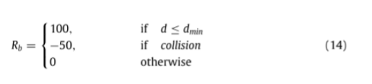

# Reward criteria impact on the performance ofreinforcement learning agent for autonomous navigation

**译文：** 

# 奖励准则对自主导航强化学习agent性能的影响

## **摘要：**

在强化学习中，主体在环境中的每个时间步采取行动（遵循策略）以最大化期望的累积奖励。因此，奖励函数的形成对智能体的学习起着至关重要的作用。设计一个最优的奖励函数不是一项简单的任务。在这篇文章中，我们提出了一个奖励标准，并利用这个标准建立了不同的奖励函数。所选择的奖励标准基于代理所接收的正面和负面奖励的百分比。这个奖励标准进一步产生了三个不同的类，“平衡类"、”偏正类“和”偏负类“。我们使用不同的奖励等级来训练深度Q网络代理执行基于点目标的导航任务。我们还将所提出的类与基准类进行了性能比较。基于实验，偏负类通过实现非常小的方差而优于基准类。另一方面，基准类比偏斜负类收敛得相对更快。

**关键词：** 深度强化学习，奖励评估，自主导航，机器学习与人工智能

## **第一部分、引言**

 

近年来，深度强化学习，（DRL）已经在许多游戏中实现了最先进的性能，即“星际争霸2”游戏[1]、"围棋“游戏[2]、”雅达利“游戏[3]等。DRL算法在这些游戏中的成功激励人们将最先进的算法应用于大量不同的领域，如”自动驾驶汽车“[4]、“无人驾驶航空器”[5]、“可再生能源”[6]等。日间行车灯算法在所有这些领域的性能优于几乎所有现有方法。因此，在几乎各行各业中遇到日间行车灯算法是迫在眉睫的。

几乎每个日间行车灯代理（算法）的核心思想是使其从环境中获得的预期贴现回报（V值函数）最大化，如公式(1)，[7]。这一核心思想驱使任何DRL代理在每个时间步选择最优动作，从而遵循最优策略。与许多深度学习算法一样，没有单一的优化方法来定义应该给予什么奖励值以及正面奖励和负面奖励的比例应该是多少。因此，这提出了一个关键问题，特别是在奖励稀少的情况下。为了克服这个问题，人们通常通过塑造奖励函数来使用密集奖励[8]。

如前所述，日间行车灯代理人的主要目标是最大化其折现回报，所以最关键的问题是如何形成奖励函数？在这篇文章中，我们没有直接提出一个奖励函数，而是提出了一个奖励准则，并利用它来建立奖励函数。所提出的奖励标准是基于奖励塑造函数中正面奖励和负面奖励的比例。该奖励标准进一步产生三个不同的等级：“平衡类”、“偏正类”和“偏负类”。然后，我们分析了这些类别中的每一个对强化学习代理在自主导航任务中的性能的影响。我们使用“深度Q网络”训练我们的智能体执行基于点目标的导航任务，并在Gazebo模拟器中进行所有实验。我们还将提议的奖励函数与最先进的奖励函数进行了比较[9]。

本文进一步安排如下：第2节讨论了之前在此方向上所做的工作，第3.1节讨论了培训中使用的深度学习模型，第3.2节讨论了使用的各种奖励函数，第5节讨论了实验设置，第6节显示了结果，最后，我们在第8节中以结论结束了本文。

## **第二部分、相关工作**

如前一节所述，奖励分配在训练RL代理中起着至关重要的作用。如果奖励分配是稀疏的，则这种训练可能变得缓慢或陷入次优。一些工作已经集中于通过塑造奖励函数来提供密集奖励以克服稀疏奖励的这个问题。A.Laud等人[8]解释了最优政策对回报水平的强依赖性，也说明了回报塑造的潜力。M.Grez等[10]提出了使用潜在函数作为奖励函数，并分析了正潜在函数和负潜在函数的影响。使用高斯函数作为报酬函数是由L.Matignon等人[11].

在更近的时间，在深度强化学习的时代，已经采取了几种不同的方法来解决稀疏奖励的问题。Zijian HU等人[12]使用了奖励突变，即上一个动作的奖励与当前奖励相差很大的现象。奖励函数也已经从不同的轨迹中成形，这些轨迹是使用工作Q中的匹配网络从类似的任务中采样的。Zhang等[13].N的。Botteghi等人[14]提出使用环境地图的在线知识来使用Rao-Blackwellized形成奖励。H。van Seijen等人[15]使用混合奖励体系结构，该体系结构将奖励函数分解为更小的分量，并学习与每个分量相关联的单独的价值函数。在另一种方法中，奖励函数由专家的示范来形成。H。B.Suay等人[16]使用逆强化学习从所收集的演示数据中恢复线性函数。该线性函数进一步用于形成基于潜力的奖励函数。A.提出了另一种类似的方法。Hussein等人[17]，其中深度监督卷积神经网络被训练以根据所展示的数据来形成基于潜力的奖励函数。D.Kimura等人[18]提出了从专家演示的状态轨迹观察中学习内部模型，以估计奖励函数。奖励函数也是使用H.Zou等人[19]。[B.de](http://B.de) Villiers等人[20]在情节环境中情节结束后及时向后发送折扣的终末期状态奖励值。这些成形的奖励然后被存储在体验重放缓冲器中。

RL代理还交互地接收来自人类专家的奖励。W.B.Knox等人[21]使用基于人的奖励、贴现率、发作性、任务表现和最终目标之间的关系进行了讨论。A. Najar等人[22]提出了一个新的框架，使用无标签的人类指令来塑造奖励。A. Camacho等人[23]提出了一种新的奖励规范形式化语言。

上述所有工作都使用不同的方法来解决稀疏报酬问题，但是最优报酬准则仍然没有被探索。为了克服这一问题，本文提出了一个报酬准则，并利用该准则建立了报酬函数。

## **第三部分、方法**

在本节中，我们深入分析了基于奖励标准开发的奖励函数如何影响强化学习（RL）代理的性能。我们考虑了六种不同的奖励函数，每一种属于不同的奖励准则，并在Gazebo模拟器上对基于点目标的导航任务进行了实验。整个拟议方法的顶层视图如图1所示

### **3.1 模型**

我们训练深Q网络（DQN）代理，其灵感来自[24]，基于点目标的导航任务。该任务是间歇性的，DQN代理的主要目标是使其预期折扣回报最大化，（Q值函数）如公式(2)，这是"V-值函数"（"V π"）的变体，根据等式（1）.在方程式中(1)和（2），"γ"是折扣因子，"T"是终端步骤，"R"是代理在每个时间步骤收到的报酬，"s"是环境的状态，"a"是代理采取的行动，"π"是代理遵循的策略。DQN代理由两个主要模块组成：感知和学习模块。

#### **3.1.1感知模块**

在该模块中，代理使用三层完全连接的神经网络来从所提供的输入数据（状态空间）中提取学习的表示。对于基于点目标的导航任务，输入数据包括28个维度、24个光检测和测距（LiDAR）数据值以及4个任务特定值。模型架构如图2所示，并在表1中进行了描述。

#### **3.1.2学习模块**

感知模块输出5 Q值的每个对应五离散行为可能为给定的任务。然后我们使用这些“Q值”来训练我们的代理根据贝尔曼方程(3),损失函数和更新规则DQN代理使用的方程式所示。(4)和(5),分别。

在等式（3）、（4）和（5）中，Q函数由θ和θ ′,参数化，s是代理在每个时间步接收的输入数据，a是代理在每个步骤采取的动作，s′是代理在采取动作之后到达的下一个状态，ai是DQN代理在状态s′中可以采取的所有可能动作。用于折扣的γ值为0.995。我们使用学习率为0.0025的RMSProp优化器来训练我们的模型。我们还使用了0.99的“ε衰减”，它控制了代理探索环境的速率。整个学习过程如图3所示

### **3.2奖励评估标准**

如前所述，DQN代理的主要目标是最大化其在每集的预期回报。因此，代理人如何获得奖励是至关重要的，并会影响代理人的行为。代理人在我们的任务中获得两个奖励的算术和，即"距离奖励"和"角度奖励"。"距离奖励"帮助代理人获得以米为单位测量的与目标的接近程度的反馈，而"角度奖励"告诉代理人以相对于目标的程度为单位测量的方向。本文根据正报酬和负报酬在报酬函数中所占的百分比定义了一个报酬准则。基于这个标准，我们可以将任何报酬函数分为三类："平衡类"、"偏正类"和"偏负类"。使用这个奖励标准，我们开发了六个不同的奖励函数，每个类两个。

#### **3.2.1平衡类**

在这个类别中，代理人在每集获得等量的正面和负面奖励（各50%）。为了表示这种行为，我们选择下面的等式（6）和（7）分别作为“距离奖励”和“角度奖励”的奖励函数。

在方程式(6)，"Dc"是从代理的位置到目标的坐标的当前欧几里德距离。'Dg'是代理的位置和目标的坐标之间的初始欧几里得距离。"Dc"在每次发作开始时等于"Dg"，并迭代更新其值，直到达到最终时间步长。公式中的x值(6)值域为（0，α]。在我们的任务中，我们设α的值等于2。因此，距离奖励遵循公式(6)在直径为"α"（2 ※ Dg）的圆内，在该圆外等于"-1"，如图4所示。在方程式(7)，'θ t'是每个时间步的主体方向（如图5所示的'Ω'）与连接主体位置和目标坐标的直线的角度（如图5所示的'φ'）之间的差值。公式中x的范围(7)为[0，1]

#### **3.2.2斜正类**

在这个类别中，代理人收到的奖励是积极的多于消极的（28%的积极奖励和72%的消极奖励）。为了概括这种行为，我们选择两个等式（8）和（9）分别作为“距离奖励”和“角度奖励”的奖励函数。

如图4所示的距离奖励遵循公式(8)在直径“α”等于2的圆内和圆外，接收的奖励是“-1”。公式中x的范围(8)和（9）分别是（0，α）和[0，1]。

#### **3.2.3斜负类**

在这个类别中，代理人收到的负面奖励多于正面奖励。为了捕捉这种行为，我们选择两个等式（10）和（11）分别作为“距离奖励”和“角度奖励”的奖励函数。为了保持正奖励与负奖励之比类似于斜正类之比的倒数，我们将等式(10)和（11）当它们各自的“z”值大于或等于0时乘以2。在这个乘法之后，这个类的正奖励和负奖励的百分比分别是22%和78%。

奖励如图4所示的距离遵循Eq。(10)内圆直径的α等于2,给一个奖励' -1 '外圆。方程式的x值。(10)和(11)的范围(0,α]和[0,1]。

用于“距离奖励”和“角度奖励”的所有奖励函数如图6所示。表2中示出了每个类别的正面和负面奖励的百分比。因此，对于给定的任务，奖励系统遵循等式：（12）和（13）

在方程式(12)，"Rd"是"距离奖励"，"Ra"是"角度奖励"，"yd"和"ya"值取决于所使用的奖励函数。

## **第四部分、基准模型**

在本文中，我们使用[9]中提出的报酬函数作为基准模型。本文提出了一种在无地图环境下训练的导航模型。它们还激发了在现实场景中以及当提供给代理的映射被破坏时对这样的代理的需求。基准测试论文的实验设置与我们的设置类似，因为这两个环境都不使用任何地图来导航代理。无地图的奖励函数如（14）所示。

在上述等式（14）中，Rb是基准奖励，dmin是最小距离，低于该距离则认为代理到达目标，d是当前位置和目标位置之间的欧几里德距离，如（15）所示。

在（15）中，p x，y t是主体在时间t的当前位置，g是目标位置。

## **第五部分、实验**

我们训练我们的代理基于点目标的导航任务。在这个任务中，在每一个情节中，随机生成一个目标，并且代理的目标是导航到该目标以避免所有碰撞。代理的完整培训是在Gazebo模拟器中完成的。我们使用了一个Turtlebot3 Waffle Pi机器人作为RL代理。该机器人配备了“1D LiDAR”，它使用激光束扫描整个环境（360 °）。LiDAR扫描的输出是维度24的向量，其包括与以米为单位测量的机器人周围的物体的距离相对应的值。我们可以从这些值中提取以下两个与任务相关的信息：“最小障碍距离”和“最小障碍角度”。这26个值（24个LiDAR值和两个任务相关值）进一步与“到目标的距离”和“到目标的方位”值级联，并且最后的28个值被用作全连接神经网络的输入。在训练期间，RL代理必须在每一步从五个可能的动作中选择离散动作。所有五个动作都与机器人的角速度有关，并且线速度对于所有时间步长保持恒定在0.15m/s。对于此任务，表3中列出了代理可以采取的可能操作。

对于给定的任务，表4定义了代理在每个情节中可以接收的可能的奖励值，每个情节由至多500个时间步长组成。如果发生以下事件之一，则认为情节完成：代理与任何障碍物碰撞，代理到达目标坐标附近至少0.4m，或者代理完成500个时间步长。

代理的整个训练是在Nvidia Jetson AGX Xavier硬件设备上完成的，这是Jetson GPU加速设备家族中发布的最新版本。Jetson AGX Xavier拥有16 GB可共享RAM、512核Volta GPU和8核ARM CPU。图7示出了用于训练RL代理的Gazebo模拟的设置。在图7中，白色的圆柱形物体是障碍物，红色的圆形区域是目标坐标。

## **第六部分、结论**

DQN Agent使用所提出的三个奖励函数进行训练，并与基准奖励函数进行比较。我们使用两个指标比较奖励函数：累积奖励的变化和奖励收敛之前所需的episode数量。

### **6.1方差**

此度量表示训练期间代理性能的噪声程度。我们计算每个奖励函数的移动方差。方差的存在是因为我们如何让我们的代理人学习。如（3）中所示，我们基于在该时间步长收集的奖励和对状态未来状态的估计来更新状态的Q值。估计的未来状态本身不是最优的，因此组合多个这样的未来状态来预测当前状态值导致噪声估计。此外，我们将折扣因子"γ“设置为0.99，这也会增加噪声。此因子指示要展望多远的未来，值高表示应考虑许多未来状态。所有奖励函数的移动方差如图8所示。我们可以通过计算观察到的最大和最小方差之间的比例差来量化这个度量。如（16）所示完成此操作。

在（16）中，Varp是方差的比例增加，Maxvar和Minvar分别是观察到的最大和最小方差。

### **6.2episode的数量**

机器学习中的收敛通常被定义为当模型的进一步训练没有改善其性能时。在本节中，我们通过绘制所有奖励函数的累积奖励与情节计数的关系图来定义一个类似的指标。尽管我们证明了所有报酬函数的收敛性，但代理收敛的值并不是最优的。这将在局限性部分进一步解释。我们在图9中画出了所有奖励函数在每集获得的累积奖励。

如两个图8和图9所示，我们报告了表5所示的以下观察结果。

在表5中，对于平衡类，虽然我们观察到最小方差和可比较数值的episode次数，直到收敛，但我们不认为这是博学的代理。这是因为与其他职业相比，该职业的移动平均累积奖励是一致的。这在第1500集中也很明显，其中平均值再次下降。在剩余的三个类中，尽管“基准类”收敛最快，但它也具有最高的方差。类似地，尽管“偏负类”具有非常小的方差，但与“基准类”相比，其收敛相对较慢。

## **第七部分、限制**

虽然我们在这项工作中显示了不同类别的收敛性，但代理收敛的回报不是最优值。这是由于所采用的学习算法。DQN代理学习缓慢，通常由于样本复杂性或者代理学习好策略所需的样本数量限制。这是由于两个因素：目标网络的延迟更新和较大的重放缓冲器大小[25]。

## **第八部分、结论**

本文分析了在自主导航任务中奖励准则对强化学习Agent性能的影响。所选择的奖励标准是代理所接收的正面和负面奖励的百分比。基于这一准则，我们得到了三个类，并在每个类中选择了两个报酬函数。我们比较了一个代理的表现与各种奖励函数类训练的基准类。我们还使用两个指标比较了每个类的性能：“方差”和“收敛前的发作次数”。该分析发现，斜负类类训练的方差非常小，但与基准类相比，在相对较高的发作次数处收敛。在未来的工作中，我们将实作各种学习算法，例如优势行动者-批判、邻近策略最佳化，以及其他的算法，以改善代理人的平均累积报酬。

## **CREdiT作者贡献声明**

艾文·达亚尔：概念化，数据管理，方法论，软件，可视化，验证，写作-初稿，写作-审查和编辑。林加·雷迪·森克拉马迪：概念化、形式化分析、资金获取、调查、方法论、项目管理、资源、写作----初稿、写作----审查和编辑、监督。Ajit Jha：形式分析，写作-审查和编辑，监督.

## **竞合利益声明**

作者声明，他们没有已知的可能影响本文所报告工作的竞争性经济利益或个人关系。

## **承认**

这项工作得到了印度-挪威自主网络物理系统合作项目的支持：287918和低空无人机通信和跟踪（LUCAT）项目：280835，来自挪威研究理事会的IKTPLUSS计划。

## **参考文献**

[1] O. Vinyals, I. Babuschkin, W. Czarnecki, M. Mathieu, A. Dudzik, J. Chung,D. Choi, R. Powell, T. Ewalds, P. Georgiev, J. Oh, D. Horgan, M. Kroiss,I. Danihelka, A. Huang, L. Sifre, T. Cai, J. Agapiou, M. Jaderberg, D. Silver,Grandmaster level in StarCraft II using multi-agent reinforcement learning,Nature 575 (2019) 350–354, http://dx.doi.org/10.1038/s41586-019-1724-z.

[2] D. Silver, A. Huang, C. Maddison, A. Guez, L. Sifre, G. Driessche, J.Schrittwieser, I. Antonoglou, V. Panneershelvam, M. Lanctot, S. Dieleman,D. Grewe, J. Nham, N. Kalchbrenner, I. Sutskever, T. Lillicrap, M. Leach,K. Kavukcuoglu, T. Graepel, D. Hassabis, Mastering the game of Go withdeep neural networks and tree search, Nature 529 (2016) 484–489, http://dx.doi.org/10.1038/nature16961.

[3] V. Mnih, K. Kavukcuoglu, D. Silver, A. Graves, I. Antonoglou, D. Wierstra,M.A. Riedmiller, Playing atari with deep reinforcement learning, 2013,CoRR abs/1312.5602 arXiv:1312.5602 URL http://arxiv.org/abs/1312.5602.

[4] B.R. Kiran, I. Sobh, V. Talpaert, P. Mannion, A.A.A. Sallab, S. Yogamani,P. Pérez, Deep reinforcement learning for autonomous driving: A survey,2020, arXiv:2002.00444.

[5] M. Zhu, X. Liu, X. Wang, Deep reinforcement learning for unmanned aerial vehicle-assisted vehicular networks, 2019, CoRR abs/1906.05015 arXiv:1906.05015 URL http://arxiv.org/abs/1906.05015.

[6] F. Tolovski, Advancing renewable electricity consumption with reinforce-ment learning, 2020, arXiv:2003.04310.

[7] V. François-Lavet, P. Henderson, R. Islam, M.G. Bellemare, J. Pineau, An introduction to deep reinforcement learning, 2018, CoRR abs/1811.12560 arXiv:1811.12560 URL http://arxiv.org/abs/1811.12560.

[8] A. Laud, G. DeJong, The influence of reward on the speed of reinforcement learning: An analysis of shaping, in: Proceedings of the 20th International Conference on Machine Learning (ICML-03), 2003, pp. 440–447.

[9] M. Dobrevski, D. Skočaj, Deep reinforcement learning for map-less goal-driven robot navigation, Int. J. Adv. Robot. Syst. 18 (1) (2021) 1729881421992621.

[10] M. Grzes, D. Kudenko, Theoretical and empirical analysis of reward shaping in reinforcement learning, in: 2009 International Conference on Machine Learning and Applications, 2009, pp. 337–344, http://dx.doi.org/10.1109/ ICMLA.2009.33.

[11] L. Matignon, G. Laurent, N. Fort-Piat, Reward function and initial values: Better choices for accelerated goal-directed reinforcement learning, in: International Conference on Artificial Neural Networks, Springer, Berlin, Heidelberg, 2006, http://dx.doi.org/10.1007/11840817_87.

[12] Z. Hu, K. Wan, X. Gao, Y. Zhai, A dynamic adjusting reward function method for deep reinforcement learning with adjustable parameters, Math. Probl. Eng. (2019) 10, http://dx.doi.org/10.1155/2019/7619483.

[13] Q. Zhang, M. Zhu, L. Zou, M. Li, Y. Zhang, Learning reward function with matching network for mapless navigation,Sensors 20 (2020) 3664, http://dx.doi.org/10.3390/s20133664.

[14] N. Botteghi, B. Sirmaçek, K.A. Mustafa, M. Poel, S. Stramigioli, On reward shaping for mobile robot navigation: A reinforcement learning and SLAM based approach, 2020, arXiv abs/2002.04109.

[15] H. van Seijen, M. Fatemi, J. Romoff, R. Laroche, T. Barnes, J. Tsang, Hybrid reward architecture for reinforcement learning, 2017, CoRR abs/1706. 04208 arXiv:1706.04208 URL http://arxiv.org/abs/1706.04208.

[16] H.B. Suay, T. Brys, M.E. Taylor, S. Chernova, Learning from demonstration for shaping through inverse reinforcement learning, in: Proceedings of the 2016 International Conference on Autonomous Agents & Multiagent Systems, in: AAMAS ’16, International Foundation for Autonomous Agents and Multiagent Systems, Richland, SC, 2016, pp. 429–437.

[17] A. Hussein, E. Elyan, M.M. Gaber, C. Jayne, Deep reward shaping from demonstrations, in: 2017 International Joint Conference on Neural Net-works (IJCNN), 2017, pp. 510–517, http://dx.doi.org/10.1109/IJCNN.2017. 7965896.

[18] D. Kimura, S. Chaudhury, R. Tachibana, S. Dasgupta, Internal model from observations for reward shaping, 2018, CoRR abs/1806.01267 arXiv:1806. 01267 URL http://arxiv.org/abs/1806.01267.

[19] H. Zou, T. Ren, D. Yan, H. Su, J. Zhu, Reward shaping via meta-learning, 2019, CoRR abs/1901.09330 arXiv:1901.09330 URL http://arxiv.org/abs/ 1901.09330.

[20] B. de Villiers, D. Sabatta, Hindsight reward shaping in deep reinforce- ment learning, in: 2020 International SAUPEC/RobMech/PRASA Conference, 2020, pp. 1–7, http://dx.doi.org/10.1109/SAUPEC/RobMech/PRASA48453. 2020.9041058.

[21] W.B. Knox, P. Stone, Framing reinforcement learning from human reward: Reward positivity, temporal discounting, episodicity, and perfor-mance, Artificial Intelligence 225 (2015)24–50,http://dx.doi.org/10.1016/j.artint.2015.03.009,URL http://www.sciencedirect.com/science/article/pii/ S0004370215000557.

[22] A. Najar, O. Sigaud, M. Chetouani, Interactively shaping robot behaviour with unlabeled human instructions, 2019, CoRR abs/1902.01670 arXiv: 1902.01670 URL http://arxiv.org/abs/1902.01670.

[23] A. Camacho, R. Icarte, T. Klassen, R. Valenzano, S. Mcilraith, LTL and be-yond: Formal languages for reward function specification in reinforcement learning, 2019, pp. 6065–6073, http://dx.doi.org/10.24963/ijcai.2019/840.

[24] V. Mnih, K. Kavukcuoglu, D. Silver, A. Rusu, J. Veness, M. Bellemare, A. Graves, M. Riedmiller, A. Fidjeland, G. Ostrovski, S. Petersen, C. Beattie, A. Sadik, I. Antonoglou, H. King, D. Kumaran, D. Wierstra, S. Legg, D. Hassabis, Human-level control through deep reinforcementlearning,Nature518 (2015) 529–533, http://dx.doi.org/10.1038/nature14236.

[25] Z. Yang, Y. Xie, Z. Wang, A theoretical analysis of deep Q-learning, 2019, CoRR abs/1901.00137 arXiv:1901.00137 URL http://arxiv.org/abs/ 1901.00137.

