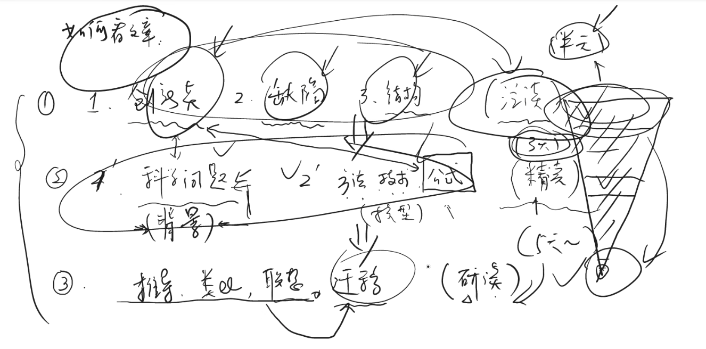
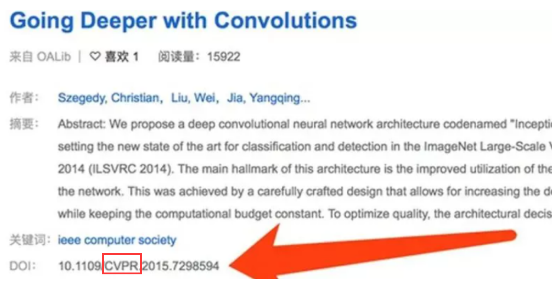
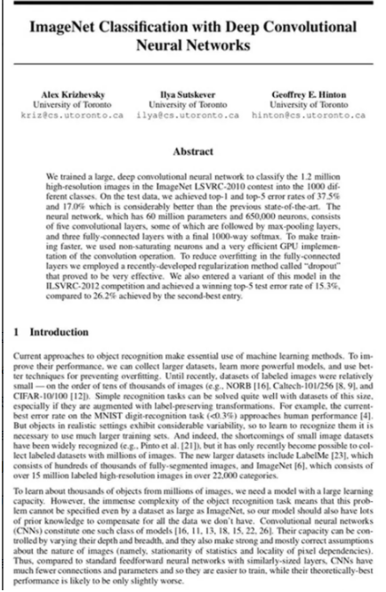

# 产出一篇论文的各个步骤

## 来自花老师的建议--实用

**如何看论文：**
（前提：优秀论文，如**顶会论文/杂志**，了解顶会是那些，召开时间是什么时候）

1. 创新点

2. 记录下来说过的别的文章/方法的缺陷 -- 看文章就是看优点/指出的其他文章的缺陷 

3. 看文章的结构 -- 文章的哪几块分别在做什么 

    ---------------------------------以上三点是第一阶段**：泛读**---------------------------------------------------
    
4. 论文讨论的科学问题（背景），科学问题：有必要用代码实现的可研究问题。-- 问题的提出

5. 看论文中提出的具体的”方法“、”技术“、”公式“（模型），创新点和这部分有很大关系。-- 模型求解

    ---------------------------------以上两点是第二阶段：**精读**---------------------------------------------------
    
6. 所读论文中自己可能会用到的详细”推导“、”类比“、”联想“、”迁移“

    ---------------------------------以上一点是第三阶段：**研读**---------------------------------------------------
    
    **最终的实际阅读的量从上到下应该是--倒金字塔**
    
    **实际耗费时间可能是：泛读（半天）、精读（两天）、研读（五天）**
    
    ------------------------------泛读大量文章之后**总结相关领域的常用模型**---------------------------------
    
    **之后就是如何读文章、如何写文章**

## 目录

1. 如何选择论文
2. 查找论文的几个常用网址
3. 如何筛选优质论文
4. 如何精确查找已知论文
5. 如何管理论文
6. 如何阅读一篇论文
7. 论文paper学习路径

## 一、如何选择论文

### 1.综述论文

**综述论文**是对某一领域的研究历史和现状的相关方法、算法进行汇总，对比分析，同时分析该领域未来发展方向。

所以，综述论文是适合入门一个新领域的首选，刚接触一个新领域，首先要读的就是综述类的论文。

### 2.专题论文

就是具体的**算法**、**模型**的提出。有了相关基础知识，我们就可以进入具体算法论文当中去学习其设计思路，实验技巧，代码实现等具体技术。但深度学习技术发展之快，每天都有成千上百的新论文，难免鱼龙混杂。所以需要挑出质量高的论文。读上百篇低质论文，不如精通一篇高质量论文。

所以，如何选择高质量的论文,我们可以从以下几个方面入手：

1. 选择**高质量期刊会议**：CVPR、ECCV、ICCV、AAAI、NIPS、ICLR、ICML等
2. 选择**高引论文**：同行间普遍认可，参考，借鉴的论文高引论文表明了这篇论文中的方法在该领域内非常重要，这也是你在选择论文时一个非常重要的参考要素
3. 选择**知名团队**：因为知名团队的论文质量相对较高，例如 Yoshua Bengio、Yann LeCun、Geoffrey Hinton、 Andrew Ng等
4. 选择**有代码论文**：我们都知道 Talk is cheap.Show me the code。这句经典名言。有代码复现的论文，不仅质量有保证的，在你实操复现的过程中，才能得到及时的反馈和收获。毕竟很多论文的实验结果无法复现，那么我们读了可能也没什么作用。

## 二、如何查找论文

### 1.论文查询网站

1. 推荐一个实用网站：[paperwithcode](https://paperswithcode.com/)，上面收集了大量论文及其代码实现，大家可以在上面寻找论文去阅读。
2. 或者看之前我整理的查询论文网站的笔记：[整理好的查询论文网站](https://github.com/lyc686/blog/blob/main/notes/%E6%9F%A5%E8%AE%BA%E6%96%87%E7%9A%84%E7%BD%91%E7%AB%99.md)。

### 2.对于未知论文题目的论文，如何进行检索？

一般来说，我们只有**关键词**，想通过关键词来寻找相关论文来阅读，那么我们可以通过以下4种方法：

1. 通过**知网**寻找优质综述，快速入门，并通过参考文献收集大量论文题目
2. 通过**搜索引擎**，这里常用的有百度学术和google scholar，这些搜索引擎上能找到大量的相关论文
3. 通过**arXiv**预印本平台。现在大多数论文在发表之前都会先公布到arXiv上占坑。这是由于技术发展之快，论文等不到见刊，就需要先公诸于世，让大家先看到这个方法是作者提出来的。
4. 到**顶会**中搜索相关关键词，紧跟技术发展。

## 三、如何筛选优质论文

评判期刊优质的方法是看期刊影响因子。

1. **期刊影响因子**是大家公认的期刊质量评判指标，它的计算方式是：采用期刊前N年发表的论文被引数除以前N年发表的论文数，通常N=2或N=5。
2. 除了看IF，更方便快捷的方法也可以看期刊的分区，一区优于二区，二区优于三区，以此类推。在这里我们需要知道，分区的方式主要有两种，一种是JCR，一种是中科院。JCR是国际通用的方式，而中科院的方式仅在中国适用。

## 四、如何精确查找已知论文

### 1.sci-hub

这里给大家安利一个能绕过科研论文收费的神奇网站——**sci-hub**（注意：由于它这个神奇的功能，所以它的网址经常需要变动。）

1. 打开网站，我们可以搜索URL，PMID，DOI或字符串就可以打开论文，进行阅读，下载。（PMID是PubMed中收录的文献编号，并且是唯一的。DOI是数字对象标识符，每一篇论文都有这个编号，相当于论文的数字身份证，我们可以通过DOI快速的锁定论文。）
2. 举个栗子，从下面图中我们可以看到，这篇论文都出自CVPR

### 2.百度学术

**百度学术**的文献互助功能。通过搜索，点击求助文献，等待有资源的朋友上传论文就可以了。这个功能还是比较实用，比较快捷的。

### 3.其他领域+顶会

**知网**：寻找优质综述，快入入门
**google scholar**：[scholar.google.com](http://scholar.google.com/) 构建知识体系
**arXiv**：[arxiv.org]([arXiv.org e-Print archive](https://arxiv.org/)) 论文预印本（preprint）平台
关注**顶会**：CVPR、ECCV、ICCV、AAAI、NIPS、ICLR、ICML等

在人工智能领域，除了大家最为熟知的最核心的**四大顶会**AAAI、IJCAI、ICML和NeurIPS，以及作为**计算机视觉和自然语言**为代表的CVPR和ACL这两大学术会议，也涌现了许多“后起之秀”，比如仅创立六年却有**深度学习顶会“无冕之王”**之称的ICLR，还有创办于1996年的大有赶超ACL之势的自**然语言处理领域顶会**EMNLP，这些“新星会议”的崛起，使得AI领域的会议呈现出亮点纷呈、多面开花的局面。**CCF 国际学术刊物推荐目录**，2019年，中国计算机学会(CCF)日前完成了《[中国计算机学会推荐国际学术会议和期刊目录](https://www.ccf.org.cn/Academic_Evaluation/By_category/)》第五版审定。将国际计算机类刊物和会议分为10个领域，每个领域分别选出期刊和会议的A、B、C三类，也就是大家说的CCF-A和CCF-B。

参考博客：[人工智能顶刊顶会有哪些](https://blog.csdn.net/sh_0001/article/details/127955740)

## 五、如何管理论文

### 1.通过命名进行管理

PDF格式论文通过命名进行管理。推荐两种命名格式：**时间-作者-题名**的方式， 或者**时间-关键词-题名**的方式。

### 2.按作者进行管理

将**同一个作者的同一个研究进行归类**，可以清晰的看出这个研究的发展。除了规范的命名，我们还需要将同类的论文放到同一个文件夹中，方便我们查找。

### 3.论文管理软件

论文管理软件：如果涉及成百上千的论文管理，那么推荐使用论文管理软件。

常用的有**endnote，mendeley，Zotero**等等，大家可以根据需要自行下载安装管理软件。【这里提醒大家，endnote是收费的，mendeley是免费的，它可以很好的管理大量的论文。】

## 六、如何阅读一篇论文

首先，不同的人看论文**侧重点**不同：

### 1.刚入门的学员

**刚入门**的学员，这一类同学主要目的是学习论文中的知识点，所以要求面面俱到，尽量每个细枝末节都要学。

### 2.工业界中的工程师

对于**工业界中的工程师**，则需要注重算法实现部分，要快速的从论文中知道如何复现算法，应用到自己的项目当中。

### 3.推荐的论文阅读方法

分为三步，首先 **泛读**，再**精读**，最后**总结**。再加上**验证**。

1. **泛读**：这里泛读的作用就是快速浏览，把握概要，如同吃火锅一样，一大桌菜，我们先看看桌上有哪些菜，哪些菜是要吃的，哪些是不吃的。比如，火锅底料我们就是不吃的啦~泛读阶段，我们重点读标题、摘要、结论以及所有的小标题和图标。

例如：CV领域经典论文Alexnet处理ImageNet图像分类数据集。

这是一篇CV领域非常经典的论文Alexnet，我们先看题目，题目是Imagenet classification with deep convolutional neural networks，从题目我们知道这论文用深度卷积神经网络来做图像分类任务。

接着阅读**摘要**，我们可以了解论文的概要，清楚论文采用什么方法，解决什么问题，达到什么效果。

接着我们要把论文所有的**小标题**给列出来，将论文大卸八块，了解论文都有哪些内容，就像前面那一桌子火锅，我们要先浏览每一个盘子里装的是什么菜。

接着还要把论文的**结论**，所有的图片和表格进行浏览，更近一步了解论文中有哪些论证，举例，内容说明。

* 在泛读之后，我们要达到的水平就是能回答以下这三个问题，这样才能算泛读完成。

  * 第一问题，论文要解决什么问题？回想摘要我们就知道它是像要解决ILSVRC挑战赛中的分类任务。

  * 第二个问题，论文采用了什么方法？那么这篇论文采用了什么方法呢？其实在题目中就告诉我们了，采用的是深度卷积神经网络。

  * 第三个问题，论文达到什么效果？从摘要我们也能知道，论文在ILSVRC2012比赛中以15.3%的top5 error夺冠 

2. **精读**：泛读完成之后，对论文总体有了把握，接下来就是挑选精华部分进行阅读。前面提到在校生与工程师读论文之间是有差异的，更具体地就体现在精读部分。

   * 对于学员来说，要学习更多知识，做到面面俱到，那么论文中的所有内容都是你的精华，都需要仔细阅读，仔细去品。

   * 对于工程师而言，目标就是找到算法实施部分，了解算法如何实现，以及其中有哪些技巧，更偏工程的看待论文。对于精读完成后，我们要能够对所读段落了如指掌。这样才算完成精读。

3. **总结**：经过泛读精读，最后需要对论文进行总结。总结是对论文的创新点、关键点和启发点进行摘抄记录。对于有写论文发论文需要的同学来说，这一步是至关重要的，对论文的总结是为课题提出创新点打下基础。 总结部分也是仁者见仁，在校生需要总结一切与写论文发论文有关的信息句子，对于工程师，可能更多的是总结算法实现的参数，步骤，实验细节等
4. **验证**：完成论文三步曲之后，我们需要对阅读效果进行一个验证。验证的方法其实很简单，就是回答三个终极问题，你是谁，从哪里来，到哪里去 最后也要知道这篇论文有哪些是可以借鉴的。最后，我们来看看论文结构，要知道论文都有哪些内容构成，每一部分会有什么信息。

* 这里总结为6个部分：

  * 摘要，摘要主要讲论文简介，阐述工作内容，创新点，效果

  * 引言部分介绍研究背景，研究意义，发展历程，提出问题

  * 相关工作相关研究算法简介，分析存在的缺点

  * 本文工作论文主要方法，实现细节

  * 实验部分，介绍算法实现步骤及结果分析 

  * 探讨部分，论文结论及未来可研究方向

## 七、Paper学习路径

如何更高效地阅读论文，并通过论文熟悉某个方向领域呢？学习论文是一个系统性的工程，如何更高效地阅读论文，并通过论文熟悉某个方向领域呢？这就需要合理的学习路径。

### 1.基础知识

第一点，基础必不可少。这里总结了必备的基础知识，我们来看一下：

* Python基础：这是毋庸置疑的必备基础，我们后边代码实现就是基于python语言。

* 数学基础：包含矩阵计算、概率论和信息论，矩阵计算在CV领域是必备知识，概率论与信息论在NLP中也是常见的概念。

* 神经网络基础：由于深度学习属于神经网络，因此神经网络的内容必须要了解，特别地，对于CV领域CNN是很重要的，大多数CV任务已经被CNN统治，对于NLP领域而言，RNN是必不可少的知识。

* 深度学习框架PyTorch：除了理论基础，实践的基础就是现在最热门的深度学习框架PyTorch，我们需要了解如何利用pytorch实现数据读取，数据增强，如何构建模型，如何设置损失函数优化器等等。而且PyTorch是现在最适合新手入门的框架，代码简洁易读懂，并且目前最前沿的技术，论文，大多数都有pytorch的实现，学会pytorch可以快速的紧跟前沿技术。

### 2.方向选择

第二点，有了理论和实践的基础，就要针对CV和NLP两个方向进行选择。

CV和NLP有着各自领域基础，大家要根据自己方向进行基础知识的巩固学习。

* 对于CV领域，我们需要知道图像基础知识，图像的基本处理方法等等内容。

* 对于NLP方向，我们需要了解什么是词袋，分布特征是什么，tfidf权重，等基础知识。

### 3.论文baseline

第三点，那我们巩固好理论、实践、方向领域上的基础之后，就可以进入论文的baseline 

* cv方向，你应该选择领域内引用高，同行间普遍熟知的论文，包含alexnet vggnet googlenet resnet等等。

* NLP方向的baseline，你应该选择开创性、引用高和应用到实际业务的论文，主要覆盖词向量、nlp深度学习主流框架和应用，预训练模型等主流方向，做到兼顾科研和工业应用平衡。

### 4.自主选择专题论文

第四点，熟悉了baseline论文，就算是入了门，就可以根据自己研究方向及感兴趣的方向选择性的学习专题论文。

对于CV常见的有OCR、GAN、知识蒸馏、目标检测、图像分割等等。对于NLP有文本分类，句子匹配，关系抽取等等。从中找到你想要研究的专题是很重要的，如果你在初期阶段，对细分专题没什么概念，你也可以初步都学习了解一下，找到自己感兴趣的专题，针对特定研究方向，深入学习。
