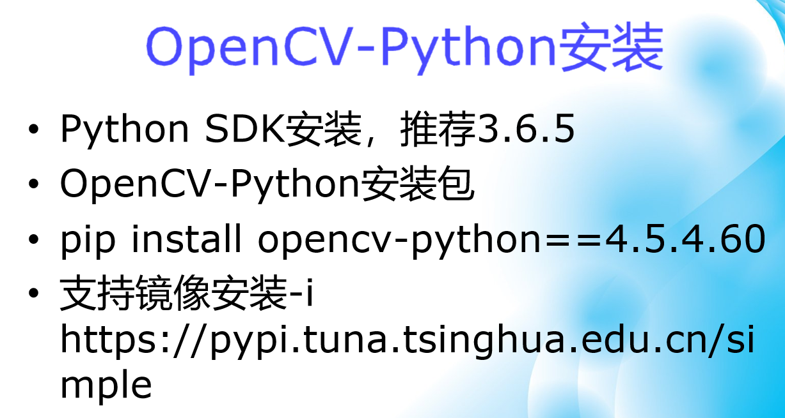
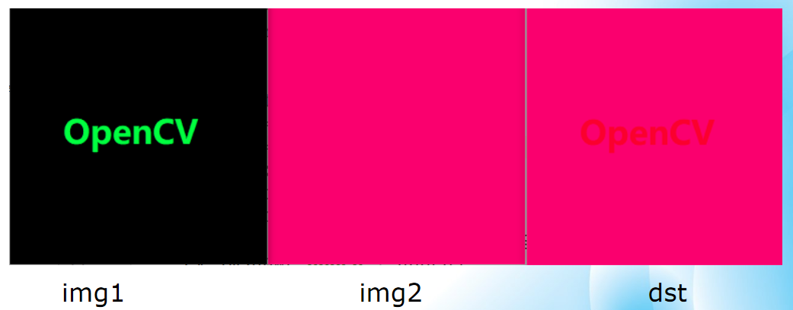
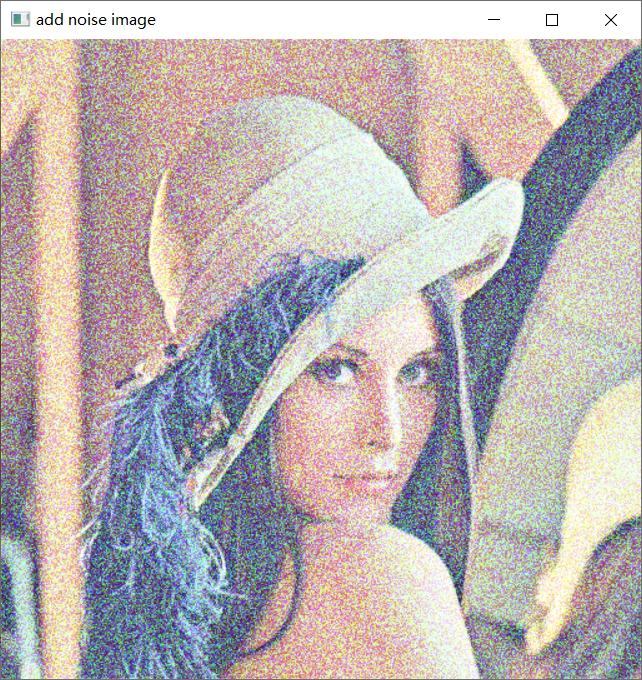
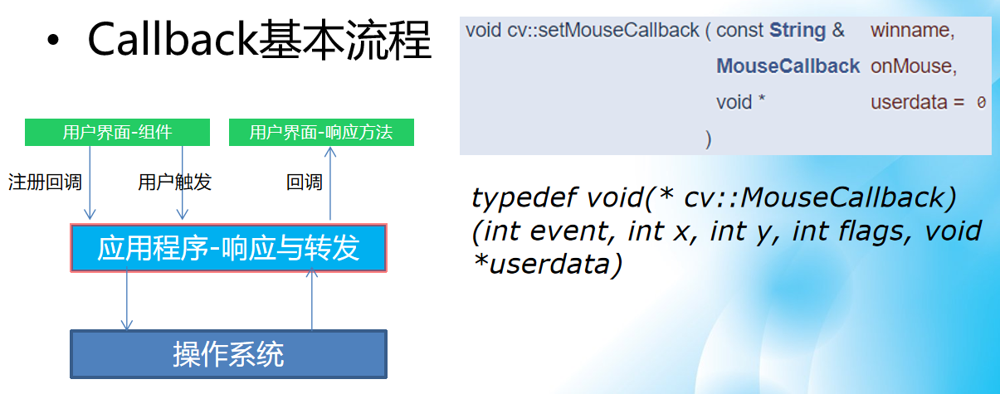
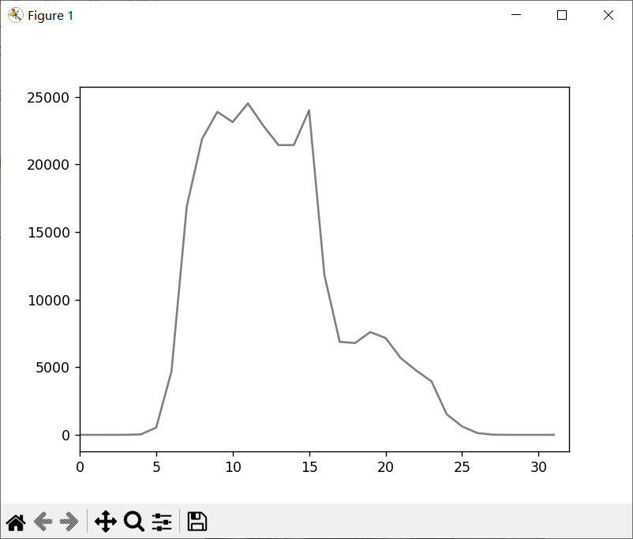
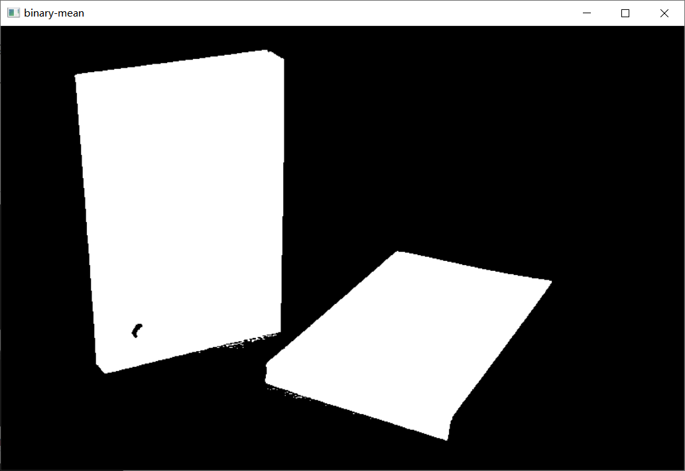

# 计算机视觉OpenCV

## 第一部分、绪论

### 1.计算机视觉发展历史

***

计算机视觉的发展从古代**小孔成像**，到近现代的**相机**，再到后来成为一个**正式学科**，计算机视觉其实就是两方面内容`重建`和`识别`。


Pascal VOC是一个做计算机视觉的基础数据集，包括图像分类，图像识别，语义分割等等。

2012年之后，人们逐渐讲计算机视觉迁移到了**深度学习**领域。

未来的世界肯定都是在`像素`中的，而这些都离不开计算机视觉。

### 2.计算机视觉的主要任务

***

早期，计算机视觉主要研究领域是**重建**。

2012年之后，计算机视觉在**感知**和**重建**两个领域受到了深度学习影响，快速发展。

目标是：通过`图灵测试`。（即，达到和人类视觉一模一样的感知和重建）

### 3.计算机视觉的应用场景

***

* 自动驾驶/辅助驾驶
* 机器视觉-AI+机构(主要是视觉的算法) / 工业质检智能
* 安防监控-人脸识别 / 火灾监控 / 异常监控 (主要是一些人不好去实现的监控，比如24h监控，火灾现场的监控)
* 其他更多行业(尤其在生物医药的细胞检测，病理切片等等应用非常广泛)

所以说计算机视觉已经从一个简单的学科，变到落地在千行百业。


## 第二部分、计算机视觉框架

我们如何把现在的计算机视觉的框架应用到我们的实际使用中来。

### 1.早期计算机视觉框架概述

***

`Matrox mil`在**机器视觉**领域至今依然很好用。

`Halcon`的框架也是做**机器视觉**非常好用的一个框架，到现在做一些机器视觉也很好用。

`Opencv`到现在已经集成了很多的传统框架，而且是**开源**的。

`VisionPro`也是现在很常用的一个机器视觉的框架。

<font color="blue">注意：只有OpenCV是开源免费的，其他三个都是商业收费的。</font>

右面这些是把OpenCV包在各种东西中使用。


有了深度学习之后，将OpenCV应用到深度学习就是下面这些。左图是深度学习模型的**训练框架**，右图是专门针对视觉的**部署框架**。


### 2.当前主流的框架与路线

***

注意就是只有OpenCV是开源免费的。

深度学习只有把训练框架和部署框架结合起来才能更好的使用。

在计算机视觉领域主流的语言就是python和c++。（这两个语言都要会）


### 3.计算机视觉框架的未来趋势

***

**现在的一些趋势**

* 低代码平台流行趋势明显（原来很多行的代码现在几行就可以实现）
* 传统视觉跟深度学习整合趋势明显
* 算法设计流程化/可视化
* 算法模块易用性跟通用性
* 计算资源异构化支持趋势
* 深度学习模型训练简捷化（对于代码能力比较弱的，可以在模型调参调优方面搞得好一点，不用自己写深度学习的模型）

**未来的一些趋势**

* 无代码化（不是不写代码，而是对于算法的代码可以复用，只需要写一些简单的调用流程）
* 算法设计流程可视化
* 导出部署支持多种语言
* 计算资源支持异构化算法model zoo丰富化，本地与云端（模型市场就是说提供一个hub这种开源平台，可以在上面上传自己写的包，丰富model）
* 开发者都可以贡献算法


## 第三部分、OpenCV框架

### 1.OpenCV的发展历史

***

OpenCV1.0是C语言的接口，到了OpenCV2.0变成C++的接口，去避免一些**内存泄漏**的问题。

2012年就变成由**开源社区**来管理。

OpenCV4.x与之前的OpenCV3.x差别是很大的，如果在不同版本下写代码，迁移的时候需要做修改，建议用4.x来学习。

官方的话：`OpenCV4.x is more than OpenCV.`（自豪）


### 2.OpenCV模块架构

***

因为OpenCV是开源的，所以了解模块架构之后我们在自己**编译**的时候，可以勾掉一些自己不需要的模块。


非官方版本的OpenCV也可以支持C#。

* github开源的源码(c和c++)： https://github.com/opencv

* Tutorial教程：https://docs.opencv.org/4.5.5/index.html

* 官方教程支持C++、Python

* Opencv-python安装包（对于课程学习安装这个就够了）

* Opencv-contrib-python安装包（这个是包括一些扩展包的）


### 3.OpenCV安装与支持

***

建议使用Python3.6.5是因为比较稳定，和各种模块一起使用都没有不兼容的情况。





我使用的是Python3.9.12的版本，使用Anaconda之后他是自己已经集成好的OpenCV，具体如下：

同时发现在Pycharm中引入Anconda包的pytorch之后，他也自带了OpenCV。

Decould codelab平台：[英特尔® Developer Cloud for the Edge 概述 (intel.cn)](https://www.intel.cn/content/www/cn/zh/developer/tools/devcloud/edge/overview.html)


<font color="red">注意：在验证邮箱的时候需要等一会，它会自动去完成重定向。</font>


如果登陆成功就是这个页面，<font color="red">注意：这个平台账号有效期一次只有30天，我们需要提前去延期，不然会账号数据丢失。</font>


登录完成之后点击下方的`jupyter教程`的链接，然后点击`OpenCV Tutorial`。


然后就会进入一个类似**jupyterlab**的地方，注意教程中的这些地址是非常关键的。

<font color="blue">注意：这个实验室平台里已经集成了各种包，我们就不需要自己去配包了</font>


示例代码中这一句非常关键，意思是，我们读入的cv图片是BGR的，我们需要先把他转换成RGB再使用。


在Launcher中我们可以选择使用的版本类型，我是用的是下面红框中的版本。


写一个简单的代码输出data中自带的一张图片，如果不转换BGR为RGB效果如下面第二个图所示：

```python
import cv2 as cv
import matplotlib.pyplot as plt

src = cv.imread("./data/cat.jpg") # BGR格式读入
rgb = cv.cvtColor(src,cv.COLOR_BGR2RGB)
plt.title("OpenCV Hello a cat")
plt.imshow(rgb)
```


## 第四部分、图像读取与显示

### 1.图像理解

***

人眼中的图像--假设是一个灰度/彩色图片，而在计算机眼中都是像素点的数字。


**灰度图像** -- 单通道

**彩色图像**-- 三通道

### 2.图像读取与显示

***

**读取：2个Api函数--imread、imshow**

```python
# 导入OpenCV支持的包，这个cv2并不是opencv的版本号，只是这个包的名字
import cv2 as cv

# 导入Numpy支持的包，因为像素点对于计算机来说都是数组存储
import numpy as np

# 读取图像
imread()

# 显示图像
imshow()
#加载图像的顺序都是B-G-R
```

**函数与参数：**

```python
cv.imread(filename[,flags])->retval(Numpy数组)
# filename表示文件路径
# []内的参数表示可选，也可以不填
# retval是读取之后返回的结果

cv.imshow(winname,mat)->None
# winname表示窗口标题（只能是英文的）
# mat表示图像对象，也就是上面返回的retval
```

**显示与等待时间：**

```python
cv.waitKey(0)
# 表示一直等待，直到任意一个键盘操作
cv.waitKey(1000)
# 表示等待1000ms或者1s

# 如果不加等待结果就是一闪而过
```

### 3.代码练习与测试

**代码示例：**

```python
import cv2 as cv
import numpy as np
from matplotlib import pyplot as plt

def show_image():
    image = cv.imread("F:\python\研究生python\Datawhale\计算机视觉OpenCV\github_opencv\\lena.jpg") # BGR的读取顺序
    cv.imshow("lena",image)
    cv.waitKey(1000)
    cv.destroyAllWindows() # 销毁该程序创建的所有窗口
```

**windows下读取文件路径的选择：**


## 第五部分、图像色彩空间转换

### 1.图像色彩空间

***

在OpenCV中我们最常用的色彩空间是`HSV`,`RGB`,`YCrCb`三种。


HSV和YCrCb空间对于亮色的区别比RGB好，所以在使用的时候需要灵活选择使用那种色彩空间。

* RGB色彩空间，设备独立
* HSV色彩空间，对计算机友好，区分各种色彩
* YCrCb, Y分量表示信息，CrCb可以被压缩
* RGB是计算机显示器的标准支持色彩系统
* RGB的取值范围0~255
* HSV取值范围H：0~180，SV:0~255

### 2.函数说明与解释

***

图像色彩转换都有下面的三个情况。

* 从一个色彩空间转换到另外一个色彩空间
* 信息传递与损失
* 过程可逆与不可逆

实现色彩转换可以通过使用函数实现：

```python
cv.cvtColor(src,code[,dst[,dstCn]])->dst # []表示的是可选的参数，也可以不写
# src表示输入图像，类型为CV_8U(字符类型)、CV_32F(浮点类型)
# code表示：从什么转换到什么，下面是cv的枚举类型对应的含义。
# cv::COLOR——BGR2RGB = 4 通道交换
# cv::COLOR——BGR2GRAY = 6 彩色到灰度
# cv::COLOR——GRAY2BGR = 8 灰度到彩色
# cv::COLOR——BGR2HSV = 40 彩色到彩色，BGR转换成HSV
# 注意从彩色到灰色，再从灰色到彩色，只是通道数恢复了，其中的信息损失是无法恢复的。
```

### 3.代码练习与测试

***

```python
def color_space_demo():
    image = cv.imread(r"F:\python\opencv-4.x\samples\data\lena.jpg")
    cv.imshow("lena",image)
    hsv = cv.cvtColor(image,cv.COLOR_BGR2HSV)
    ycrcb = cv.cvtColor(image,cv.COLOR_BGR2YCrCb)
    cv.imshow("hsv",hsv)
    cv.imshow("ycrcb",ycrcb)
    cv.waitKey(0)
    cv.destroyAllWindows()
```

转换的示例：


```python
def color_space_demo():
    image = cv.imread(r"F:\python\opencv-4.x\samples\data\lena.jpg")
    cv.imshow("lena", image)
    gray = cv.cvtColor(image, 6)  # 相当于cv.COLOR_BGR2GRAY
    image2 = cv.cvtColor(gray, 8)  # 相当于cv.COLOR_GRAY2BGR
    cv.imshow("gray", gray)
    cv.imshow("image2", image2)
    print("image's shape:", image.shape)
    print("gray's shape:", gray.shape)
    print("image2's shape:", image2.shape)
    cv.waitKey(0)
    cv.destroyAllWindows()
```

如果我们把彩色图片转换成灰度再转换回来，可以发现他丢失了色彩的信息，如果打印通道数的话发现虽然通道数转换回来了，但是里面的信息已经丢失了，也就是转换之后每个通道中的值是相同的，并不是原来彩色图片中通道的值。

但是BGR和HSV，YCrCb这些彩色之间是可以相互转换的。


## 第六部分、图像对象的创建与赋值

### 1.图像对象属性

***

* 图像宽高 image.shape (h, w, c) -- (高，宽，通道数)

* 图像深度 image 

  如下图所示的一个png图片（不包含透明通道，一共3个通道）位深度表示每个通道占的1个字节(8bit)，所以下图的一个png图片所有通道深度一共是24。如果使用folat32存储图片的话，一个png图片的深度就是3 * 32 = 96。

* 图像数据类型 image.dtype

* 图像通道 image.shape

* 如何加载不同通道的图像


用**c/c++做opencv**中的一些数据类型和**opencv-python**的一些数据类型。

左边是c/c++做opencv，其中U对应unit，S对应int，F对应float，C对应通道数。

右边是用python做opencv。

<font color="red">一般第一步都是将图像转成float32类型，以免后续计算的时候有精度丢失出现，最后再转成int类型得到图片。</font>


### 2.图像对象创建与赋值

***

**在OpenCV中所有图片对象都是`Numpy Array`。**

**创建图像就是创建`numpy array`**

```python
# Numpy常用函数

1. numpy.array
2. numpy.zeros
3. numpy.zeros_like  # 生成一个和读入图片大小完全一致，但是黑色的图片，即在所有位置都填成0
4. numpy.asarray  # 把正常的python数组变成Numpy数组
5. numpy.copy
6. numpy.reshape
```

一些函数的解释：

1. numpy.array(object, dtype=None, *, copy=True, order='K', subok=False, ndmin=0, like=None)

   * object 数组

   * dtype 数据类型 

2. numpy.zeros(shape, dtype=float, order=‘C’, *, like=None) 
   * 数组维度
   * dtype 数据类型

3. numpy.asarray(a, dtype=None, order=None, *, like=None) 

   * 数组对象

   * dtype 数据类型

4. numpy.reshape(a, newshape, order='C')

   * 数组维度

   * dtype 数据类型

创建图片一般不会像左图所示自己去写，而是使用右图中的函数去创建。


```python
def make_numpy():
    m = np.zeros((3, 3, 3), dtype=np.uint8)
    print(m)
    m[:] = 255
    print(m)
    m[:] = (255, 0, 0)
    print(m)
```


### 3.代码练习与测试

***

自己创建一些numpy array并且输出图片

```python
def make_numpy_show():
    m = np.zeros((512, 512, 3), dtype=np.uint8)
    m.shape  # 分别是H W C
    m[:] = 255
    cv.imshow("m1", m)
    n = np.zeros_like(m)  # 用m的大小去创造一个n，并且n中元素全为0
    print(n)
    cv.imshow("n", n)
    n[:256] = (255, 0, 0)
    cv.imshow("n2", n)
    cv.waitKey(0)
    cv.destroyAllWindows()
```

输出示例如下所示：


**尝试给画布左右分隔添加颜色**

```python
def try_color():
    m = np.zeros((512, 512, 3), dtype=np.uint8)
    print(m.shape)  # 分别是H W C
    m[:256] = (255, 0, 0)
    m[0:256, 0:256] = (0, 0, 255)
    print(m)
    cv.imshow("m1", m)
    cv.waitKey(0)
    cv.destroyAllWindows()
```


## 第七部分、图像像素的读写操作

### 1.图像像素

***

#### （1）**像素与分辨率**

如下图高分辨率就是8x8的像素，低分辨率就是2x2的像素。（**高分辨率携带的像素数量多于低分辨率**）

例如，我们有一个大熊猫的图片，高分辨率就可以连大熊猫的毛发都能看到，低分辨率可能画出来大熊猫的轮廓都很吃力。


* 像素实际大小：dpi x inches = 像素总数

* 术语**dpi**：每英寸的点数目，96dpi --- 针对打印

* 术语**ppi**: `每英寸的像素数目` --- 针对图像分辨率

  下图所示的就是相机像素从一百万到四百万对应的像素数目。


#### （2）OpenCV中的像素

* 灰度图像排序
  * 灰度图片只有一个通道
  * 左上角的值就是图片中的左上角第一个像素点


* 彩色图片排序
  * 彩色图片有三个通道
  * 开始的像素点在左上角，结束的像素点在右下角


### 2.像素遍历

***

#### （1）像素遍历

像素遍历参照上面灰度图片和彩色图片的示意图，使用**for循环**来遍历**numpy数组**，一个for循环管高度方向的，另一个for循环管宽度方向，从左到右，从上到下遍历数组。

* 像素遍历本质就是numpy数组
* 访问假设变量image
* 获取图像维度信息: image.shape -- 彩色图像分别是H(高) W(宽) C(通道数)，灰度图片就是H(高) W(宽)
* 图像访问像素: image[row, col]
* 图像赋值像素: image[row, col] = (b,g,r) -- 彩色图片每个位置对应三个值

#### （2）像素读写

* 读写像素，彩色图像：
  * b, g, r = image[row, col]
  * image[row, col] = (255-b, 255-g, 255-r)
* 读写像素，灰度图像：
  * pv = image[row, col]
  * image[row, col] = 255-pv

### 3.代码练习与测试

***

```python
def visit_pixel_demo():
    image = cv.imread(r"F:\python\opencv-4.x\samples\data\lena.jpg")
    cv.imshow("lena",image)
    h, w, c = image.shape
    print("h: ", h, "w: ", w, "c:", c)
    for row in range(h):
        for col in range(w):
            b, g, r = image[row, col]
            image[row, col] = (255-b, 255-g, 255-r) # 取反色，把原图RGB，通过255-，变成反色。
    cv.imshow("visited", image)
    cv.waitKey(0)
    cv.destroyAllWindows()
```

结果示例：


同理我们可以如上节所学代码实现在图片的某一个部分添加颜色快。

```python
def visit_pixel_demo2():
    image = cv.imread(r"F:\python\opencv-4.x\samples\data\lena.jpg")
    cv.imshow("lena", image)
    h, w, c = image.shape
    print("h: ", h, "w: ", w, "c:", c)
    print(image.dtype)
    image[0:256, 256:512] = (0, 0, 255) # 在右上角添加了一个红色块
    cv.imshow("visited", image)
    cv.waitKey(0)
    cv.destroyAllWindows()
```


## 第八部分、图像算术操作

### 1.算术操作

***

### （1）加、减、乘、除

1. 加法

```python
img1[row, col] + img2[row, col] --> dst[row, col] # img1和img2的大小要相同，对应像素点相加结果给dst
```

黑色是(0, 0, 0)所以和什么像素值相加就是什么什么，而中间OpenCV绿色加粉色最后就是米黄色的OpenCV。


2. 减法

```python
img2[row, col] - img1[row, col] --> dst[row, col] # img1和img2的大小要相同，对应像素点相减结果给dst
```



3. 乘法

```python
img1[row, col] * img2[row, col] --> dst[row, col] # img1和img2的大小要相同，对应像素点相乘结果给dst
```


4. 除法

```python
img2[row, col] / img1[row, col] --> dst[row, col] # img1和img2的大小要相同，对应像素点相除结果给dst
```


### 2.像素算术操作

***

### （1）OpenCV函数实现算术操作

但是在OpenCV中并不需要我们手动写计算式，而是调用现有的函数就可以。

```python
1.加法 cv.add(src1, src2[, dst[, mask[, dtype]]]) ->dst
2.减法 cv.subtract(src1,src2[,dst[,mask[,dtype]]])->dst
3.乘法 cv.multiply(src1,src2[,dst[,scale[,dtype]]])->dst
4.除法 cv.divide(src1, src2[, dst[, scale[, dtype]]])->dst
```

**参数说明：**

* src1 & src2都是图像
* 加法，保证不越界：**saturate(src1 + src2)** --> 0~255 - 意思是两个数(0-255)做加法(0-512)如果大于255，就赋值成255；如果做减法小于0，就赋值成0。
* 加法和减法是有**mask**的，乘法除法没有。

### （2）mask参数

因为mask参数只在加法和减法中出现，所以以加法为例。

```python
cv.add(src1, src2[, dst[, mask[, dtype]]]) --> dst
```

* src1输入图像1
* src2输入图像2
* mask表示模板，只包括0和非零部分。

结果如下图所示：做加法的时候只将mask为1的部分做加法，其余部分和mask一样补0。


**`mask不同，提取的图像区域不同，所以当需要提取不规则区域的时候可以使用mask`**


### 3.代码练习于测试

***

```python
# 算术操作实现加、减、乘、除
def arithmetic_demo():
    image1 = cv.imread(r"F:\python\opencv-4.x\samples\data\opencv-logo.png")
    image2 = np.zeros_like(image1)
    image2[:, :] = (110, 0, 250)
    image1 = cv.resize(image1, None, fx=0.5, fy=0.5)  # 调整图片大小
    image2 = cv.resize(image2, None, fx=0.5, fy=0.5)  # 调整图片大小
    cv.imshow("img1", image1)
    cv.imshow("img2", image2)
    added = cv.add(image1, image2)  # 加法
    subbed = cv.subtract(image1, image2)  # 减法
    multiplied = cv.multiply(image1, image2)  # 乘法
    divided = cv.divide(image1, image2)  # 除法
    cv.imshow("added", added)
    cv.imshow("subbed", subbed)
    cv.imshow("multiplied", multiplied)
    cv.imshow("divided", divided)
    cv.waitKey(0)
    cv.destroyAllWindows()
```

结果示例：


**使用mask之后的效果：**

```python
# 使用mask实现的算术（加法、减法）操作实现加法
def arithmetic_demo_mask():
    image1 = cv.imread(r"F:\python\opencv-4.x\samples\data\opencv-logo.png")
    image2 = np.zeros_like(image1)
    image2[:, :] = (110, 0, 250)
    image1 = cv.resize(image1, None, fx=0.5, fy=0.5)  # 调整图片大小
    image2 = cv.resize(image2, None, fx=0.5, fy=0.5)  # 调整图片大小
    cv.imshow("img1", image1)
    cv.imshow("img2", image2)
    h, w, c = image1.shape
    print("h: ", h, "w: ", w, "c:", c)
    mask = np.zeros((h, w), dtype=np.uint8)
    mask[100:200, 100:250] = 1
    added = cv.add(image1, image2, mask=mask)  # 使用mask参数对[100:200, 100:250]部分进行add操作，其余位置补0
    subbed = cv.subtract(image2, image1, mask=mask)  # 使用mask参数对[100:200, 100:250]部分进行sub操作，其余位置补0
    cv.imshow("added", added)
    cv.imshow("subbed", subbed)
    cv.waitKey(0)
    cv.destroyAllWindows()
```

结果示例：


## 第九部分、滚动条操作

### 1.事件响应函数

***

#### （1）**UI组件时间响应过程**

* Callback基本流程

  * OpenCV中的响应主要是通过操作系统实现。

  * 如右图所示假设我们自己创建了一个Api，做滚动条，名字是createTrackbar，滚动条里面参数包括。
    * `注意：参数的定义必须按照右图中的形式定义`
    * trackbarname滚动条名称
    * winname窗口名称 -- imshow的第一个参数
    * value 滚动条上拉动滑块的值
    * count 滑块的最大值（0-255或者0-100等等）
    * onChange 滑动过程中触发的函数
    * userdata 滑动过程中外带的参数，没有的话就置0


<font color="blue">注意：右图中的TrackbarCallback指的就是左图中的回调的响应方法，当我们用户组件触发之后，应用程序会去让用户界面回调一个方法，这个方法就是TrackbarCallback，这个回调的方法是要自己定义的。</font>

#### （2）事件响应函数

```python
typedef void(* cv::TrackbarCallback) (int pos, void *userdata) 
# pos必须定义，指的是滑块的位置，userdata用户数据可以定义也可以不定义
# 完成事件响应函数的声明与实现
def trackbar_callback (pos):
    print(pos)

```

#### （3）创建窗口函数

```python
cv.namedWindow(winname [, flags]) -> None
# 参数: winname表示窗口标题
# 参数flags支持的flag有：
1. WINDOW_NORMAL  # 可以调整窗口大小，（推荐如果图片太大就用这个）
2. WINDOW_AUTOSIZE  # 根据图像大小自动适应，不可调，（推荐如果自己电脑分辨率能显示出来就用这个）
3. WINDOW_KEEPRATIO  # 可以保持比例窗口，调整大小，（推荐不用这个，用上面两个）
```

#### （4）调整图像亮度

```python
RGB值表示亮度
RGB(0, 0,0) 黑色 --> RGB(255,255,255)白色 # 通过增大像素值提高亮度
# add、subtract函数除了支持图像+图像、也可以图像+常量方式（常量就是一个颜色）
# 通过他们可以修改图像的亮度
```

**一些常见的调整图像亮度的方法：**

* 动态调整，基于滚动条修改常量值，实现动态修改图像亮度并刷新显示
* 创建图像窗口
* 创建滚动条组件
* 在窗口显示图像
* 拖拉滚动条修改图像亮度

### 2.滚动条操作

***

通过滚动条的方式改变图像亮度：


### 3.代码练习与测试

***

```python
# 创建一个滚动条调整亮度
def trackbar_callback(pos):  # trackbar_callback函数里可以什么都不做，但是必须有这个函数
    print(pos)


def trackbar_demo():
    image = cv.imread(r"F:\python\opencv-4.x\samples\data\butterfly.jpg")
    cv.namedWindow("trackbar_demo",cv.WINDOW_AUTOSIZE)
    cv.createTrackbar("lightness", "trackbar_demo", 0, 200, trackbar_callback)# callback先注册后使用
    cv.imshow("trackbar_demo", image)
    while True:
        pos = cv.getTrackbarPos("lightness", "trackbar_demo")
        image2 = np.zeros_like(image)
        # image2是个常量，通过原图片和image2做加减法来提升和降低亮度
        image2[:, :] = (np.uint8(pos), np.uint8(pos), np.uint8(pos))
        # 提升亮度
        result = cv.add(image, image2)
        # 降低亮度
        # result = cv.subtract(image, image2)
        cv.imshow("trackbar_demo", result)
        # 1ms获取一次键值，默认是 - 1，ESC是27
        c = cv.waitKey(1)
        if c == 27:  # 按ESC建终止调整亮度功能
            break
    cv.waitKey(0)  # 按任意建关闭窗口
    cv.destroyAllWindows()
```

结果示例：


## 第十部分、键盘响应操作

键盘响应中有一个函数叫做`waitKey`，所有的获取键盘键值都是通过waitKey函数实现的。

### 1.键盘响应事件

***

* cv.waitKey( [, delay]	) --> retval
* delay如果没有声明或者delay=0,表示一直阻塞
* delay大于0，表示阻塞指定毫秒数
* retval返回的对应键盘键值，注意:在不同的操作系统中可能会有差异！
* 典型的retval = 27是ESC按键（windows环境下）


用户通过敲击键盘，操作系统会返回键值给各个应用程序，当返回键值给OpenCV的时候，如果我们有自己定义的接收返回值的方法，就会按照我们定义的方法对返回值进行处理。

键盘属于**外部设备**，由**操作系统**负责监听响应，当键盘发出响应被操作系统接收后，操作系统根据发出**注册的应用程序**返回接收到的键盘值。

### 2.键盘响应

***

* 检查返回键值，根据不同键值完成不同操作
* 推荐使用if-elif-else, switch-case方式python3.10支持

```python
# 例如借助if-elif-else来处理我们需要的键值
if <expr>:
    <statement(s)>
elif <expr>:
    <statement(s)>
elif <expr>:
    <statement(s)>
    ...
else:
    <statement(s)>
```

### 3.代码练习与测试

***

例如我们可以按照如下设定：

* 按ESC退出程序
* 按1显示HSV图像
* 按2显示YCrCb图像
* 按3显示RGB图像
* 按0恢复原图BGR显示

```python
def keyboard_demo():
    image = cv.imread(r"F:\python\opencv-4.x\samples\data\butterfly.jpg")
    cv.namedWindow("keyboard_demo", cv.WINDOW_AUTOSIZE)
    cv.imshow("keyboard_demo", image)
    while True:
        c = cv.waitKey(10)  # 停顿10ms
        # ESC
        if c == 27:
            break
        # key = 0
        elif c == 48:
            cv.imshow("keyboard_demo", image)
        # key = 1
        elif c == 49:
            hsv = cv.cvtColor(image, cv.COLOR_BGR2HSV)
            cv.imshow("keyboard_demo", hsv)
        # key = 2
        elif c == 50:
            ycrcb = cv.cvtColor(image, cv.COLOR_BGR2YCrCb)
            cv.imshow("keyboard_demo", ycrcb)
        # key = 3
        elif c == 51:
            rgb = cv.cvtColor(image, cv.COLOR_BGR2RGB)
            cv.imshow("keyboard_demo", rgb)
        else:
            if c != -1:
                print("Key: ", c, "is not define.")
    cv.waitKey(0)
    cv.destroyAllWindows()
```

结果示例：

从左往右依次是BGR/HSV/YCrCb/RGB：


如果键入了没有定义的键值就会按照else中写的返回一个结果如下图所示：


## 第十一部分、颜色表操作

### 1.查找表LUT(look up table)

***

查找表可以降低运算时间，实现线性计算时间。

如下图所示0-4分别对应四种颜色。0-4叫做**索引(index)**。

* 首先构建LUT表
* 循环图像中的索引，去LUT中找对应的颜色
* **用空间换时间**


### 2.颜色查找表

***

变换不同色彩的时候可以通过颜色查找表实现。

#### （1）Gamma校正

**`Gamma校正`** -- 在图像预处理的时候经常使用

* 公式p(x, y)表示输入图像像素值，Gamma为最终输出的一个数。


* 像素值取值范围在0~255之间，每一个值对应一个输出值，这样映射关系，可以先建立查找表LUT
* 根据输入得像素值作为index，在LUT中直接映射读取得到gamma校正之后得值
* 对256x256大小的图像，计算量对比：
  * 不应用找表计算gamma - 65536次，
  * 应用查找表计算gamma – 256次

gamma校正示例：


#### （2）OpenCV默认的查找表

OpenCV中默认的查找表api，`cv.applyColorMap`

```python
cv.applyColorMap(src, colormap[, dst]) --> dst
1. 第一个参数输入图像
2. 第二个参数是颜色表
3. dst返回图像

```

下面是色彩表类型：


### 3.代码练习与测试

***

#### （1）多种颜色查找表

```python
# 自定义颜色查找表与系统自带的颜色查找表
def lut_demo():
    cv.namedWindow("lut-demo", cv.WINDOW_NORMAL)
    # 构建一个查找表，lut数组是一些随机的颜色
    lut = [[255, 0, 255], [125, 0, 0], [127, 255, 200], [200, 127, 127], [0, 255, 255]]
    m1 = np.array([[2, 1, 3, 0], [2, 2, 1, 1], [3, 3, 4, 4], [4, 4, 1, 1]])
    m2 = np.zeros((4, 4, 3), dtype=np.uint8)
    # 用索引和颜色做对应
    for i in range(4):
        for j in range(4):
            index = m1[i, j]
            m2[i, j] = lut[index]
    # 按照索引输出对应颜色
    cv.imshow("lut-demo", m2)
    cv.waitKey(0)
    cv.destroyAllWindows()

    # 读取图片
    image = cv.imread(r"F:\python\opencv-4.x\samples\data\butterfly.jpg")
    cv.imshow("input", image)
    cv.namedWindow("butterfly-gamma", cv.WINDOW_AUTOSIZE)

    # 1.建立查找表，直接使用索引对应颜色表示图片
    lut2 = np.zeros((256), dtype=np.uint8)
    gamma = 0.7  # 假定gamma为0.7
    for i in range(256):
        if i == 0:  # 这个是因为i = 0的时候，log(o/255.0)不存在，所以我自己找了个-6.0代替了一下
            print(i, "---", -6.0)
            lut2[i] = int(np.exp(-6.0 * gamma) * 255.0)  # gamma校正的公式
        else:
            print(i, "---", np.log(i / 255.0))
            lut2[i] = int(np.exp(np.log(i / 255.0) * gamma) * 255.0)  # gamma校正的公式
    print(lut2)
    h, w, c = image.shape
    for row in range(h):
        for col in range(w):
            b, g, r = image[row, col]
            image[row, col] = (lut2[b], lut2[g], lut2[r])   # 直接用查找表的索引表示图片
    cv.imshow("butterfly-gamma", image)
    cv.waitKey(0)

    # 2.自定义颜色查找表
    # 注意自己定义颜色查找表的时候第一个维度永远是256，表示总共有0-255种颜色
    # 第二个维度是宽度只有1列，因为每个位置上面有一个值就可以了
    # 第三个维度表示通道数，可以是三通道也可以是单通道
    lut3 = np.zeros((256, 1, 3), dtype=np.uint8)
    for i in range(256):
        if i == 0:  # 这个是因为i = 0的时候，log(o/255.0)不存在，所以我自己找了个-6.0代替了一下
            print(i, "---", -6.0)
            c = int(np.exp(-6.0 * gamma) * 255.0)  # gamma校正的公式
        else:
            print(i, "---", np.log(i / 255.0))
            c = int(np.exp(np.log(i / 255.0) * gamma) * 255.0)  # gamma校正的公式
        lut3[i, 0] = (c, c, c)
    print(lut3)
    dst = cv.LUT(image, lut3)  # 使用自定义的查找表
    cv.imshow("butterfly-gamma", dst)
    cv.waitKey(0)

    # 3.使用系统自带的COLORMAP_PINK颜色查找表
    dst = cv.applyColorMap(image, cv.COLORMAP_PINK)
    cv.imshow("butterfly-pink", dst)
    cv.waitKey(0)
    
    # 4.使用系统自带的COLORMAP_JET颜色查找表
    dst = cv.applyColorMap(image, cv.COLORMAP_JET)
    cv.imshow("butterfly-jet", dst)
    cv.waitKey(0)

    cv.destroyAllWindows()
```

结果示例：

对于自己给定的一些颜色设计的LUT查找表：


下面几张图从左到右分别是：

1. 读入的原图片
1. 在gamma=0.7的条件下使用自定义的颜色查找表直接对原图片相应使用索引
1. 在gamma=0.7的条件下对原图片使用自定义颜色查找表
1. 对原图片使用系统自带的COLOR_PINK颜色查找表


5. 对原图片使用系统自带的COLOR_JET颜色查找表


#### （2）滚动条+颜色查找表

将示例中的系统自带的颜色查找表存储在数组中，添加到滚动条中实现不同颜色查找表的切换。

```python
# 用滚动条做系统自带的颜色查找表
def trackbar_lut_callback(pos):
    print(pos)


def trackbar_lut_demo():
    arr = [0, 1, 17, 8, 21, 11, 9, 14, 2, 13, 5, 12, 10, 15, 4, 7, 6, 20, 18, 19]
    image = cv.imread(r"F:\python\opencv-4.x\samples\data\butterfly.jpg")
    cv.namedWindow("trackbar_lut_demo", cv.WINDOW_AUTOSIZE)
    cv.createTrackbar("colormap", "trackbar_lut_demo", 0, 21, trackbar_lut_callback)  # callback先注册后使用
    cv.imshow("trackbar_lut_demo", image)
    while True:
        pos = cv.getTrackbarPos("colormap", "trackbar_lut_demo")
        # 颜色查找表
        if pos in arr:
            dst = cv.applyColorMap(image, pos)
            cv.imshow("trackbar_lut_demo", dst)
        else:
            cv.imshow("trackbar_lut_demo", image)
        # 1ms获取一次键值，默认是 - 1，ESC是27
        c = cv.waitKey(1)
        if c == 27:  # 按ESC建终止调整亮度功能
            break
    cv.waitKey(0)  # 按任意建关闭窗口
    cv.destroyAllWindows()
```

结果示例：


## 第十二部分、通道分离与合并

### 1.通道分离与合并

***

通道分离是针对于**多通道**的图片来说的，如下图我们将一个RGB的彩色图像分离成R、G、B三个通道，最后再合并。

通道分离的原因：**可能对某一个单独的通道进行处理，处理完之后再合并。**

* RGB/HSV彩色通道分离为单独通道
* 针对不同通道使用不同阈值提取mask
* 提取其中一个通道的信息。


### 2.函数解释

***

**分离函数：**

```python
# 通道分离函数
1. cv.split(m[, mv]) --> mv
# m表示输入图像,必须是多通道图像
# mv表示输出的，是多通道分离出来的单通道的数组
```

**合并与混合函数：**

```python
# 通道合并
2. cv.merge(mv[, dst])--> dst
# mv表示各个通道
3. cv.mixChannels(src, dst, fromTo)--> dst
# src表示输入多通道图像
# fromTo表示通道索引，例如可以通过调整通道索引把BGR变成RGB（0, 1, 2）--> (2, 1, 0)
# dst表示返回结果
```

**通道阈值：**

```python
4. cv.inRange(	src, lowerb, upperb[, dst]) -->	dst
# 其中src是输入图像
# Lowerb是低值
# Upperb是高值
# 只取在Lowerb - Upperb之间的图像变成255，其余部分都变成0
# dst = (lowerb < src < upperb)
# 输出的dst是一个二值mask图像（黑白图像）
# 白色区域是符合约束条件的，黑色区域是背景
```

### 3.代码练习与测试

***

```python
# 通道分离与合并
def channel_splits():
    image = cv.imread(r"F:\python\opencv-4.x\samples\data\butterfly.jpg")
    cv.namedWindow("butterfly", cv.WINDOW_AUTOSIZE)
    cv.imshow("butterfly", image)

    # 通道分割
    mv = cv.split(image)
    cv.imshow("B", mv[0])
    cv.imshow("G", mv[1])
    cv.imshow("R", mv[1])
    cv.waitKey(0)
    cv.destroyAllWindows()

    # 通道合并
    mv2 = cv.merge(mv)
    cv.imshow("merge", mv2)
    mv[1][:, :] = 255  # 修改其中一个通道的颜色为全白
    mv3 = cv.merge(mv)
    cv.imshow("merge_1", mv3)
    cv.waitKey(0)
    cv.destroyAllWindows()

    # BGR2RGB
    dst = np.zeros_like(image)
    cv.mixChannels([image], [dst], fromTo=[0, 1, 2, 2, 1, 0])  # (0,1,2)->(2,1,0)
    cv.imshow("mix_channels", dst)
    cv.waitKey(0)
    cv.destroyAllWindows()

    # 通道阈值
    # mask = cv.inRange(image, (43, 46, 100), (128, 200, 200))  #阈值范围为(43, 46, 100), (128, 200, 200)
    mask = cv.inRange(image, (20, 46, 80), (128, 230, 180))  # 阈值范围为(20, 46, 80), (128, 230, 180)
    cv.imshow("inRange", mask)
    cv.waitKey(0)
    cv.destroyAllWindows()
```

1. 通道分离：


2. 通道合并：


3. BGR与RGB交换通道顺序：


4. 设置通道阈值

   中间图为将颜色在(43, 46, 100) ~ (128, 200, 200)之间的变成白色，其余部分变成黑色。

​		右图为，将颜色在(20, 46, 80) ~ (128, 230, 180)之间变成白色其余变成黑色。


```python
# BGR2HSV + inRange
def bgr2rgb_inrange():
    image = cv.imread(r"F:\python\opencv-4.x\samples\data\butterfly.jpg")
    cv.namedWindow("butterfly", cv.WINDOW_AUTOSIZE)
    cv.imshow("butterfly", image)

    # BGR2HSV
    hsv = cv.cvtColor(image, cv.COLOR_BGR2HSV)

    # inRange
    mask = cv.inRange(hsv, (43, 46, 100), (128, 200, 200))
    mask2 = cv.inRange(hsv, (20, 46, 80), (128, 230, 180))
    cv.imshow("bgr2rgb_inrange_1", mask)
    cv.imshow("bgr2rgb_inrange_2", mask2)
    cv. waitKey(0)
    cv.destroyAllWindows()
```

结果示例：


## 第十三部分、图像统计信息

### 1.像素值统计

***

对单通道来说，一个像素点除了R,G,B三个维度之外，还有两个维度表示位置信息x,y，所以一个单通道的图片，每个像素点是**五个维度**。

对像素值进行统计与像素所处的位置**无关**只是单纯统计数值的大小。

<font color="blue">（图像像素在OpenCV中相当于数组）</font>

例如：

* 以单通道为例

  * 均值

  * 

  * 均值 + 方差
  * 根据计算出来的均值和方差，可以对图像所**携带的信息**做出一些判断。
    比如**方差**，方差就是数据的分散程度（偏离均值）。图像中有个人和有辆车，那么他们的灰度值是不同的（颜色不同），你把全图像的灰度值取平均，偏离平均值越大，方差越大。方差越大，说明信息越多，能量越大。
  * **方差为0**，说明该图片的像素点没有变化，是张纯色图片，说明图片不携带任何有效信息。
  * 

  * 极值（最大、最小）
  * 
  * 

<font color="red">OpenCV中多通道计算均值方差，是在每个通道上分别计算的。</font>

### 2.函数支持说明

***

```python
1. cv.mean(src[, mask]	) ->retval
2. cv.meanStdDev(src[, mean[, stddev[, mask]]]) ->mean, stddev
3. cv.minMaxLoc(src[, mask]) ->minVal, maxVal, minLoc, maxLoc
# src表示输入图像,mask表示计算区域，不写mask表示计算全图
# mean, stddev, minVal, maxVal分别表示均值，标准方差，最小与最大
4. Dst = (Src-mean) * contrast + mean  # 简单应用 -- 对比度
```

### 3.代码练习与测试

***

```python
# 简单应用 -- 对比度
Dst = (Src-mean) * contrast + mean
# contrast < 1.0 降低对比度
# contrast > 1.0 提升对比度
# 例如，均值是70，100-70=30，当contrast=0.5时，差值变为30*0.5=15。
```

```python
# 图像像素统计 -- 改变对比度 + 均值
def stats_demo_2():
    image = cv.imread(r"F:\python\opencv-4.x\samples\data\butterfly.jpg")
    cv.namedWindow("butterfly", cv.WINDOW_AUTOSIZE)
    cv.imshow("butterfly", image)
    # 计算全图均值
    bgr_m = cv.mean(image)
    # 对原图像设置低对比度
    sub_m = np.float32(image)[:, :] - (bgr_m[0], bgr_m[1], bgr_m[2])
    result = sub_m * 0.5  # 提升差值
    result = result[:, :] + (bgr_m[0], bgr_m[1], bgr_m[2])  # 提升差值之后还要把均值加上去
    cv.imshow("low-contrast-butterfly", cv.convertScaleAbs(result))  # convertScaleAbs转换为绝对值，然后转成CV_8UC
    # 对原图像设置高对比度
    result2 = sub_m * 2.0  # 提升差值
    result2 = result2[:, :] + (bgr_m[0], bgr_m[1], bgr_m[2])  # 提升差值之后还要把均值加上去
    cv.imshow("high-contrast-butterfly", cv.convertScaleAbs(result2))  # convertScaleAbs转换为绝对值，然后转成CV_8UC
    # 输出不同对比度下的图片均值
    m1 = cv.mean(image)
    m2 = cv.mean(cv.convertScaleAbs(result))
    m3 = cv.mean(cv.convertScaleAbs(result2))
    print("image:", m1)
    print("result_low:", m2)
    print("result_high:", m3)
    cv.waitKey(0)
    cv.destroyAllWindows()
```

结果示例：


上面三张图片的像素均值：**<font color="red">可以看出均值可以反应出图片的明暗程度</font>**


```python
# 图像像素统计 -- 均值、方差、极值（最大、最小）
def stats_demo_1():
    # 计算均值和方差
    roi = np.array([[5, 3, 4], [9, 6, 7], [8, 2, 3]], dtype=np.uint8)  # 定义一个3*3的数组
    mask = np.array([[0, 3, 0], [0, 6, 0], [0, 2, 0]], dtype=np.uint8)  # 定义一个mask区域
    m1 = cv.meanStdDev(roi)  # 计算全图均值，方差
    m2 = cv.meanStdDev(roi, mask=mask)  # 计算mask区域的均值，方差
    minx, maxx, minx_loc, max_loc = cv.minMaxLoc(roi)  # 计算最小值，最大值，最小值坐标，最大值坐标
    print("roi:\n", roi, "\n", "mask:\n", mask)
    print("m1:", m1, "\n", "m2: ", m2)
    print("min: ", minx, " max: ", maxx, " min_loc: ", minx_loc, " max_loc: ", max_loc)
    # 计算均值
    m3 = cv.mean(roi)  # 计算全图均值
    # 计算结果是四个值，对应四个通道，opencv使用mat(数组矩阵)来表示图片数据，其中四个通道分别表示R,G,B,透明度
    m4 = cv.meanStdDev(roi, mask=mask)  # 计算mask区域的均值和方差
    print("roi:\n", roi, "\n", "mask:\n", mask)
    print("m3: ", m3, "\n", "m4: ", m4)
```

结果示例：


## 第十四部分、图像几何形状绘制

### 1.几何形状

***

* 支持绘制线、矩形、圆形
* 支持填充矩形、圆形、椭圆
* 支持绘制文本

<font color="blue">注意：绘制只能用英文</font>

几何形状的函数：

```python
相关函数
1.cv.line() # 线
2.cv.circle() # 圆形
3.cv.rectangle() # 矩形
4.cv.ellipse() # 椭圆
5.cv.putText() # 文本
# 相关参数解释：
# img表示输入图像
# color表示颜色，如(255, 0,0)表示蓝色，注意颜色维度要和通道数匹配
# thickness表示线宽, 大于0表示绘制，小于0表示填充
# lineType表示渲染模式, 默认LINE_8, LINE_AA表示反锯齿
# 渲染指的是，绘制一个图的时候会对每个像素点周围4个或8个点进行渲染，常用的是LINE_8
# 反锯齿是另一种渲染方式，使用反锯齿渲染的图片效果更好，但是会比较耗时
# 如果追求用户体验并且计算机带的动就用LINE_AA，如果追求性能就用LINE_8
```

**文本绘制：**

* putText 默认只支持英文
* org表示文字起始坐标点
* fontFace表示字体类型
* fontScale表示字体大小

**计算文本区域大小：**

```python
# 计算文本区域大小的函数
getTextSize (
text,  # 表示文本信息
fontFace, # 表示字体类型
fontScale, # 表示字体大小
thickness # 表示线宽
) 
# 返回文本信息区域大小，与字体的基线baseline位置
```

如下图包裹OpenCV-Python的白色框就是文本区域大小


### 2.填充、绘制与着色

***

```python
def draw_demo_1():
    # 创建一个512*512*3大小的图像作为画布
    canvas = np.zeros((512, 512, 3), dtype=np.uint8)
    # (100, 100)是起点坐标，(300, 300)是终点坐标
    # 绘制一个红色矩形
    cv.rectangle(canvas, (100, 100), (300, 300), (0, 0, 255), 2, 8)
    # 填充一个紫色矩形
    cv.rectangle(canvas, (400, 100), (450, 150), (255, 0, 255), -1, 8)
    # 绘制一个蓝色圆形
    cv.circle(canvas, (250, 250), 50, (255, 0, 0), 2, cv.LINE_8)
    # 填充一个蓝色圆形
    cv.circle(canvas, (425, 200), 20, (255, 0, 0), -1, cv.LINE_8)
    # 绘制一个绿色线段，lineType=8指的是8联通线型，涉及到线的产生算法，另一种是lineType=4指的是4联通线型
    cv.line(canvas, (100, 100), (300, 300), (0, 255, 0), 2, 8)
    # 添加一个文本
    cv.putText(canvas, "OpenCV-Python", (100, 100), cv.FONT_HERSHEY_SIMPLEX, 1.0, (255, 0, 255), 2)
    cv.imshow("canvas", canvas)
    cv.waitKey(0)
    cv.destroyAllWindows()
```

结果示例：右图是矩形的参数列表


### 3.代码练习与测试

***

```python
# 动态显示文本区域
def draw_demo_2():
    # 创建一个512*512*3大小的图像作为画布
    canvas = np.zeros((512, 512, 3), dtype=np.uint8)
    # 深度学习对象检测经典颜色:土耳其蓝(140, 199, 0)
    font_color = (140, 199, 0)
    cv.rectangle(canvas, (100, 100), (300, 300), font_color, 2, 8)

    label_txt = "OpenCV-Python"
    label_txt2 = "Hello world is a nice sentence."
    font = cv.FONT_HERSHEY_SIMPLEX  # 字体选择建议就是cv.FONT_HERSHEY_SIMPLEX 或者 cv.FONT_HERSHEY_PLAIN
    font_scale = 0.5  # 字体大小0.5
    thickness = 1  # 线宽1
    # cv.getTextSize动态获取文本，(fw, uph)是宽、高，dh是基线
    (fw, uph), dh = cv.getTextSize(label_txt, font, font_scale, thickness)
    (fw2, uph2), dh2 = cv.getTextSize(label_txt2, font, font_scale, thickness)
    cv.rectangle(canvas, (100, 80-uph-dh), (100+fw, 80), (255, 255, 255), -1, 8)
    cv.rectangle(canvas, (100, 100-uph2-dh2), (100+fw2, 100), (255, 255, 255), -1, 8)
    cv.putText(canvas, label_txt, (100, 80-dh), font, font_scale, (255, 0, 255), thickness)
    cv.putText(canvas, label_txt2, (100, 100-dh), font, font_scale, (255, 0, 255), thickness)
    cv.imshow("canvas", canvas)
    cv.waitKey(0)
    cv.destroyAllWindows()
```

动态显示文本示例：


## 第十五部分、随机数与随机颜色

### 1.随机数与随机颜色

***

OpenCV中的随机数都是使用的**Numpy中的random随机函数：**

```python
random.randint(low, high=None, size=None, dtype=int) 
# Low表低值，high表示高值，size表示维度，dtype表示类型
np.random.randint(256)
np.random.randint(0, 256)
# 表示产生0~255随机数，类型是int
np.random.randint(0, 256, size=3) 
# size 随机数的尺寸，默认是返回单个，输入3 返回 3个，输入 (3,4） 返回的是一个 3*4 的二维数组。
```

**随机噪声图：**

```python
cv.randn(dst, mean, stddev)
# 生成目标图像dst
# 噪声均值mean
# 噪声方差stddev
cv.randn(canvas, (40, 200, 140), (10, 50, 10)) # 噪声图像三个通道的均值分别是40、200、140，方差分别是10、50、10
```

### 2.随机绘制

***

**随机颜色：**

* 修改color和thickness参数实现随机的绘制或者填充

* 位置随机，颜色随机


**随机噪声图像：**

* 修改mean与stddev参数实现随机噪声图像


### 3.代码练习与测试

***

```python
# 随机颜色+随机噪声
def random_demo():
    # 设置512*512*3的图像作为画布
    canvas = np.zeros((512, 512, 3), dtype=np.uint8)
    # 随即绘制
    while True:
        # 随机的颜色
        b, g, r = np.random.randint(0, 256, size=3)
        # 随机坐标起点(x1, y1)，终点（x2, y2）
        x1 = np.random.randint(0, 512)
        x2 = np.random.randint(0, 512)
        y1 = np.random.randint(0, 512)
        y2 = np.random.randint(0, 512)
        cv.rectangle(canvas, (x1, y1), (x2, y2), (int(b), int(g), int(r)), -1, 8)
        cv.imshow("canvas", canvas)
        # 50ms获取一次键盘值，默认是-1，ESC是27
        c = cv.waitKey(50)
        if c == 27:
            break
        # 重新绘制背景画布
        cv.rectangle(canvas, (0, 0), (512, 512), (0, 0, 0), -1, 8)  # 擦除之前所绘制的内容
        
    # 随机产生噪声图片
    # cv.randn(canvas, (40, 200, 140), (10, 50, 10))
    cv.randn(canvas, (120, 100, 140), (30, 50, 20))
    cv.imshow("noise image", canvas)

    cv.waitKey(0)
    cv.destroyAllWindows()
```

注释掉重新绘制画布背景 cv.rectangle(canvas, (0, 0), (512, 512), (0, 0, 0), -1, 8) 之后结果示例：


**给图片添加噪声：**

```python
# 给图片添加噪声
def random_demo_2():
    # 设置512*512*3的图像作为画布
    canvas = np.zeros((512, 512, 3), dtype=np.uint8)
    # 给512*512*3的图片添加噪声
    image = cv.imread(r"F:\python\opencv-4.x\samples\data\lena.jpg")
    # 定义三个随机数
    while True:
        n1 = np.random.randint(0, 100)
        n2 = np.random.randint(0, 100)
        n3 = np.random.randint(0, 100)
        # 将随机数作为噪声的均值和方差
        cv.randn(canvas, (n1, n2, n3), (n1, n2, n3))
        # 在原图中添加噪声
        dst = cv.add(image, canvas)
        cv.imshow("add noise image", dst)
        # 1000ms即1s获取一次键盘值，默认是-1，ESC是27
        c = cv.waitKey(1000)
        if c == 27:
            break
        # 重新绘制背景画布
        cv.rectangle(canvas, (0, 0), (512, 512), (0, 0, 0), -1, 8)  # 擦除之前所绘制的内容

    cv.waitKey(0)
    cv.destroyAllWindows()
```



## 第十六部分、多边形填充与绘制

### 1.多边形绘制函数

```python
# 填充多边形
1.cv.fillPoly(img, pts, color[, lineType[, shift[, offset]]]) ->img
# 绘制多边形
2.cv.polylines(img, pts, isClosed, color[, thickness[, lineType[, shift]]] ) ->img
# pts表示一个或者多个点集
# color表示颜色
# thickness表示线宽，注意：必须大于0
# lineType 表示渲染方式

```

**pts表示一个或多个点集**

```python
pts = []
pts.append((100, 100))
pts.append((200, 50))
pts.append((280, 100))
pts.append((290, 300))
pts.append((50, 300))
pts = np.asarray(pts, dtype=np.int32)
print(pts.shape)
# 要求：必须是CV_32S, 对应np.int32
```

### 2.绘制与填充

***

**支持一次绘制多个图形**

例如：红色边框是绘制、蓝色区域是填充


### 3.代码练习与测试

***

```python
# 多边形绘制
def poly_demo():
    # 设置画布
    canvas = np.zeros((512, 512, 3), dtype=np.uint8)
    # pts = [(100, 100), (200, 50), (280, 100), (290, 300), (50, 300)]
    pts = []
    pts.append((100, 100))
    pts.append((200, 50))
    pts.append((280, 100))
    pts.append((290, 300))
    pts.append((50, 300))
    pts = np.array(pts, dtype=np.int32)
    print(pts.shape)

    pts2 = []
    pts2.append((300, 300))
    pts2.append((400, 250))
    pts2.append((500, 300))
    pts2.append((500, 500))
    pts2.append((250, 500))
    pts2 = np.array(pts2, dtype=np.int32)
    print(pts2.shape)

    # 同时绘制两个点集
    cv.polylines(canvas, [pts, pts2], True, (0, 0, 255), 2, 8)
    # 填充
    cv.fillPoly(canvas, [pts, pts2], (255, 0, 0), 8, 0)
    cv.imshow("poly-demo", canvas)
    cv.waitKey(0)
    cv.destroyAllWindows()
```

结果示例：


## 第十七部分、鼠标操作与响应

### 1.鼠标事件与回调

***

和键盘一样，鼠标属于**外部设备**，由**操作系统**负责监听响应，当鼠标发出响应被操作系统接收后，操作系统根据发出**注册的应用程序**返回接收到的鼠标值。

注册与回调过程非常类似**滚动条**的操作。





**鼠标支持的事件：**

* 左键操作：

  * 

* 右键操作：

  * 

* 中键+滚轮操作：

  * 

  ```python
  1.EVENT_LBUTTONDOWN
  2.EVENT_MOUSEMOVE
  3.EVENT_LBUTTONUP
  # 以上是三个非常重要的鼠标事件，这三个动作要在一套动作中完成
  鼠标左键按下、鼠标移动、鼠标左键弹起
  
  ```

  

### 2.鼠标操作

***

```python
# 鼠标回调函数
1. cv2.setMouseCallback(windowName, onMouse, param=None) 
# windowName：窗口名称
# onMouse：鼠标响应函数
# param：响应函数传递的的参数

# 鼠标响应函数
2. onMouse(event, x, y, flags, param)
# event：鼠标事件，可用参数对应值代替
# x：鼠标x坐标
# y：鼠标y坐标
# flags：鼠标状态，可用参数对应值代替
# param：param是用户定义的传递到setMouseCallback函数调用的参数
```

### 3.代码练习与测试

***

**绘制矩形：**


* 鼠标绘制第一步，reset之前的绘制
* 记录鼠标按下位置(EVENT_LBUTTONDOWN)
* 记录鼠标移动位置，并绘制矩形(EVENT_MOUSEMOVE)
* 抬起，记录位置，绘制最终矩形大小(EVENT_LBUTTONUP)

**鼠标绘制矩形：**

```python
# 鼠标操作绘制矩形
b1 = cv.imread(r"F:\python\opencv-4.x\samples\data\starry_night.jpg")
img = np.copy(b1)
# (x1, y1)表示左上角，（x2, y2）表示右下角点
x1 = -1
x2 = -1
y1 = -1
y2 = -1


# 定义绘制矩形的注册函数
def mouse_drawing_rectangle(event, x, y, flags, parm):
    # 全局参数
    global x1, y1, x2, y2
    # 鼠标放下，赋值左上角点给x1，y1
    if event == cv.EVENT_LBUTTONDOWN:
        x1 = x
        y1 = y
    # 鼠标移动
    if event == cv.EVENT_MOUSEMOVE:
        # x1，y1初始值都是-1，如果移动过程<0说明鼠标没有摁下
        if x1 < 0 or y1 < 0:
            return
        x2 = x
        y2 = y
        dx = x2 - x1
        dy = y2 - y1
        # 移动有一定距离才会绘制
        if dx > 0 and dy > 0:
            # 矩形绘制到b1（读入的图片）上
            # img是原图
            b1[:, :, :] = img[:, :, :]  # 用原图覆盖擦除之前的绘制结果
            cv.putText(b1, "searching...", (x1, y1-5), cv.FONT_HERSHEY_SIMPLEX, 0.5, (255, 0, 255), 2)
            cv.rectangle(b1, (x1, y1), (x2, y2), (255, 0, 255), 2, 8, 0)  # 移动过程中用紫色线
    if event == cv.EVENT_LBUTTONUP:
        x2 = x
        y2 = y
        dx = x2 - x1
        dy = y2 - y1
        if dx > 0 and dy > 0:
            # 矩形绘制到b1（读入的图片）上
            # img是原图
            b1[:, :, :] = img[:, :, :]  # 用原图覆盖擦除之前的绘制结果
            cv.putText(b1, "Moon", (x1, y1-5), cv.FONT_HERSHEY_SIMPLEX, 0.5, (0, 0, 255), 2)
            cv.rectangle(b1, (x1, y1), (x2, y2), (0, 0, 255), 2, 8, 0)  # 鼠标抬起之后用红色线
        # 重新赋值为下一次绘制做准备
        x1 = -1
        y1 = -1
        x2 = -1
        y2 = -1
        
def mouse_demo():
    cv.namedWindow("mouse_demo", cv.WINDOW_AUTOSIZE)
    # 实时关注mouse_demo画布上的响应，如果发生mouse_drawing中定义的事件，就返回响应
    cv.setMouseCallback("mouse_demo", mouse_drawing_rectangle)  # 绘制矩形
    while True:
        cv.imshow("mouse_demo", b1)  # 绘制矩形
        # 每过10ms就获取一次键盘键值，默认是-1，ESC键是27
        c = cv.waitKey(10)
        if c == 27:
            break
    cv.destroyAllWindows()
```

结果示例：


**鼠标绘制圆形：**

```python
# 鼠标操作绘制圆形
b2 = cv.imread(r"F:\python\opencv-4.x\samples\data\starry_night.jpg")
img2 = np.copy(b2)
# (c1, c2)表示圆心坐标，r1表示半径
c1 = -1
c2 = -1


# 定义圆形的注册函数
def mouse_drawing_circle(event, x, y, flags, parm):
    # 全局参数
    global c1, c2, r1
    # 鼠标放下，赋值左上角点给x1，y1
    if event == cv.EVENT_LBUTTONDOWN:
        c1 = x
        c2 = y
    # 鼠标移动
    if event == cv.EVENT_MOUSEMOVE:
        # c1，c2初始值都是-1，如果移动过程<0说明鼠标没有摁下
        if c1 < 0 or c2 < 0:
            return
        dr = int(math.sqrt(pow((x-c1), 2) + pow((y-c2), 2)))
        # 移动有一定距离才会绘制
        if dr > 0:
            # 圆形绘制到b1（读入的图片）上
            # img是原图
            b2[:, :, :] = img2[:, :, :]  # 用原图覆盖擦除之前的绘制结果
            cv.circle(b2, (c1, c2), dr, (255, 0, 255), 2, cv.LINE_8)  # 移动过程中用紫色线
    if event == cv.EVENT_LBUTTONUP:
        dr = int(math.sqrt(pow((x - c1), 2) + pow((y - c2), 2)))
        if dr > 0:
            # 圆形绘制到b1（读入的图片）上
            # img是原图
            b2[:, :, :] = img2[:, :, :]  # 用原图覆盖擦除之前的绘制结果
            cv.circle(b2, (c1, c2), dr, (0, 0, 255), 2, cv.LINE_8)  # 移动过程中用红色线
        # 重新赋值为下一次绘制做准备
        c1 = -1
        c2 = -1
        
def mouse_demo():
    cv.namedWindow("mouse_demo", cv.WINDOW_AUTOSIZE)
    # 实时关注mouse_demo画布上的响应，如果发生mouse_drawing中定义的事件，就返回响应
    cv.setMouseCallback("mouse_demo", mouse_drawing_circle)  # 绘制圆形
    while True:
        cv.imshow("mouse_demo", b2)  # 绘制圆形
        # 每过10ms就获取一次键盘键值，默认是-1，ESC键是27
        c = cv.waitKey(10)
        if c == 27:
            break
    cv.destroyAllWindows()
```

结果示例：


## 第十八部分、图像像素类型转换与归一化

### 1.归一化方法与支持

***

图像归一化就是让图像在不同情况下来回转换。

**OpenCV中常用的归一化方法：**

* NORM_MINMAX
* NORM_INF
* NORM_L1
*  NORM_L2
* **最常用 NORM_MINMAX**
* NORM_L1与NORM_L2范数
  * 下图中L1范数 = x / (∑ xi)，例如0.1 = 2.0 / (2.0 + 8.0 + 10.0) 
  * 下图中L2范数 = x / (∑ xi ^ 2) ^ 1/2 ，例如0.15 = 2.0 / (4.0 + 64.0 +100.0) ^ 1/2


### 2.归一化函数

***

```python
1.cv.normalize(	src, dst[, alpha[, beta[, norm_type[, dtype[, mask]]]]]	) -> dst
# src表示输入图像, dst表示输出图像
# alpha, beta 默认是1， 0，是归一化的区间值
# norm_type默认是NORM_L2, 
# norm_type常用是NORM_MINMAX
2.数据转换
# Imread读入默认是uint8, 转换为float32
# 通过imshow显示之前，必须归一化到[0~1]之间。
```


### 3.代码练习与测试

***

**图像像素NORM_MINMAX归一化：**

```python
# 图像像素类型转换与归一化
def norm_demo():
    image_uint8 = cv.imread(r"F:\python\opencv-4.x\samples\data\ml.png")
    cv.imshow("image_uint8", image_uint8)
    img_f32 = np.float32(image_uint8)
    cv.imshow("image_f32", img_f32)
    cv.normalize(img_f32, img_f32, 1, 0, cv2.NORM_MINMAX)
    cv.imshow("norm-img_f32", img_f32)
    cv.waitKey(0)
    cv.destroyAllWindows()
```

结果示例：当图片类型从uint8转换到f32之后，如果不适用归一化结果如中间所示只有一堆点，使用归一化之后结果如右图所示。

<font color="blue">因为imshow只支持两种类型显示，一种是uint8(0, 255)，另一种是f32(0, 1)。</font>


**滚动条显示四种归一化方法：**

```python
# 定义滚动条的注册响应
def trackbar_norm_callback(pos):
    print(pos)


# 用滚动条实现四种归一化方式
def norm_trackbar_demo():
    image_uint8 = cv.imread(r"F:\python\opencv-4.x\samples\data\ml.png")
    cv.namedWindow("norm-demo", cv.WINDOW_AUTOSIZE)
    # 注意使用cv.createTrackbar滚动条之前线要定义注册响应trackbar_norm_callback
    cv.createTrackbar("normtype", "norm-demo", 0, 3, trackbar_norm_callback)
    while True:
        dst = np.float32(image_uint8)
        pos = cv.getTrackbarPos("normtype", "norm-demo")
        if pos == 0:
            cv.normalize(dst, dst, 1, 0, cv.NORM_MINMAX)
        if pos == 1:
            cv.normalize(dst, dst, 1, 0, cv.NORM_L1)
        if pos == 2:
            cv.normalize(dst, dst, 1, 0, cv.NORM_L2)
        if pos == 3:
            cv.normalize(dst, dst, 1, 0, cv.NORM_INF)
        cv.imshow("norm-demo", dst)
        # 每过50ms就获取一个键值，默认键值为-1，ESC键值为27
        c = cv.waitKey(50)
        if c == 27:
            break
    cv.waitKey(0)
    cv.destroyAllWindows()
```

结果示例：


## 第十九部分、图像几何变换

### 1.图像几何变换矩阵

***

图像的变化使用**几何变换矩阵**实现的

所以图像几何变换最重要的就是<font color="red">几何变换矩阵M(2x3)，前面四个参数是控制放缩，最后一列是平移</font>。

例如：矩形变圆形

* **平移变换**
  * 
* **放缩变换**
  * 
* **旋转变换**
  * 

### 2.函数支持

***

```python
# 仿射变换
1. cv.warpAffine(src, M, dsize[, dst[, flags[, borderMode[, borderValue]]]]	) --> dst
# src表示输入图像
# M 表示2x3变换矩阵
# dsize表示目标图像输出dst的大小
# 支持平移变换、放缩变换、旋转变换
```

**输出dst形式如下所示：实现原坐标(x,y)到目标位置的变换**


```python
# 旋转矩阵获取
2. cv.getRotationMatrix2D
# Center表示旋转中心
# angle表示度数，>0表示逆时针旋转
# scale表示放缩尺度大小

# 翻转
3. cv.flip(src, flipCode[, dst]	) ->dst
# 特殊角度旋转
4. cv.rotate(src, rotateCode[, dst]	) -> dst
# src表示输入图像
# flipCode支持0水平、1垂直，-1对角线翻转，只表示翻转
# rotateCode只支持旋转90°，180°，270°，不支持任意角度旋转
```

### 3.代码练习与测试

***

```python
# 图像几何旋转
def affine_demo():
    image = cv.imread(r"F:\python\opencv-4.x\samples\data\ml.png")
    h, w, c = image.shape
    # 获取中心位置
    cx = int(w/2)
    cy = int(h/2)
    cv.imshow("image", image)
    # 定义原图放缩0.7倍，上下均平移50的矩阵M
    M = np.zeros((2, 3), dtype=np.float32)
    M[0, 0] = .7
    M[1, 1] = .7
    M[0, 2] = 50
    M[1, 2] = 50
    print("M(2x3) = \n", M)
    dst = cv.warpAffine(image, M, (int(w*.7), int(h*.7)))
    cv.imshow("rescale-demo", dst)
    # 在指定路径写一个图片
    cv.imwrite(r"F:\python\opencv-4.x\result.png", dst)

    # 定义旋转，获取旋转矩阵degree>0，表示逆时针旋转，原点在左上角
    # (w/2, h/2)表示旋转中心,逆时针旋转45°，放缩1.0即不做放缩操作。
    M = cv.getRotationMatrix2D((w/2, h/2), 45.0, 1.0)
    dst = cv.warpAffine(image, M, (w, h))
    cv.imshow("rotate-demo", dst)

    # 图像翻转，0表示水平翻转
    dst = cv.flip(image, 0)
    cv.imshow("flip-demo", dst)

    # 图像特殊角度旋转，顺时针旋转90°
    dst = cv.rotate(image, cv.ROTATE_90_CLOCKWISE)
    cv.imshow("rotate-90-demo", dst)

    cv.waitKey(0)
    cv.destroyAllWindows()
```

结果示例：


## 第二十部分、视频读写处理

### 1.视频标准与格式

***

**视频标准与格式：**

* SD(Standard Definition)标清480P
* HD(High Definition)高清720P/1080P
* UHD(Ultra High Definition)超高清4K/2160P

**分辨率表示**

* SD-640x480, 704x480, 720x480, 848x480等
* HD-960x720,1280x720,1440x1080,1920x1080
* UHD-4K,2160P

图片压缩的时候清晰度选取越高，所占内存也越大。


### 2.视频读写与函数

***


* filename表示视频文件
* Index表示USB摄像头或者web camera的索引，index = 0表示电脑自带的摄像头
* apiPreference = CAP_ANY意思自动决定第三方视频库如： cv.CAP_FFMPEG， cv.CAP_DSHOW，OpenCV并没有自己集成视频的编码与解码，所以需要自己指定使用哪个第三方库来完成视频读写。多数情况不设这个参数，让电脑自行选择。

```python
# VideoCaput的get方法
1.cv.CAP_PROP_FRAME_WIDT  # 每一帧的宽
2.cv.CAP_PROP_FRAME_HEIGHT  # 每一帧的高度
3.cv.CAP_PROP_FPS  # 每一秒多少张图（帧数）
# 帧越高计算机处理能力越强，一秒钟30帧观感比较好，当一秒超过3帧的时候我们就认为他是连续播放图片（视频）
4.cv.CAP_PROP_FOURCC  # 获取视频编码格式（MP4，AVI等等）
5.cv.CAP_PROP_FRAME_COUNT  # 视频流总帧数

cv.VideoWriter( 
filename, 保存文件名称
fourcc, 编码方式
fps,  帧率
frameSize 视频帧大小，与实现大小相符（取决于接收方电脑1s能跑多少帧）
[, isColor]	) ->	<VideoWriter object>
```

<font color="blue">当视频**无法保存**时可能是fps帧率=0，或者设定的framesize大小与电脑实际运行返回的framesize大小不一致。</font>

### 3.代码练习与测试

***

<font color="red">注意：摄像头的权限控制与释放，当我们使用完摄像头之后要释放资源。</font>

* cap.release()
* writer.release()

```python
# 视频读写处理
def video_demo():
    # 读取视频文件
    cap = cv.VideoCapture(r"F:\python\opencv-4.x\samples\data\vtest.avi")
    # 获取视频帧率fps
    fps = cap.get(cv.CAP_PROP_FPS)
    # 获取每帧的宽度
    frame_w = cap.get(cv.CAP_PROP_FRAME_WIDTH)
    # 获取每帧的高度
    frame_h = cap.get(cv.CAP_PROP_FRAME_HEIGHT)
    print("fps:", fps, "frame_w", frame_w, "frame_h", frame_h)
    # 编码方式
    # 指定编码方式为vp09
    # fourcc = cv.VideoWriter_fourcc(*'vp09')
    # 计算机自动获取编码格式
    fourcc = cap.get(cv.CAP_PROP_FOURCC)
    # 注意将编码格式fourcc转换成int类型
    # 定义写入一个视频
    writer_mp4 = cv.VideoWriter('output.mp4', int(fourcc), fps, (int(frame_w), int(frame_h)))
    # 循环读取图片完成视频
    while True:
        # 摄像头读取,ret为是否成功打开摄像头,true,false。 frame为视频的每一帧图像
        ret, frame = cap.read()
        if ret is not True:
            break
        cv.imshow("frame", frame)
        # 间隔1ms播放下一帧
        c = cv.waitKey(1)
        if c == 27:
            break
        # 写入视频帧，注意初始的帧数要和实际返回帧数一致
        writer_mp4.write(frame)

    # 释放资源
    cap.release()
    writer_mp4.release()

    cv.waitKey(0)
    cv.destroyAllWindows()
    # 视频文件执行之后会有警告但是不影响使用
```

结果示例：


```python
# 调用摄像头读写
def video_face_demo():
    # 程序执行开始时间
    a = time.time()
    print(a)
    # 读取视频文件
    cap = cv.VideoCapture(0)
    # # 更改分辨率大小和fps大小
    # cap.set(cv2.CAP_PROP_FRAME_WIDTH, 1280)
    # cap.set(cv2.CAP_PROP_FRAME_HEIGHT, 960)
    # cap.set(cv2.CAP_PROP_FPS, 70)
    # resize = (int(cap.get(cv.CAP_PROP_FRAME_WIDTH)), int(cap.get(cv.CAP_PROP_FRAME_HEIGHT)))
    # print(resize)

    # 获取视频帧率fps
    fps = cap.get(cv.CAP_PROP_FPS)
    # 获取每帧的宽度
    frame_w = cap.get(cv.CAP_PROP_FRAME_WIDTH)
    # 获取每帧的高度
    frame_h = cap.get(cv.CAP_PROP_FRAME_HEIGHT)
    print("fps:", fps, "frame_w", frame_w, "frame_h", frame_h)
    # 记录调用时长
    print(time.time() - a)
    print(time.strftime('%Y-%m-%d %H:%M:%S'))
    while True:
        # 获取每一帧的帧率
        fps = cap.get(cv.CAP_PROP_FPS)
        print(fps)
        # 摄像头读取,ret为是否成功打开摄像头,true,false。 frame为视频的每一帧图像
        ret, frame = cap.read()
        # 摄像头是和人对立的，将图像垂直翻转
        frame = cv2.flip(frame, 1)
        cv.imshow("video", frame)
        # 10ms显示一张图片
        c = cv.waitKey(10)
        if c == 27:
            break

    # 释放资源
    cap.release()
    cv.waitKey(0)
    cv.destroyAllWindows()
    # 视频文件执行之后会有警告但是不影响使用
```

## 第二十一部分、图像直方图

### 1.图像直方图定义

***

**图像直方图就是图像像素值的分布**

例如，有图像数据8x8，像素值范围0~14共15个**灰度等级**，统计得到各个等级(x)出现次数(y)及直方图如右侧所示，每个紫色的长条叫BIN


每一个图像都可以绘制出自己的图像直方图

**三个通道三个不同的直方图分布，将上图中的每个顶点连成线**


<font color="red">注意：两个图像直方图相同，但是图像可能不同，因为直方图只关注了像素信息，没有关注空间位置信息。</font>

### 2.直方图函数

***

```python
1. calcHist(images, channels, mask, histSize, ranges[, hist[, accumulate]]) -> hist
# images表示图像
# channels表示通道
# mask 默认None
# histSzie表示bin的个数，横坐标的等级个数
# ranges表示通道的取值范围
# 例如 hist = cv.calcHist([image], [i], None, [32], [0, 255])
# image输入图像
# i表示通道索引
# mask=None
# 表示分为32个bin
# 表示取值范围0~256，即每个bin是256/32 = 每个范围的步长为8，即8个灰度等级
# hsv中h通道的取值范围为0-180，sv取值范围为0-255
```

### 3.代码练习与测试

***

```python
# 图像直方图
def image_hist():
    image = cv.imread(r"F:\python\opencv-4.x\samples\data\ml.png")
    cv.imshow("input", image)
    color = ('blue', 'green', 'red')
    # enumerate遍历数组类型同时返回下标和对应数组值
    for i, color in enumerate(color):
        # 一共分32类，每一类256/32步长，按照B,G,R的通道顺序一次使用blue,green,red颜色绘制
        hist = cv.calcHist([image], [i], None, [32], [0, 255])
        print(hist.dtype)
        plt.plot(hist, color=color)
        plt.xlim([0, 32])
    plt.show()
    cv.waitKey(0)
    cv.destroyAllWindows()
```


结果示例：


## 第二十二部分、图像直方图均衡化

### 1.直方图均衡化

***

**均衡化作用**：

* 提升对比度（通过拉大低值和高值之间的差距）
* 灰度图像支持


* k类别名
* rk每类对应的等级分数
* nk每类的像素点数
* nk/n占总像素的比例
* Sk表示累计(0.44 = 0.19+0.25)
* ps(sk)表示每一个s累计之后所属类的概率

**三个通道三个不同的直方图分布**


### 2.直方图均衡化函数

***

```python
cv.equalizeHist(src[, dst]) --> dst
# src必须是八位(0,255)单通道图像(即必须是个灰度图像)
# dst返回结果图像，类型与src保持一致
```

### 3.代码练习与测试

***

```python
# 图像直方图均衡化
def image_eq_demo():
    # 直接读入灰度图片
    # image = cv.imread(r"F:\python\opencv-4.x\samples\data\lena.jpg", cv.IMREAD_GRAYSCALE)
    # 读入RGB彩色图片，切分通道，取单通道
    image = cv.imread(r"F:\python\opencv-4.x\samples\data\lena.jpg")
    image = cv.split(image)
    cv.imshow("input", image[0])
    # 提取原图的B通道作图像直方图
    hist = cv.calcHist([image[0]], [0], None, [32], [0, 255])
    print(hist.dtype)
    plt.plot(hist, color="gray")
    # 灰度等级设定为256/32 = 8
    plt.xlim([0, 32])
    plt.show()

    eqimg = cv.equalizeHist(image[0])
    cv.imshow("eq", eqimg)
    # 确保均衡化的输入是一个八位(0,255)单通道图像
    hist = cv.calcHist([eqimg], [0], None, [32], [0, 255])
    print(hist.dtype)
    plt.plot(hist, color="gray")
    plt.xlim([0, 32])
    plt.show()
    cv.waitKey(0)
    cv.destroyAllWindows()
```

结果示例：

发现均衡化之后对比度明显提升，并且直方图高值与低值差距拉大。




## 第二十三部分、图像卷积操作

### 1.图像卷积定义

***

**卷积的基本原理：**

* 输入图像
* 输出图像
* 卷积核（窗口大小），卷积核里的数叫卷积核系数/权重/卷积核

左图所示是原值填充边缘，中间的部分是点乘求和之后取平均值。

**卷积的本质**：线性组合（矩阵乘法）

<font color="red">所有卷积核系数都相同如下图都是1，实验证明可以抑制噪声。并且最后求平均值的方法叫做**均值卷积**，可以用来做图像模糊。</font>


卷积定义示例：


### 2.卷积函数

***

**最常见的边缘填充函数：**

```python
# 边缘处理，边缘填充的方式
1. cv.BORDER_DEFAULT # 边框将是边框元素的镜像gfedcb|abcdefgh|gfedcba
2. cv.BORDER_WRAP # 用另一边(对边)的像素来补偿填充 cdefgh|abcdefgh|abcdefg
3. cv.BORDER_CONSTANT # 填充边缘用指定像素值 iiiiii|abcdefgh|iiiiiii
```

**卷积模糊函数：**

```python
cv.blur(src, ksize[, dst[, anchor[, borderType]]]) --> dst
# src表示输入图像 CV_8U, CV_32F or CV_64F
# Ksize卷积核大小
# Anchor锚定位置，默认是赋值在锚点中心位置(-1, -1)
# borderType边缘处理方式
```


### 3.代码练习与测试

***

```python
# 图像卷积操作
def conv_demo():
    image = cv.imread(r"F:\python\opencv-4.x\samples\data\lena.jpg")
    dst = np.copy(image)
    cv.imshow("input", image)
    h, w, c = image.shape
    # 自定义方法实现卷积
    # 从上到下，从左到右，从1开始说明边缘有一个没有绑定会有缝隙，从2开始就可以边缘填满
    for row in range(2, h-2, 1):
        for col in range(2, w-2, 1):
            # 求均值的区域范围是(0, 4)就是0, 1, 2, 3, 4，也就是一个5*5的卷积核
            m = cv.mean(image[row-2:row+2, col-2:col+2])
            # 把卷积后的均值结果赋值给中心位置
            dst[row, col] = (int(m[0]), int(m[1]), int(m[2]))
    cv.imshow("convolution-demo", dst)

    # 用官方自带的卷积api函数
    blured = cv.blur(image, (5, 5), anchor=(-1, -1))
    cv.imshow("blur-demo", blured)

    cv.waitKey(0)
    cv.destroyAllWindows()
```

结果示例：


```python
# 窗口大小不是正方形的图像卷积
def conv_demo_2():
    image = cv.imread(r"F:\python\opencv-4.x\samples\data\lena.jpg")
    cv.imshow("input", image)
    # 用官方自带的卷积api函数
    # 水平抖动
    blured1 = cv.blur(image, (15, 1), anchor=(-1, -1))
    cv.imshow("blur-demo1", blured1)
    # 垂直抖动
    blured2 = cv.blur(image, (1, 15), anchor=(-1, -1))
    cv.imshow("blur-demo2", blured2)

    cv.waitKey(0)
    cv.destroyAllWindows()
```

结果示例：


```python
# 模糊操作：系数相同，均值卷积
# 窗口大小不是正方形的图像卷积
def conv_demo_2():
    image = cv.imread(r"F:\python\opencv-4.x\samples\data\lena.jpg")
    cv.imshow("input", image)
    # 用官方自带的卷积api函数
    # 模糊操作，系数相同，均值卷积
    blured3 = cv.blur(image, (25, 25), anchor=(-1, -1))
    cv.imshow("blur-demo3", blured3)
    cv.waitKey(0)
    cv.destroyAllWindows()
```


## 第二十四部分、高斯模糊

### 1.高斯模糊

***

卷积核系数相同叫做**均值模糊**，卷积核系数不同可以做**高斯模糊**。

左图所示是均值模糊，右图是高斯模糊，中间的是高斯函数（中间部分是最高的，离中间越远值越小）

高斯模糊下针对不同位置使用高斯公式生成的卷积核叫做**`高斯核`**。


中心对称，不同权重，线性组合


高斯模糊和均值模糊的差异就是，**高斯模糊考虑了中心位置对权重的影响**。

### 2.函数解释

***

```python
# 高斯函数
1. cv.GaussianBlur(src, ksize, sigmaX[, dst[, sigmaY[, borderType]]]) -->dst
# ksize窗口大小，必须是正数而且是奇数
# sigmaX高斯核函数X方向标准方差
# sigmaY高斯核函数Y方向标准方差,默认0（表示跟sigmaX相同）
# ksize为0表示从sigmaX计算生成ksize
# ksize大于0表示从ksize计算生成sigmaX
# 所以ksize和sigmaX设一个就行
# 计算方式：σ = 0.3*((size - 1)*0.5 - 1) + 0.8
# ksize取值越大模糊程度越高，sigmaX取值越大模糊程度越高
```

* **均值模糊** – 卷积核权重系数相同
* **高斯模糊** – 卷积核根据高斯函数生成，权重系数不同

### 3.代码练习与测试

***

```python
# 高斯模糊
def gaussian_blur_demo():
    image = cv.imread(r"F:\python\opencv-4.x\samples\data\lena.jpg")
    cv.imshow("input", image)
    # 用官方自带的卷积api函数
    # 窗口大小ksize为0表示从sigmaX计算生成ksize
    # ksize窗口大小，必须是正数而且是奇数
    g1 = cv.GaussianBlur(image, (0, 0), 15)
    # ksize大于0表示从ksize计算生成sigmaX
    # 此时的sigmaX由计算式子σ = 0.3*((size - 1)*0.5 - 1) + 0.8 计算为：2.6
    # ksize窗口大小，必须是正数而且是奇数
    g2 = cv.GaussianBlur(image, (15, 15), 15)
    cv.imshow("GaussianBlur-demo1", g1)
    cv.imshow("GaussianBlur-demo2", g2)

    cv.waitKey(0)
    cv.destroyAllWindows()
```

结果示例：

由于窗口大小ksize不为0时sigmaX由计算得出，所以会出现两种模糊不一致的情况。


## 第二十五部分、像素重映射

### 1.像素重映射定义

***

把某个位置(x, y)的像素值赋值到另一个位置。例如(50, 50) -> (100, 100)


### 2.重映射函数

***

```python
1. cv.remap(src, map1, map2, interpolation[, dst[, borderMode[, borderValue]]] ) -> dst
# src表示图像
# map1表示x,y方向映射规则，或者x方向映射
# Map2如果map1表示x,y映射时为空，否则表示y
# 表示映射时候的像素插值方法 支持：INTER_NEAREST 、NTER_LINEAR 、NTER_CUBIC 
```

### 3.代码练习与测试

***

```python
# 滚动条实现像素重定向
def trackbar_remap_callback(pos):
    print(pos)


def remap_demo():
    cv.namedWindow("remap-demo", cv.WINDOW_AUTOSIZE)
    # 注意使用cv.createTrackbar滚动条之前线要定义注册响应trackbar_remap_callback
    cv.createTrackbar("remap-type", "remap-demo", 0, 3, trackbar_remap_callback)
    image = cv.imread(r"F:\python\opencv-4.x\samples\data\lena.jpg")
    cv.imshow("lena", image)
    h, w, c = image.shape
    # map_x和map_y只存储映射规则的坐标
    map_x = np.zeros((h, w), dtype=np.float32)
    map_y = np.zeros((h, w), dtype=np.float32)
    # 完成map_x和map_y的定义
    while True:
        pos = cv.getTrackbarPos("remap-type", "remap-demo")
        # 倒立,x方向不变，修改y方向
        if pos == 0:
            # map_x.shape[0]对应h
            # 一行一行的操作x
            for i in range(map_x.shape[0]):
                map_x[i, :] = [x for x in range(map_x.shape[1])]
            # map_y.shape[1]对应w
            # 一列一列的操作y
            for j in range(map_y.shape[1]):
                map_y[:, j] = [map_y.shape[0] - y for y in range(map_y.shape[0])]
        # 镜像，x方向修改，y方向不变
        elif pos == 1:
            # map_x.shape[0]对应h
            # 一行一行的操作x
            for i in range(map_x.shape[0]):
                map_x[i, :] = [map_x.shape[1] - x for x in range(map_x.shape[1])]
            # map_y.shape[1]对应w
            # 一列一列的操作y
            for j in range(map_y.shape[1]):
                map_y[:, j] = [y for y in range(map_y.shape[0])]
        # 对角线对称，x方向修改，y方向也修改
        elif pos == 2:
            # map_x.shape[0]对应h
            # 一行一行的操作x
            for i in range(map_x.shape[0]):
                map_x[i, :] = [map_x.shape[1] - x for x in range(map_x.shape[1])]
            # map_y.shape[1]对应w
            # 一列一列的操作y
            for j in range(map_y.shape[1]):
                map_y[:, j] = [map_y.shape[0] - y for y in range(map_y.shape[0])]
        # 放大两倍，x方向修改，y方向也修改
        elif pos == 3:
            # map_x.shape[0]对应h
            # 一行一行的操作x
            for i in range(map_x.shape[0]):
                map_x[i, :] = [int(x/2) for x in range(map_x.shape[1])]
            # map_y.shape[1]对应w
            # 一列一列的操作y
            for j in range(map_y.shape[1]):
                map_y[:, j] = [int(y/2) for y in range(map_y.shape[0])]
        # 像素重映射remap函数
        dst = cv.remap(image, map_x, map_y, cv.INTER_LINEAR)
        cv.imshow("remap-demo", dst)
        # 每50ms获取一次键值，ESC键值为27
        c = cv.waitKey(50)
        if c == 27:
            break
    cv.destroyAllWindows()
```

结果示例：


## 第二十六部分、图像二值化

### 1.图像二值化定义

***

* 只有两个像素值0、1（0表示黑色，1-255表示白色）
* 前景与背景描述
  * 白色表示对象（前景）
  * 黑色表示背景
  * 
  * 如果在opencv二值化中违反了白色表示对象（前景），黑色表示背景，结果可能就会相反

### 2.图像二值化方法

***

```python
1. inRange方法
# 第十二部份通道分离与合并中，通道阈值的方法
2. cv.mean,计算灰度图像均值m
# >=m设置成255，<m设置成0
```

**二值化与二值化反**


```python
# 二值化函数
3. cv.threshold(src, thresh, maxval, type[, dst]) -> retval, dst
# src表示输入图像
# thresh表示阈值
# maxval表示最大值
# type表示二值化THRESH_BINARY或者二值化反THRESH_BINARY_INV
# retval表示返回分割阈值
# dst表示返回的二值图像
```

### 3.代码练习与测试

***

```python
# 图像二值化
def binary_demo():
    # 彩色图像变成灰度图像
    image = cv.imread("../data/bin_test.png")
    gray = cv.cvtColor(image, cv.COLOR_BGR2GRAY)
    cv.imshow("gray", gray)

    # 手动定义阈值，假设为120，做二值化
    # ret表示返回分割阈值，binary表示返回的二值图像
    ret, binary = cv.threshold(gray, 120, 255, cv.THRESH_BINARY)
    print("ret-myself: ", ret)
    cv.imshow("binary-myself", binary)

    # 用均值作为阈值，做二值化
    # mean的结果是四通道的数，因为灰度图像只有一个通道所以只取[0]即可
    m = cv.mean(gray)[0]
    print("m-mean: ", m)
    # ret表示返回分割阈值，binary表示返回的二值图像
    ret, binary = cv.threshold(gray, m, 255, cv.THRESH_BINARY)
    print("ret-mean: ", ret)
    cv.imshow("binary-mean", binary)

    cv.waitKey(0)
    cv.destroyAllWindows()
```

结果示例：

可以看到用均值做阈值图像边缘有一些杂讯



自己定义的阈值以及使用均值阈值，二值化后返回的分割阈值如下所示：


## 第二十七部分、全局与自适应二值化

### 1.全局二值化

***

根据**全局**找到一个合适的阈值，大于阈值作为一种颜色(黑色/白色)，小于阈值作为另一种颜色(白色/黑色)

0~5六个灰度级别，根据直方图分布，以每个灰度等级分割直方图分布为两个部分，分别求取均值跟方差，如图示，最小方法差和对应的灰度值为，分割阈值这种方法称为:**大津法**

大津法实际就是根据划分计算两个方差，最终使得这两个方差按照**计算比重求和**，方差和最小的就是最好的划分。

原因是方差是衡量划分内**偏差**的一个参数，方差越小说明这些数据越属于同一类。


**三角法：**在直方图中从波峰向一侧画线，使得直方图上的点向这条线求距离d，保证α、β均为45°角，当d最大时，我们在这个点的位置向右偏移0.2，就是我们的分割阈值。


```python
# 全局二值化函数，依然是threshold
cv.threshold(src, thresh, maxval, type[, dst]) ->	retval, dst
# type表示二值化
# THRESH_BINARY | THRESH_OTSU  二值化，大津法
# THRESH_BINARY | THRESH_TRIANGLE  二值化，三角法
# THRESH_BINARY_INV | THRESH_OTSU  二值化反，大津法
# 表示不同的全局二值化方法，填了阈值化方法之后，手动输入的阈值就不起作用了

```

### 2.自适应二值化

***

根据**局部**的自身和自身对比度的高低实现二值化

* 模糊图像-D （可以为均值模糊/高斯模糊）
* 原图S+加上偏置常量C（修改亮度）
* T = S –D > -C ?  255 : 0（大于就是255，小于就是0）


<font color="red">当全局二值化失效的时候，我们可以通过自适应二值化获取图像中的有效信息，比如上图中自适应二值化之后，仍能看到花的边界形状。</font>

```python
# 自适应二值化函数
1. cv.adaptiveThreshold(src, maxValue, adaptiveMethod, thresholdType, blockSize, C[, dst]	) ->	dst
2. cv.ADAPTIVE_THRESH_MEAN_C # 均值模糊
3. cv.ADAPTIVE_THRESH_GAUSSIAN_C  # 高斯模糊
# blockSize必须为奇数（因为用到高斯模糊，所以前置检验要求这个参数必须是奇数）
# C表示要减去的权重，可以是正数，负数，0
# b, c 通常设置25，10效果比较好
```

### 3.代码练习与测试

***

```python
# 全局与自适应二值化
def binary_demo_2():
    # 彩色图像变成灰度图像
    image = cv.imread(r"F:\python\opencv-4.x\samples\data\lena.jpg")
    gray = cv.cvtColor(image, cv.COLOR_BGR2GRAY)
    cv.imshow("gray", gray)

    # 手动阈值，大津法
    ret, binary = cv.threshold(gray, 0, 255, cv.THRESH_BINARY | cv.THRESH_OTSU)
    print("ret-OTSU: ", ret)
    cv.imshow("binary-OTSU", binary)
    cv.waitKey(0)

    # 手动阈值，三角法
    ret, binary = cv.threshold(gray, 0, 255, cv.THRESH_BINARY | cv.THRESH_TRIANGLE)
    print("ret-TRIANGLE: ", ret)
    cv.imshow("binary-TRIANGLE", binary)
    cv.waitKey(0)

    # 高斯自适应法
    # 高斯自适应背景是白色
    # blocksize必须为奇数，C表示要减去的权重，可以是正数，负数，0，通常取25，10效果比较好
    binary = cv.adaptiveThreshold(gray, 255, cv.ADAPTIVE_THRESH_GAUSSIAN_C, cv.THRESH_BINARY, 25, 10)
    cv.imshow("binary-gaussian-white", binary)
    # 高斯自适应背景修改为黑色
    binary = cv.adaptiveThreshold(gray, 255, cv.ADAPTIVE_THRESH_GAUSSIAN_C, cv.THRESH_BINARY_INV, 25, 10)
    cv.imshow("binary-gaussian-black", binary)
    cv.waitKey(0)

    cv.destroyAllWindows()
```

结果示例：


## 第二十八部分、实时人脸检测

### 1.OpenCV人脸检测支持演化

***

OpenCV4 DNN模块

DNN- 深度神经网络

* 来自另外一个开源项目tiny dnn
* OpenCV3.3正式发布
* 最新版本OpenCV4.5.5
* 支持后台硬件加速机制 CPU/GPU等
* 支持多种任务(分类、检测、分割、风格迁移、场景文字检测等)
* **只支持推理，不支持训练**，推理：支持模型的部署，但是不支持训练。
* 支持主流的深度学习框架生成模型
* 推荐使用pytorch/tensorflow


人脸检测的发展过程：

* OpenCV3.3之前基于HAAR/LBP级联检测

* OpenCV3.3开始支持深度学习人脸检测支持人脸检测

* 模型caffe/tensorflowOpenCV4.5.4 支持人脸检测+landmark

* 模型下载地址：
  * https://gitee.com/opencv_ai/opencv_tutorial_data

OpenCV人脸检测支持演化：

* OpenCV人脸检测传统算法与深度学习模型对比
* 针对同一段视频文件，速度与检测总数统计比较
  * 

### 2.OpenCV DNN检测函数

***

```python
# 读取模型：
1. readNetFromTensorflow
# 转换为blob对象：(实际上就是一个tensor)
2. blobFromImage
# 设置输入：
3. setInput
# 推理预测：
4. forward
```

* 模型输入:1x3x300x300（将图片放入，自动变成1x3x300x300的大小）
* 模型输出:1xNx7（N代表检测出多少个人脸，下所示就是1x1x7）
  * 7个数字分别是：
  * 最后四个：人脸检测框，左上角和右下角坐标（x1, x2, y1, y2）
  * 第三个：预测置信度
  * 第一个：batch-size的index索引 ，目前是0，每批读入一个图片
  * 第二个：classid，分类的类别，因为当前是人脸识别只有一类，所以classid=0
  * 所以当前只用解析后五个参数即可
* 推理时间与帧率


### 3.代码练习与测试

***

1.readNetfromTensorflow 加载模型

2.blobFromImage转换输入格式数据

3.setInput设置输入数据

4.forward推理

5.对输出的数据 Nx7 完成解析

6.绘制矩形框跟得分

<font color="red">加载模型一次即可，推理可以执行多次！</font>

```python
# 人脸识别需要的文件
model_bin ="../data/opencv_face_detector_uint8.pb"
config_text = "../data/opencv_face_detector.pbtxt"


# 识别一张图片中的人脸
def frame_face_demo():
    # 记录开始时间
    a = time.time()
    print(a)
    # 获取摄像头
    font = cv.FONT_HERSHEY_SIMPLEX
    font_scale = 0.5
    thickness = 1
    # 部署tensorflow模型
    net = cv.dnn.readNetFromTensorflow(model_bin, config=config_text)
    # 记录调用时长
    print(time.time() - a)
    print(time.strftime('%Y-%m-%d %H:%M:%S'))
    e1 = cv.getTickCount()
    # 摄像头是和人对立的，将图像垂直翻转
    frame = cv.imread(r"F:\python\opencv-4.x\samples\data\lena.jpg")
    h, w, c = frame.shape
    print("h:", h, "w: ", w, "c: ", c)
    # 模型输入:1x3x300x300
    # 1.0表示不对图像进行缩放，设定图像尺寸为(300, 300)，减去一个设定的均值(104.0, 177.0, 123.0)，是否交换BGR通道和是否剪切都选False
    blobimage = cv.dnn.blobFromImage(frame, 1.0, (300, 300), (104.0, 177.0, 123.0), False, False)
    net.setInput(blobimage)
    # forward之后，模型输出:1xNx7
    cvout = net.forward()
    print(cvout.shape)

    t, _ = net.getPerfProfile()
    label = "Inference time: %.2f ms" % (t * 1000.0 / cv.getTickFrequency())
    # 绘制检测矩形
    # 只考虑后五个参数
    for detection in cvout[0, 0, :]:
        # 获取置信度
        score = float(detection[2])
        objindex = int(detection[1])
        # 置信度>0.5说明是人脸
        if score > 0.5:
            # 获取实际坐标
            left = detection[3] * w
            top = detection[4] * h
            right = detection[5] * w
            bottom = detection[6] * h

            # 绘制矩形框
            cv.rectangle(frame, (int(left), int(top)), (int(right), int(bottom)), (255, 0, 0), thickness=2)

            # 绘制类别跟得分
            label_txt = "score:%.2f" % score
            # 获取文本的位置和基线
            (fw, uph), dh = cv.getTextSize(label_txt, font, font_scale, thickness)
            cv.rectangle(frame, (int(left), int(top) - uph - dh), (int(left) + fw, int(top)), (255, 255, 255), -1, 8)
            cv.putText(frame, label_txt, (int(left), int(top) - dh), font, font_scale, (255, 0, 255), thickness)

    e2 = cv.getTickCount()
    fps = cv.getTickFrequency() / (e2 - e1)
    cv.putText(frame, label + (" FPS: %.2f" % fps), (10, 50), cv.FONT_HERSHEY_SIMPLEX, 1.0, (0, 0, 255), 2)
    cv.imshow("face-dectection-demo", frame)

    # 释放资源
    cv.waitKey(0)
    cv.destroyAllWindows()
    # 视频文件执行之后会有警告但是不影响使用
```

结果示例：


```python
# 人脸识别需要的文件
model_bin ="../data/opencv_face_detector_uint8.pb"
config_text = "../data/opencv_face_detector.pbtxt"


# 实时人脸识别摄像头
def video_face_demo():
    # 记录开始时间
    a = time.time()
    print(a)
    # 获取摄像头
    cap = cv.VideoCapture(0)
    font = cv.FONT_HERSHEY_SIMPLEX
    font_scale = 0.5
    thickness = 1
    # 部署tensorflow模型
    net = cv.dnn.readNetFromTensorflow(model_bin, config=config_text)
    # 记录调用时长
    print(time.time() - a)
    print(time.strftime('%Y-%m-%d %H:%M:%S'))
    while True:
        e1 = cv.getTickCount()
        # 获取每一帧的帧率
        fps = cap.get(cv.CAP_PROP_FPS)
        print(fps)
        # 摄像头读取,ret为是否成功打开摄像头,true,false。 frame为视频的每一帧图像
        ret, frame = cap.read()
        # 摄像头是和人对立的，将图像垂直翻转
        frame = cv.flip(frame, 1)
        if ret is not True:
            break
        h, w, c = frame.shape
        print("h:", h, "w: ", w, "c: ", c)
        # 模型输入:1x3x300x300
        # 1.0表示不对图像进行缩放，设定图像尺寸为(300, 300)，减去一个设定的均值(104.0, 177.0, 123.0)，是否交换BGR通道和是否剪切都选False
        blobimage = cv.dnn.blobFromImage(frame, 1.0, (300, 300), (104.0, 177.0, 123.0), False, False)
        net.setInput(blobimage)
        # forward之后，模型输出:1xNx7
        cvout = net.forward()
        print(cvout.shape)

        t, _ = net.getPerfProfile()
        label = "Inference time: %.2f ms" % (t * 1000.0 / cv.getTickFrequency())
        # 绘制检测矩形
        # 只考虑后五个参数
        for detection in cvout[0, 0, :]:
            # 获取置信度
            score = float(detection[2])
            objindex = int(detection[1])
            # 置信度>0.5说明是人脸
            if score > 0.5:
                # 获取实际坐标
                left = detection[3] * w
                top = detection[4] * h
                right = detection[5] * w
                bottom = detection[6] * h

                # 绘制矩形框
                cv.rectangle(frame, (int(left), int(top)), (int(right), int(bottom)), (255, 0, 0), thickness=2)

                # 绘制类别跟得分
                label_txt = "score:%.2f" % score
                # 获取文本的位置和基线
                (fw, uph), dh = cv.getTextSize(label_txt, font, font_scale, thickness)
                cv.rectangle(frame, (int(left), int(top) - uph - dh), (int(left) + fw, int(top)), (255, 255, 255), -1, 8)
                cv.putText(frame, label_txt, (int(left), int(top) - dh), font, font_scale, (255, 0, 255), thickness)

        e2 = cv.getTickCount()
        fps = cv.getTickFrequency() / (e2 - e1)
        cv.putText(frame, label + (" FPS: %.2f" % fps), (10, 50), cv.FONT_HERSHEY_SIMPLEX, 1.0, (0, 0, 255), 2)
        cv.imshow("face-dectection-demo", frame)
        # 10ms显示一张图片
        c = cv.waitKey(10)
        if c == 27:
            break
        # 释放资源
    cap.release()
    cv.waitKey(0)
    cv.destroyAllWindows()
    # 视频文件执行之后会有警告但是不影响使用
```

结果示例：


## *所遇到的问题部分*

<font color="green">注意：</font>

- [ ] 未解决

- [x] 已解决

***


- [ ] 
- [ ] 